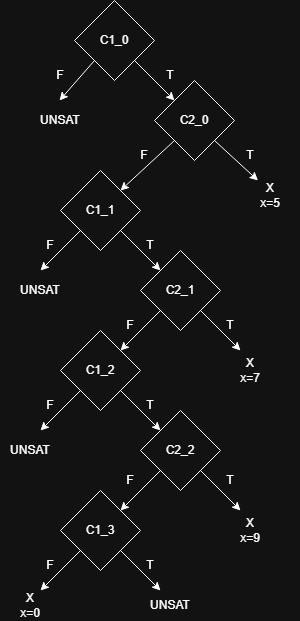
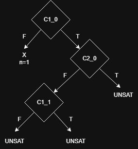
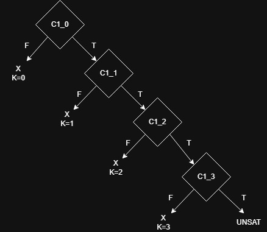
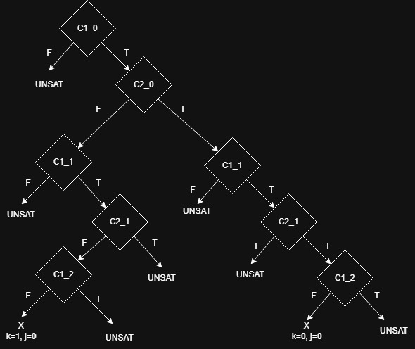

## Ejercicio 1
| Iteración | Input Concreto | Condición de Ruta                                | Fórmula enviada al demostrador                  | Resultado posible |
|-----------|----------------|--------------------------------------------------|-------------------------------------------------|-------------------|
| 1         | a=0, b=0, c=0  | (a>=b) && (a >= c)                               | !((a>=b) && (a >= c)) = (a < b) or (a < c)      | a=0, b=0, c=1     |
| 2         | a=0, b=0, c=1  | !((a>=b) && (a >= c)) && !((b >= a) && (b >= c)) | !((a>=b) && (a >= c)) && ((b >= a) && (b >= c)) | a=0, b=2, c=1     |
| 3         | a=0, b=2, c=1  | !((a>=b) && (a >= c)) && ((b >= a) && (b >= c))  | END                                             |                   |

  

## Ejercicio 2

| Iteración | Input Concreto | Condición de Ruta      | Fórmula enviada al demostrador | Resultado posible |
|-----------|----------------|------------------------|--------------------------------|-------------------|
| 1         | x=0, y=0       | 2y == x && !(x > y+10) | 2y == x && (x > y+10)          | x=22, y=11        |
| 2         | x=22, y=11     | 2y == x && x > y+10    | !(2y == x)                     | x=1, y=0          |
| 3         | x=1, y=0       | !(2y == x)             | END                            |                   |

  

## Ejercicio 3

| Iteración | Input Concreto | Condición de Ruta                                                                                | Fórmula enviada al demostrador                                                              | Resultado posible |
|-----------|----------------|--------------------------------------------------------------------------------------------------|---------------------------------------------------------------------------------------------|-------------------|
| 7         | x=5            | $\;C1_0 \land C2_0$                                                                              | $\neg \;C1_0$                                                                               | UNSAT             |
| 6         | x=7            | $\;C1_0 \land \neg C2_0 \land C1_1$                                                              | $\;C1_0 \land C2_0$                                                                         | x=5               |
| 4         | x=9            | $\;C1_0 \land \neg C2_0 \land C1_1 \land \neg C2_1$                                              | $\;C1_0 \land \neg C2_0 \land C1_1 \land C2_1$                                              | x=7               |
| 2         | x=0            | $\;C1_0 \land \neg C2_0 \land C1_1 \land \neg C2_1 \land C1_2 \land \neg C2_2$                   | $\;C1_0 \land \neg C2_0 \land C1_1 \land \neg C2_1 \land C1_2 \land C2_2$                   | x=9               |
| 1         | x=0            | $\;C1_0 \land \neg C2_0 \land C1_1 \land \neg C2_1 \land C1_2 \land \neg C2_2 \land \neg C1_3\;$ | $\;C1_0 \land \neg C2_0 \land C1_1 \land \neg C2_1 \land C1_2 \land \neg C2_2 \land C1_3\;$ | UNSAT             |
| 3         | x=9            | $\;C1_0 \land \neg C2_0 \land C1_1 \land \neg C2_1 \land C1_2 \land C2_2$                        | $\;C1_0 \land \neg C2_0 \land C1_1 \land \neg C2_1 \land \neg C1_2$                         | UNSAT             |
| 5         | x=7            | $\;C1_0 \land \neg C2_0 \land C1_1 \land C2_1$                                                   | $\;C1_0 \land \neg C2_0 \land \neg C1_1$                                                    | UNSAT             |

  

## Ejercicio 4
| Iteración | Input Concreto | Condición de Ruta                      | Fórmula enviada al demostrador    | Resultado posible |
|-----------|----------------|----------------------------------------|-----------------------------------|-------------------|
| 1         | n=0            | $\neg C1_0$                            | $C1_0$                            | n=1               |
| 2         | n=1            | $C1_0 \land \neg C2_0 \land \neg C1_1$ | $C1_0 \land \neg C2_0 \land C1_1$ | UNSAT             |
| 3         | n=1            | $C1_0 \land \neg C2_0$                 | $C1_0 \land C2_0$                 | UNSAT             |

  

## Ejercicio 5
| Iteración | Input Concreto | Condición de Ruta                            | Fórmula enviada al demostrador          | Resultado posible |
|-----------|----------------|----------------------------------------------|-----------------------------------------|-------------------|
| 1         | k=0            | $\neg C1_0$                                  | $C1_0$                                  | k=1               |
| 2         | k=1            | $C1_0 \land \neg C1_1$                       | $C1_0 \land C1_1$                       | k=2               |
| 3         | k=2            | $C1_0 \land C1_1 \land \neg C1_2$            | $C1_0 \land C1_1 \land C1_2$            | k=3               |
| 4         | k=3            | $C1_0 \land C1_1 \land C1_2 \land \neg C1_3$ | $C1_0 \land C1_1 \land C1_2 \land C1_3$ | UNSAT             |

  

## Ejercicio 6
| Iteración | Input Concreto | Condición de Ruta                                       | Fórmula enviada al demostrador                     | Resultado posible |
|-----------|----------------|---------------------------------------------------------|----------------------------------------------------|-------------------|
| 1         | k=0, j=0       | $C1_0 \land C2_0 \land C1_1 \land C2_1 \land \neg C1_2$ | $C1_0 \land C2_0 \land C1_1 \land C2_1 \land C1_2$ | UNSAT             |
| 2         | k=0, j=0       | $C1_0 \land C2_0 \land C1_1 \land C2_1$                 | $C1_0 \land C2_0 \land C1_1 \land \neg C2_1$       | UNSAT             |
| 3         | k=0, j=0       | $C1_0 \land C2_0 \land C1_1$                            | $C1_0 \land C2_0 \land \neg C1_1$                  | UNSAT             |
| 4         | k=0, j=0       | $C1_0 \land C2_0$                                       | $C1_0 \land \neg C2_0$                             | k=1, j=0          |
| 5         | k=1, j=0       | $C1_0 \land \neg C2_0 \land C1_1 \land \neg C2_1 \land \neg C1_2$                                                        | $C1_0 \land \neg C2_0 \land C1_1 \land \neg C2_1 \land C1_2$                                                   | UNSAT                  |
| 6         | k=1, j=0       | $C1_0 \land \neg C2_0 \land C1_1 \land \neg C2_1$                                                        | $C1_0 \land \neg C2_0 \land C1_1 \land C2_1$                                                   | UNSAT                  |
| 7         | k=1, j=0       | $C1_0 \land \neg C2_0 \land C1_1$                                                        | $C1_0 \land \neg C2_0 \land \neg C1_1$                                                   | UNSAT                  |
| 8         | k=1, j=0       | $C1_0$                                                        | $\neg C1_0$                                                   | UNSAT                  |

  

