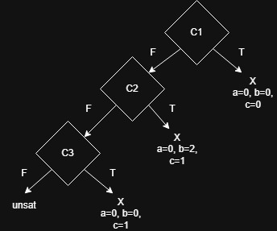
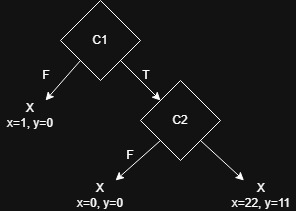

## Ejercicio 1
| Iteración | Input Concreto | Condición de Ruta                                | Fórmula enviada al demostrador                  | Resultado posible |
|-----------|----------------|--------------------------------------------------|-------------------------------------------------|-------------------|
| 1         | a=0, b=0, c=0  | (a>=b) && (a >= c)                               | !((a>=b) && (a >= c)) = (a < b) or (a < c)      | a=0, b=0, c=1     |
| 2         | a=0, b=0, c=1  | !((a>=b) && (a >= c)) && !((b >= a) && (b >= c)) | !((a>=b) && (a >= c)) && ((b >= a) && (b >= c)) | a=0, b=2, c=1     |
| 3         | a=0, b=2, c=1  | !((a>=b) && (a >= c)) && ((b >= a) && (b >= c))  | END                                             |                   |

  

## Ejercicio 2

| Iteración | Input Concreto | Condición de Ruta      | Fórmula enviada al demostrador | Resultado posible |
|-----------|----------------|------------------------|--------------------------------|-------------------|
| 1         | x=0, y=0       | 2y == x && !(x > y+10) | 2y == x && (x > y+10)          | x=22, y=11        |
| 2         | x=22, y=11     | 2y == x && x > y+10    | !(2y == x)                     | x=1, y=0          |
| 3         | x=1, y=0       | !(2y == x)             | END                            |                   |

  

## Ejercicio 3
## Ejercicio 1

| Iteración | Input Concreto | Condición de Ruta                                                                 | Fórmula enviada al demostrador | Resultado posible |
|-----------|----------------|-----------------------------------------------------------------------------------|--------------------------------|-------------------|
| 1         | x=0            | $\;C1_0 \land \neg C2_0 \land C1_1 \land \neg C2_1 \land C1_2 \land \neg C2_2 \land \neg C1_3\;$ | $\;C1_0 \land \neg C2_0 \land C1_1 \land \neg C2_1 \land C1_2 \land \neg C2_2 \land C1_3\;$                               | UNSAT                  |
| 2         |                |                                                                                   |                                |                   |
| 3         |                |                                                                                   |                                |                   |
| 4         |                |                                                                                   |                                |                   |