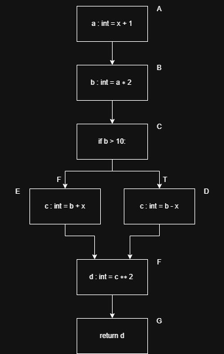

## Ejercicio 1 

| test_1 | distanceTrue | distanceFalse |
|--------|--------------|---------------|
| C1     | 1000         | 0             |
| C2     | inf          | inf           |
| C3     | inf          | inf           |

| test_2 | distanceTrue | distanceFalse |
|--------|--------------|---------------|
| C1     | 0            | 1             |
| C2     | 1            | 0             |
| C3     | inf          | inf           |

| test_3 | distanceTrue | distanceFalse |
|--------|--------------|---------------|
| C1     | 0            | 2             |
| C2     | 0            | 0             |
| C3     | 1            | 0             |

Si tomamos los minimos nos queda:
| tests | distanceTrue | distanceFalse |
|-------|--------------|---------------|
| C1    | 0            | 0             |
| C2    | 0            | 0             |
| C3    | 1            | 0             |

- El cubrimiento de líneas es igual a 87,5%. 
- El cubrimiento de branches es igual a 83,3%. 

## Ejercicio 2
| test_1 | distanceTrue | distanceFalse |
|--------|--------------|---------------|
| C1     | 0            | 0.5           |
| C2     | 10.5         | 0             |

| test_2 | distanceTrue | distanceFalse |
|--------|--------------|---------------|
| C1     | 1            | 0             |
| C2     | inf          | inf           |

| test_3 | distanceTrue | distanceFalse |
|--------|--------------|---------------|
| C1     | 2            | 0             |
| C2     | inf          | inf           |

Si tomamos los minimos nos queda: 
| tests | distanceTrue | distanceFalse |
|-------|--------------|---------------|
| C1    | 0            | 0             |
| C2    | 10.5         | 0             |

- El cubrimiento de líneas es igual a 83.3%. 
- El cubrimiento de branches es igual a 75%.

## Ejercicio 3 
| test_1 | distanceTrue | distanceFalse |
|--------|--------------|---------------|
| C1     | 5            | 0             |
| C2     | inf          | inf           |

| test_2 | distanceTrue | distanceFalse |
|--------|--------------|---------------|
| C1     | 0            | 3             |
| C2     | 5            | 0             |

Si tomamos los minimos nos queda: 
| tests | distanceTrue | distanceFalse |
|--------|--------------|---------------|
| C1     | 0            | 0             |
| C2     | 5            | 0             |

- El cubrimiento de branches es igual a 75%.

## Ejercicio 4
| test_1 | distanceTrue | distanceFalse |
|--------|--------------|---------------|
| C1     | 3            | 0             |
| C2     | inf          | inf           |

| test_2 | distanceTrue | distanceFalse |
|--------|--------------|---------------|
| C1     | 3            | 0             |
| C2     | inf          | inf           |

Si tomamos los minimos nos queda: 
| tests | distanceTrue | distanceFalse |
|-------|--------------|---------------|
| C1    | 3            | 0             |
| C2    | inf          | inf           |

- El cubrimiento de branches es igual a 25%.

## Ejercicio 5
Control flow graph:

  

| Nodo | Dominadores   |
|------|---------------|
| A    | A             |
| B    | A, B          |
| C    | A, B, C       |
| D    | A, B, C, D    |
| E    | A, B, C, E    |
| F    | A, B, C, F    |
| G    | A, B, C, F, G |

| Nodo | Post- Dominadores |
|------|-------------------|
| A    |                   |
| B    |                   |
| C    |                   |
| D    |                   |
| E    |                   |
| F    |                   |
| G    |                   |