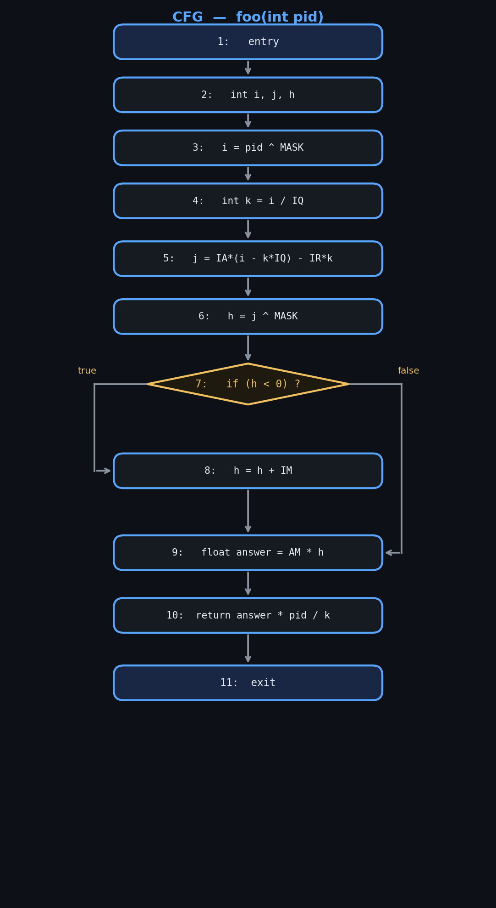
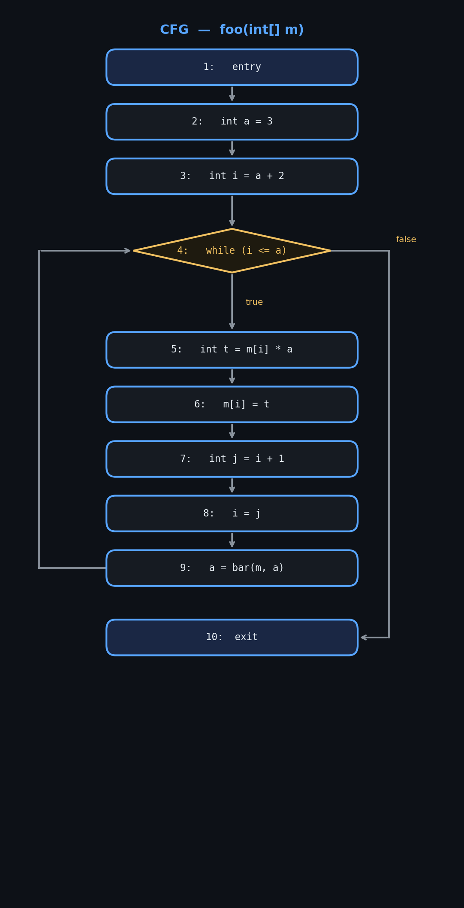
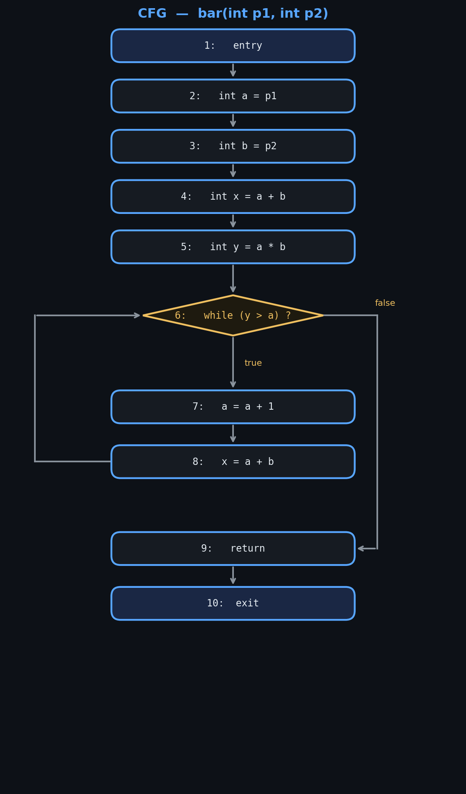
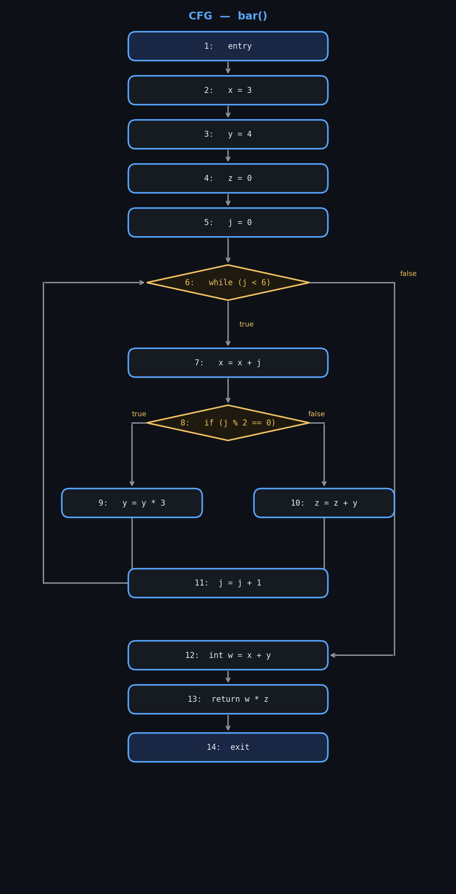
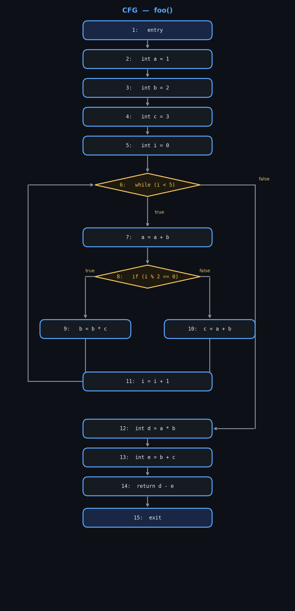

# Ejercicio 1 
| Iteración | Nodo n | IN[n]                        | OUT[n]                       |
|-----------|--------|------------------------------|------------------------------|
| 1         | 1      | -                            | $\emptyset$                  |
| 1         | 2      | $\emptyset$                  | {(x,2)}                      |
| 1         | 3      | {(x,2)}                      | {(x,2), (y,3)}               |
| 1         | 4      | {(x,2), (y,3)}               | {(x,2), (y,3)}               |
| 1         | 5      | {(x,2), (y,3)}               | {(x,2), (y,5)}               |
| 1         | 6      | {(x,2), (y,5)}               | {(y,5), (x,6)}               |
| 1         | 7      | {(x,2), (y,3)}               | -                            |
| 2         | 1      | -                            | $\emptyset$                  |
| 2         | 2      | $\emptyset$                  | {(x,2)}                      |
| 2         | 3      | {(x,2)}                      | {(x,2), (y,3)}               |
| 2         | 4      | {(x,2), (y,3), (y,5), (x,6)} | {(x,2), (y,3), (y,5), (x,6)} |
| 2         | 5      | {(x,2), (y,3), (y,5), (x,6)} | {(x,2), (y,5), (x,6)}        |
| 2         | 6      | {(x,2), (y,5), (x,6)}        | {(y,5), (x,6)}               |
| 2         | 7      | {(x,2), (y,3), (y,5), (x,6)} | -                            |
| 3         | 1      | -                            | $\emptyset$                  |
| 3         | 2      | $\emptyset$                  | {(x,2)}                      |
| 3         | 3      | {(x,2)}                      | {(x,2), (y,3)}               |
| 3         | 4      | {(x,2), (y,3), (y,5), (x,6)} | {(x,2), (y,3), (y,5), (x,6)} |
| 3         | 5      | {(x,2), (y,3), (y,5), (x,6)} | {(x,2), (y,5), (x,6)}        |
| 3         | 6      | {(x,2), (y,5), (x,6)}        | {(y,5), (x,6)}               |
| 3         | 7      | {(x,2), (y,3), (y,5), (x,6)} | -                            |

Entonces el cuadro final va a ser: 
| Nodo n | IN[n]                        | OUT[n]                       |
|--------|------------------------------|------------------------------|
| 1      | -                            | $\emptyset$                  |
| 2      | $\emptyset$                  | {(x,2)}                      |
| 3      | {(x,2)}                      | {(x,2), (y,3)}               |
| 4      | {(x,2), (y,3), (y,5), (x,6)} | {(x,2), (y,3), (y,5), (x,6)} |
| 5      | {(x,2), (y,3), (y,5), (x,6)} | {(x,2), (y,5), (x,6)}        |
| 6      | {(x,2), (y,5), (x,6)}        | {(y,5), (x,6)}               |
| 7      | {(x,2), (y,3), (y,5), (x,6)} | -                            |

# Ejercicio 2 
$$\text{Transfer}(n, S) =
\begin{cases}
(S \downarrow \text{var}) \cup \{\langle \text{var}, n \rangle\} & \text{si } n = \text{var} := E \\[4pt]
S & \text{en caso contrario}
\end{cases}$$

# Ejercicio 3

| Nodo n | IN[n]            | OUT[n]           |
|--------|------------------|------------------|
| 1      | -                | {pid}            |
| 2      | {pid}            | {pid}            |
| 3      | {pid}            | {pid, i}         |
| 4      | {pid, i}         | {pid, k, i}      |
| 5      | {pid, k, i}      | {pid, k, j}      |
| 6      | {pid, k, j}      | {pid, k, h}      |
| 7      | {pid, k, h}      | {pid, k, h}      |
| 8      | {pid, k}         | {pid, k, h}      |
| 9      | {pid, k, h}      | {answer, pid, k} |
| 10     | {answer, pid, k} | {}               |
| 11     | {}               | -                |

(Preguntar si el parametro pid cuenta y si las declaraciones no se agregan)

Tabla en caso de que las constantes sean variables: 

| Nodo n | IN[n]                                 | OUT[n]                                |
|--------|---------------------------------------|---------------------------------------|
| 1      | -                                     | {pid, AM, IM, MASK, IA, IQ, IR}       |
| 2      | {pid, AM, IM, MASK, IA, IQ, IR}       | {pid, AM, IM, MASK, IA, IQ, IR}       |
| 3      | {pid, AM, IM, MASK, IA, IQ, IR}       | {pid, AM, IM, MASK, IA, i, IQ, IR}    |
| 4      | {pid, AM, IM, MASK, IA, i, IQ, IR}    | {pid, k, AM, IM, MASK, IA, i, IQ, IR} |
| 5      | {pid, k, AM, IM, MASK, IA, i, IQ, IR} | {pid, k, AM, IM, j, MASK}             |
| 6      | {pid, k, AM, IM, j, MASK}             | {pid, k, AM, h, IM}                   |
| 7      | {pid, k, AM, h, IM}                   | {pid, k, AM, h, IM}                   |
| 8      | {pid, k, AM, h, IM}                   | {pid, k, AM, h}                       |
| 9      | {pid, k, AM, h}                       | {answer, pid, k}                      |
| 10     | {answer, pid, k}                      | {}                                    |
| 11     | {}                                    | -                                     |

# Ejercicio 4

| Iteración | Nodo n | IN[n]                   | OUT[n]                  |
|-----------|--------|-------------------------|-------------------------|
| 1         | 1      | -                       | {}                      |
| 1         | 2      | {}                      | {}                      |
| 1         | 3      | {}                      | {a + 2}                 |
| 1         | 4      | {a + 2}                 | {a + 2}                 |
| 1         | 5      | {a + 2}                 | {a + 2, m[i], m[i] * a} |
| 1         | 6      | {a + 2, m[i], m[i] * a} | {a + 2}                 |
| 1         | 7      | {a + 2}                 | {a + 2, i + 1}          |
| 1         | 8      | {a + 2, i + 1}          | {a + 2}                 |
| 1         | 9      | {a + 2}                 | {}                      |
| 1         | 10     | {a + 2}                 | -                       |
| 2         | 1      | -                       | {}                      |
| 2         | 2      | {}                      | {}                      |
| 2         | 3      | {}                      | {a + 2}                 |
| 2         | 4      | {}                      | {}                      |
| 2         | 5      | {}                      | {m[i], m[i] * a}        |
| 2         | 6      | {m[i], m[i] * a}        | {}                      |
| 2         | 7      | {}                      | {i + 1}                 |
| 2         | 8      | {i + 1}                 | {}                      |
| 2         | 9      | {}                      | {}                      |
| 2         | 10     | {}                      | -                       |
| 3         | 1      | -                       | {}                      |
| 3         | 2      | {}                      | {}                      |
| 3         | 3      | {}                      | {a + 2}                 |
| 3         | 4      | {}                      | {}                      |
| 3         | 5      | {}                      | {m[i], m[i] * a}        |
| 3         | 6      | {m[i], m[i] * a}        | {}                      |
| 3         | 7      | {}                      | {i + 1}                 |
| 3         | 8      | {i + 1}                 | {}                      |
| 3         | 9      | {}                      | {}                      |
| 3         | 10     | {}                      | -                       |

Entonces la tabla final queda:
| Nodo n | IN[n]                 | OUT[n]                |
|--------|-----------------------|-----------------------|
| 1      | -                     | {}                    |
| 2      | {}                    | {}                    |
| 3      | {}                    | {a + 2}               |
| 4      | {}                    | {}                    |
| 5      | {}                    | {m[i], m[i] * a}      |
| 6      | {m[i], m[i] * a}      | {}                    |
| 7      | {}                    | {i + 1}               |
| 8      | {i + 1}               | {}                    |
| 9      | {}                    | {}                    |
| 10     | {}                    | -                     |

# Ejercicio 5
|      | Forward               | Backward              |
|------|-----------------------|-----------------------|
| May  | Reaching Definitions  | Live Variables        |
| Must | Available Expressions | Very Busy Expressions |

# Ejercicio 6

| Iteración | Nodo n | IN[n]     | OUT[n]    |
|-----------|--------|-----------|-----------|
| 1         | 1      | -         | {}        |
| 1         | 2      | {}        | {a}       |
| 1         | 3      | {a}       | {b, a}    |
| 1         | 4      | {b,a}     | {b, a}    |
| 1         | 5      | {b, a}    | {b, y, a} |
| 1         | 6      | {b, y, a} | {b}       |
| 1         | 7      | {b}       | {a, b}    |
| 1         | 8      | {a, b}    | {}        |
| 1         | 9      | {}        | {}        |
| 1         | 10     | {}        | -         |
| 2         | 1      | -         | {}        |
| 2         | 2      | {}        | {a}       |
| 2         | 3      | {a}       | {b, a}    |
| 2         | 4      | {b,a}     | {b, a}    |
| 2         | 5      | {b, a}    | {b, y, a} |
| 2         | 6      | {b, y, a} | {b, y}    |
| 2         | 7      | {b, y}    | {b, y, a} |
| 2         | 8      | {b, y, a} | {b, y, a} |
| 2         | 9      | {}        | {}        |
| 2         | 10     | {}        | -         |
| 3         | 1      | -         | {}        |
| 3         | 2      | {}        | {a}       |
| 3         | 3      | {a}       | {b, a}    |
| 3         | 4      | {b,a}     | {b, a}    |
| 3         | 5      | {b, a}    | {b, y, a} |
| 3         | 6      | {b, y, a} | {b, y}    |
| 3         | 7      | {b, y}    | {b, y, a} |
| 3         | 8      | {b, y, a} | {b, y, a} |
| 3         | 9      | {}        | {}        |
| 3         | 10     | {}        | -         |

Estado final:
| Nodo n | IN[n]     | OUT[n]    |
|--------|-----------|-----------|
| 1      | -         | {}        |
| 2      | {}        | {a}       |
| 3      | {a}       | {b, a}    |
| 4      | {b,a}     | {b, a}    |
| 5      | {b, a}    | {b, y, a} |
| 6      | {b, y, a} | {b, y}    |
| 7      | {b, y}    | {b, y, a} |
| 8      | {b, y, a} | {b, y, a} |
| 9      | {}        | {}        |
| 10     | {}        | -         |

# Ejercicio 7

| Nodo n | IN[n]          | OUT[n]         |
|---------|----------------|----------------|
| 1       | -              | {}             |
| 2       | {}             | {}             |
| 3       | {}             | {}             |
| 4       | {}             | {}             |
| 5       | {}             | {}             |
| 6       | {}             | {}             |
| 7       | {}             | {}             |
| 8       | {}             | {j % 2}        |
| 9       | {j % 2}        | {j % 2}        |
| 10      | {j % 2}        | {j % 2}        |
| 11      | {j % 2}        | {}             |
| 12      | {}             | {x + y}        |
| 13      | {x + y}        | {x + y, w * z} |
| 14      | {x + y, w * z} | -              |

# Ejercicio 8

| Iteracion | Nodo n | IN[n]                                             | OUT[n]                                                   |
|-----------|--------|---------------------------------------------------|----------------------------------------------------------|
| 1         | 1      | -                                                 | {}                                                       |
| 1         | 2      | {}                                                | {}                                                       |
| 1         | 3      | {}                                                | {}                                                       |
| 1         | 4      | {}                                                | {}                                                       |
| 1         | 5      | {}                                                | {}                                                       |
| 1         | 6      | {}                                                | {}                                                       |
| 1         | 7      | {d * e, i % 2, a + b}                             | {d * e, i % 2}                                           |
| 1         | 8      | {d * e, i % 2}                                    | {d * e}                                                  |
| 1         | 9      | {b * c, i + 1, d * e}                             | {a + b, b * c, a + b, i + 1, a * b, b + c, d * e}        |
| 1         | 10     | {a + b, a + b, i + 1, a * b, d * e}               | {a + b, b * c, a + b, i + 1, a * b, b + c, d * e}        |
| 1         | 11     | {a + b, b * c, a + b, i + 1, a * b, b + c, d * e} | {a + b, i % 2, b * c, a + b, i + 1, a * b, b + c, d * e} |
| 1         | 12     | {b + c, a * b}                                    | {b + c}                                                  |
| 1         | 13     | {b + c}                                           | {d - e}                                                  |
| 1         | 14     | {d - e}                                           | {}                                                       |
| 1         | 15     | {}                                                | -                                                        |
| 2         | 1      | -                                                 | {}                                                       |
| 2         | 2      | {}                                                | {}                                                       |
| 2         | 3      | {}                                                | {}                                                       |
| 2         | 4      | {}                                                | {}                                                       |
| 2         | 5      | {}                                                | {}                                                       |
| 2         | 6      | {}                                                | {}                                                       |
| 2         | 7      | {i + 1, i % 2, a + b}                             | {i + 1, i % 2}                                           |
| 2         | 8      | {i + 1, i % 2}                                    | {i + 1}                                                  |
| 2         | 9      | {i + 1, b * c}                                    | {i + 1}                                                  |
| 2         | 10     | {i + 1, a + b}                                    | {i + 1}                                                  |
| 2         | 11     | {i + 1}                                           | {}                                                       |
| 2         | 12     | {b + c, a * b}                                    | {b + c}                                                  |
| 2         | 13     | {b + c}                                           | {d - e}                                                  |
| 2         | 14     | {d - e}                                           | {}                                                       |
| 2         | 15     | {}                                                | -                                                        |
| 3         | 1      | -                                                 | {}                                                       |
| 3         | 2      | {}                                                | {}                                                       |
| 3         | 3      | {}                                                | {}                                                       |
| 3         | 4      | {}                                                | {}                                                       |
| 3         | 5      | {}                                                | {}                                                       |
| 3         | 6      | {}                                                | {}                                                       |
| 3         | 7      | {i + 1, i % 2, a + b}                             | {i + 1, i % 2}                                           |
| 3         | 8      | {i + 1, i % 2}                                    | {i + 1}                                                  |
| 3         | 9      | {i + 1, b * c}                                    | {i + 1}                                                  |
| 3         | 10     | {i + 1, a + b}                                    | {i + 1}                                                  |
| 3         | 11     | {i + 1}                                           | {}                                                       |
| 3         | 12     | {b + c, a * b}                                    | {b + c}                                                  |
| 3         | 13     | {b + c}                                           | {d - e}                                                  |
| 3         | 14     | {d - e}                                           | {}                                                       |
| 3         | 15     | {}                                                | -                                                        |

Tabla final:

| Nodo n | IN[n]                   | OUT[n]          |
|--------|-------------------------|-----------------|
| 1      | -                       | {}              |
| 2      | {}                      | {}              |
| 3      | {}                      | {}              |
| 4      | {}                      | {}              |
| 5      | {}                      | {}              |
| 6      | {}                      | {}              |
| 7      | {i + 1, i % 2, a + b}   | {i + 1, i % 2}  |
| 8      | {i + 1, i % 2}          | {i + 1}         |
| 9      | {i + 1, b * c}          | {i + 1}         |
| 10     | {i + 1, a + b}          | {i + 1}         |
| 11     | {i + 1}                 | {}              |
| 12     | {b + c, a * b}          | {b + c}         |
| 13     | {b + c}                 | {d - e}         |
| 14     | {d - e}                 | {}              |
| 15     | {}                      | -               |
