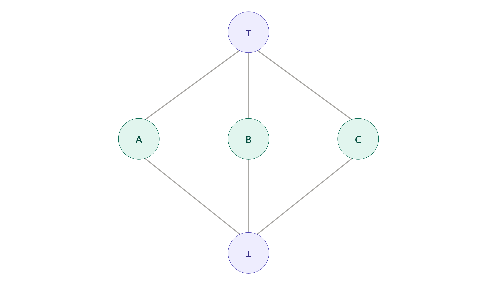
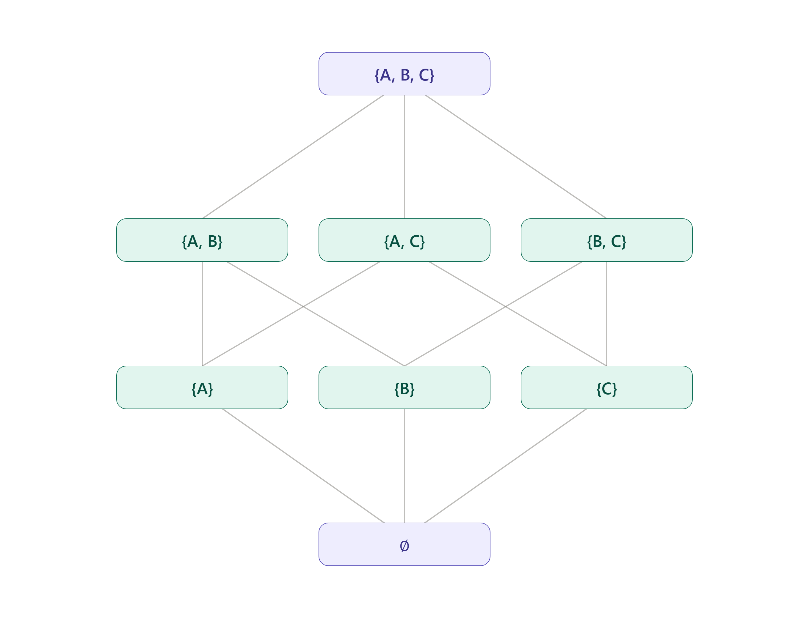
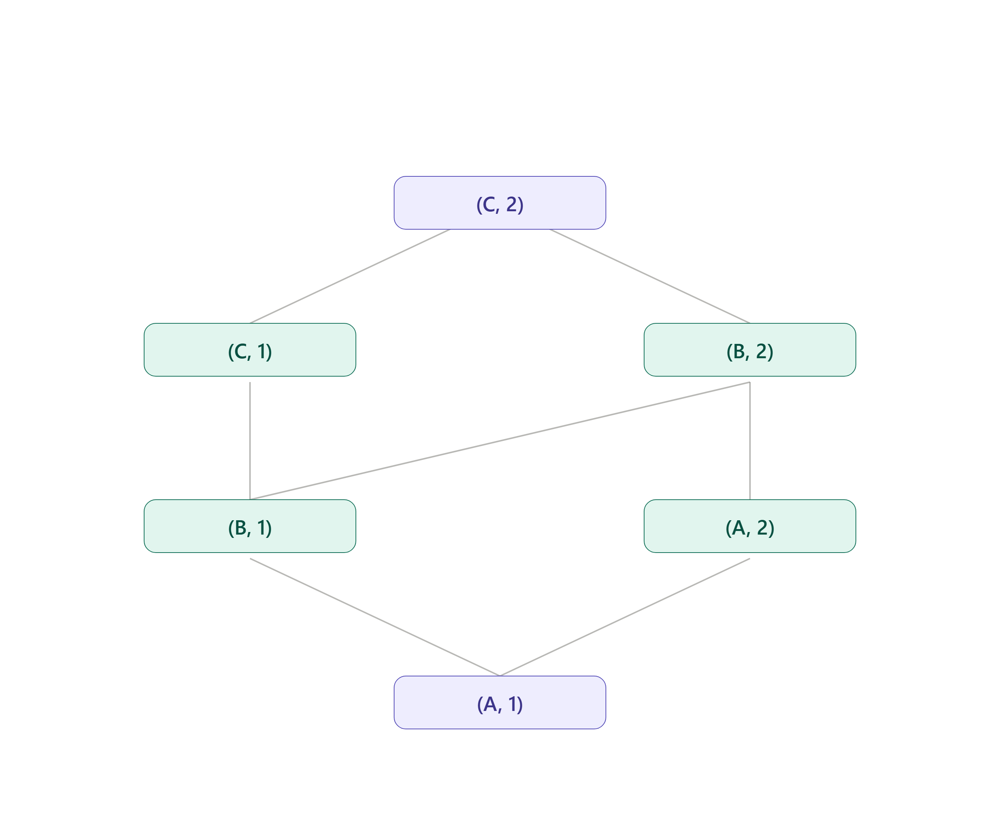

# Ejercicio 1 
## Punto 1
$\{\mathbb{Z}, \leq\}$ ya es un reticulado, donde $x \sqcup y := \max\{x,y\}$ y $x \sqcap y := \min\{x,y\}$. 

No existen los elementos $\top$ y $\bot$ porque $\forall x \in \mathbb{Z} \ \exists x', x'' \in \mathbb{Z} \ / \ x < x' \land x'' < x$. 

## Punto 2 
El poset va a ser $\{\mathbb{Z} \cup \{-\infty, \infty\}, \sqsubseteq\}$. 

Donde $x \sqsubseteq y$ va a estar definido como:

$x \sqsubseteq y \iff \begin{cases} x = -\infty \\ y = +\infty \\ x, y \in \mathbb{Z} \text{ y } x \leq_{\mathbb{Z}} y \end{cases}$.

$\bot = -\infty, \top = \infty$.

Podemos definir $\sqcup X$ como: 

$\sqcup X = \begin{cases} +\infty & \text{si } +\infty \in X \\ \max\{ x \in \mathbb{Z} \mid x \in X \} & \text{si } +\infty \notin X \text{ y } X \cap \mathbb{Z} \neq \emptyset \\ -\infty & \text{si } +\infty \notin X \text{ y } X \cap \mathbb{Z} = \emptyset \end{cases}$

Y podemos definir a $\sqcap X$ como: 

$\sqcap X = \begin{cases} -\infty & \text{si } -\infty \in X \\ \min\{ x \in \mathbb{Z} \mid x \in X \} & \text{si } -\infty \notin X \text{ y } X \cap \mathbb{Z} \neq \emptyset \\ +\infty & \text{si } -\infty \notin X \text{ y } X \cap \mathbb{Z} = \emptyset \end{cases}$.

# Ejercicio 2 
El poset de la izquierda no es un reticulado porque los dos elementos de arriba a los costados no tienen un supremo. 

El poset de la derecha tampoco es un reticulado porque agarrando a los elementos de los costados no se cumple que tengan un unico supremo/ infimo, dado que para ambos pares de puntos vale que los de abajo/arriba son menores/ mayores a los dos a la vez, por lo que no se cumple que sea unica esa cota superior/ inferior, por lo que no tienen infimo o supremo. 

# Ejercicio 3 
## Punto 1 
$S = <\{A, B, C, \bot, \top \}, \sqsubseteq>$

Cuyo diagrama de Hasse es: 

Es un reticulado porque $\sqsubseteq$ es una relacion de orden y se cumple que $\forall x, y \in S$ existen tanto $x \sqcup y$ como $x \sqcap y$.

## Punto 2 
El reticulado va a ser $\mathcal{P}(S), \subseteq$ donde $\bot = \emptyset$ y $\top = S$, $x \sqcup y = x \cup y$ y $x \sqcap y = x \cap y$.  

La altura del reticulado es 3.

## Punto 3 
Si los elementos de $S$ no son comparables, entonces no existe el reticulado de pares $S \times N$, porque $(s,n) \sqsubseteq (s',n') \iff s \sqsubseteq_S s' \land n \sqsubseteq_N n'$. Y como los elementos de $S$ no son comparables, entonces los elementos de $S \times N$ tampoco, por lo que no existe para ningun par $(s,n) \sqcap (s',n')$ ni $(s,n) \sqcup (s',n')$.

Suponiendo que ahora los elementos de $S$ cumplan $A \sqsubseteq B \sqsubseteq C$, entonces el diagrama de Hasse seria: 

