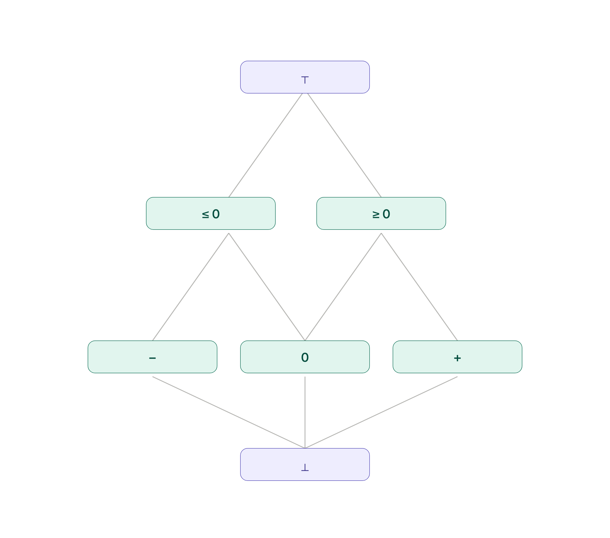
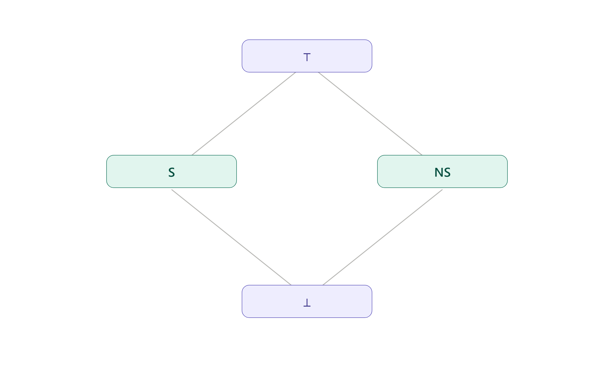
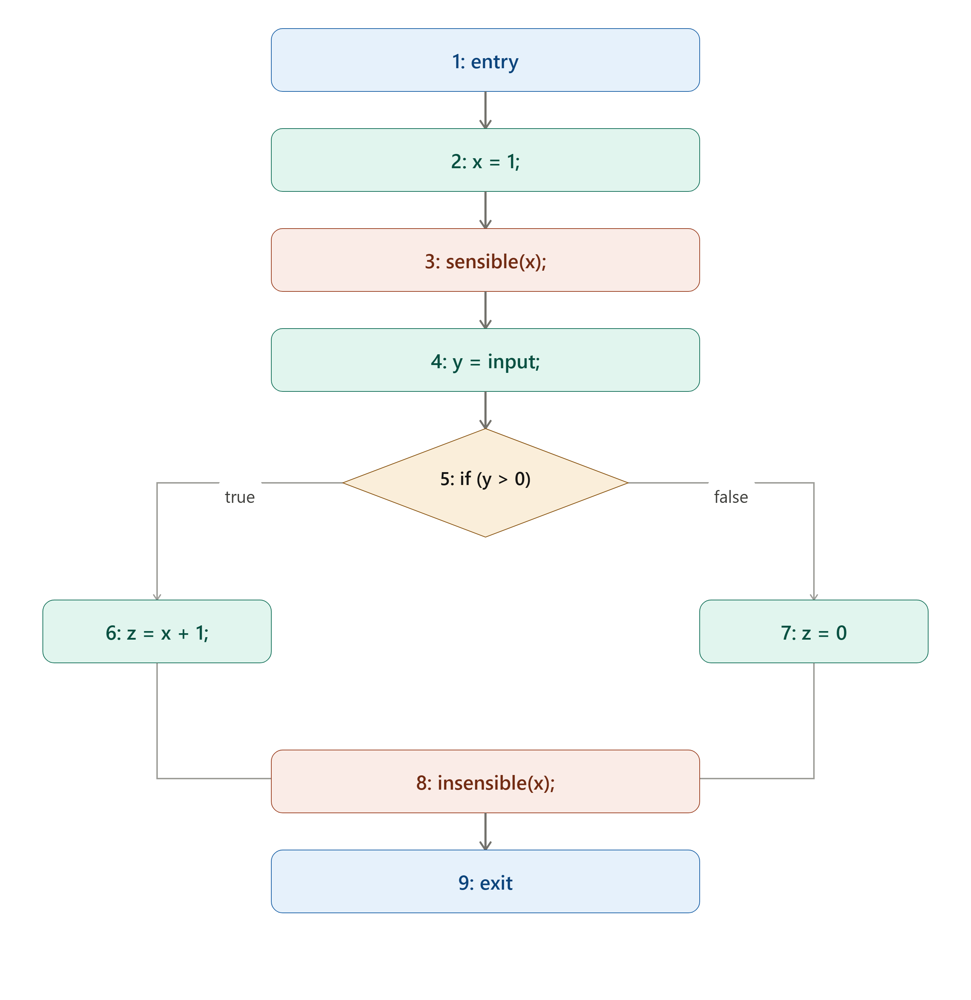
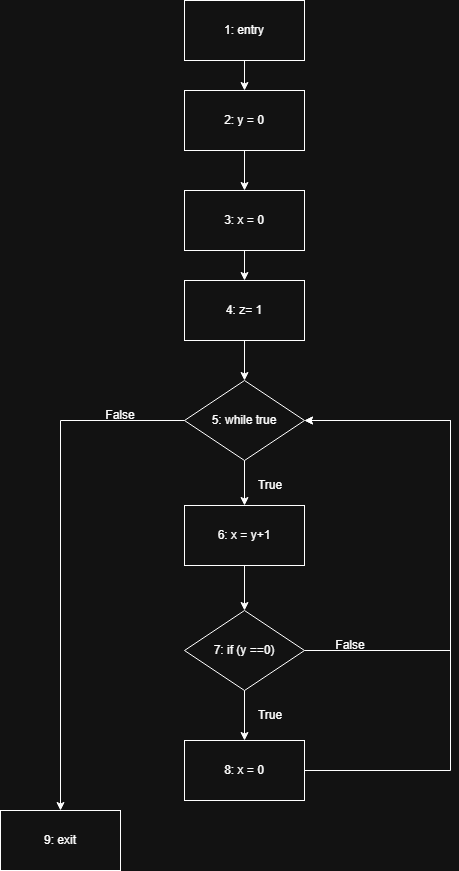
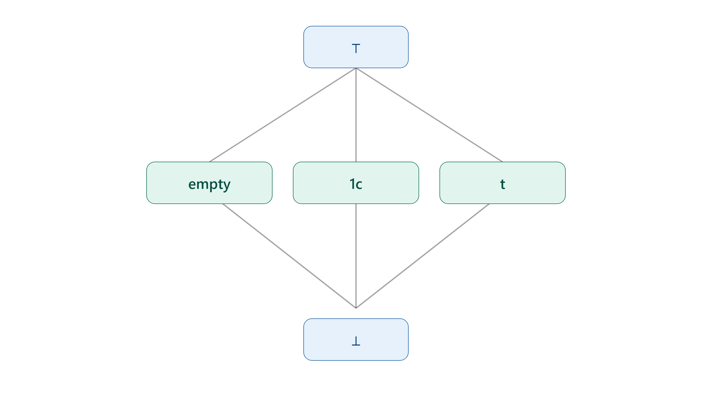
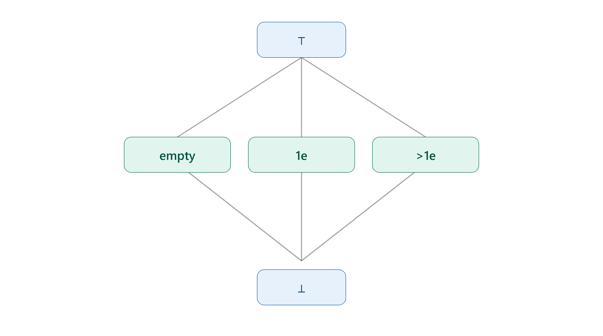

# Ejercicio 1 
## Punto 1
$\{\mathbb{Z}, \leq\}$ ya es un reticulado, donde $x \sqcup y := \max\{x,y\}$ y $x \sqcap y := \min\{x,y\}$. 

No existen los elementos $\top$ y $\bot$ porque $\forall x \in \mathbb{Z} \ \exists x', x'' \in \mathbb{Z} \ / \ x < x' \land x'' < x$. 

## Punto 2 
El poset va a ser $\{\mathbb{Z} \cup \{-\infty, \infty\}, \sqsubseteq\}$. 

Donde $x \sqsubseteq y$ va a estar definido como:

$x \sqsubseteq y \iff \begin{cases} x = -\infty \\ y = +\infty \\ x, y \in \mathbb{Z} \text{ y } x \leq_{\mathbb{Z}} y \end{cases}$.

$\bot = -\infty, \top = \infty$.

Podemos definir $\sqcup X$ como: 

$\sqcup X = \begin{cases} +\infty & \text{si } +\infty \in X \\ \max\{ x \in \mathbb{Z} \mid x \in X \} & \text{si } +\infty \notin X \text{ y } X \cap \mathbb{Z} \neq \emptyset \\ -\infty & \text{si } +\infty \notin X \text{ y } X \cap \mathbb{Z} = \emptyset \end{cases}$

Y podemos definir a $\sqcap X$ como: 

$\sqcap X = \begin{cases} -\infty & \text{si } -\infty \in X \\ \min\{ x \in \mathbb{Z} \mid x \in X \} & \text{si } -\infty \notin X \text{ y } X \cap \mathbb{Z} \neq \emptyset \\ +\infty & \text{si } -\infty \notin X \text{ y } X \cap \mathbb{Z} = \emptyset \end{cases}$.

# Ejercicio 2 
El poset de la izquierda no es un reticulado porque los dos elementos de arriba a los costados no tienen un supremo. 

El poset de la derecha tampoco es un reticulado porque agarrando a los elementos de los costados no se cumple que tengan un unico supremo/ infimo, dado que para ambos pares de puntos vale que los de abajo/arriba son menores/ mayores a los dos a la vez, por lo que no se cumple que sea unica esa cota superior/ inferior, por lo que no tienen infimo o supremo. 

# Ejercicio 3 
## Punto 1 
$S = <\{A, B, C, \bot, \top \}, \sqsubseteq>$

Cuyo diagrama de Hasse es: 

Es un reticulado porque $\sqsubseteq$ es una relacion de orden y se cumple que $\forall x, y \in S$ existen tanto $x \sqcup y$ como $x \sqcap y$.

## Punto 2 
El reticulado va a ser $\mathcal{P}(S), \subseteq$ donde $\bot = \emptyset$ y $\top = S$, $x \sqcup y = x \cup y$ y $x \sqcap y = x \cap y$.  

La altura del reticulado es 3.

## Punto 3 
Si los elementos de $S$ no son comparables, entonces no existe el reticulado de pares $S \times N$, porque $(s,n) \sqsubseteq (s',n') \iff s \sqsubseteq_S s' \land n \sqsubseteq_N n'$. Y como los elementos de $S$ no son comparables, entonces los elementos de $S \times N$ tampoco, por lo que no existe para ningun par $(s,n) \sqcap (s',n')$ ni $(s,n) \sqcup (s',n')$.

Suponiendo que ahora los elementos de $S$ cumplan $A \sqsubseteq B \sqsubseteq C$, entonces el diagrama de Hasse seria: 

# Ejercicio 4 
## Diagrama 1 

$\varphi(\sqcup X) = \begin{cases} + & \text{si } + \in X, \\ 0 & \text{en caso contrario.} \end{cases}$

Las cadenas incrementales van a ser: $\{(-), (0), (+), (-,0), (0,+), (-,+), (-,0,+)\}$

## Diagrama 2 
TODO

## Diagrama 3 
TODO 

# Ejercicio 5
TODO

# Ejercicio 6 

| $E_1 + E_2$ | $\bot$ | $-$    | $0$      | $+$    | $\leq 0$ | $\geq 0$ | $\top$ |
|-------------|--------|--------|----------|--------|----------|----------|--------|
| $\bot$      | $\bot$ | $\bot$ | $\bot$   | $\bot$ | $\bot$   | $\bot$   | $\bot$ |
| $-$         | $\bot$ | $-$    | $-$      | $\top$ | $-$      | $\top$   | $\top$ |
| $0$         | $\bot$ | $-$    | $0$      | $+$    | $\leq 0$ | $\geq 0$ | $\top$ |
| $+$         | $\bot$ | $\top$ | $+$      | $+$    | $\top$   | $+$      | $\top$ |
| $\leq 0$    | $\bot$ | $-$    | $\leq 0$ | $\top$ | $\leq 0$ | $\top$   | $\top$ |
| $\geq 0$    | $\bot$ | $\top$ | $\geq 0$ | $+$    | $\top$   | $\geq 0$ | $\top$ |
| $\top$      | $\bot$ | $\top$ | $\top$   | $\top$ | $\top$   | $\top$   | $\top$ |

# Ejercicio 7
TODO

# Ejercicio 8
El diagrama de Hasse del reticulado va a ser: 

En analisis va a ser forward may. 
$\text{IN}[n] = \bigsqcup_{n' \in \text{pred}(n)} \text{OUT}[n']$.

$\text{OUT}[n] = \text{Transfer}(n, \text{IN}[n])$. Donde $\text{Transfer}(n, \text{IN}[n])$ se define como: 

$$
\text{Transfer}(n, S) =
\begin{cases}
S[\text{var} \mapsto s] & \text{si } n = \text{sensible}(\text{var}) \\
S[\text{var} \mapsto ns] & \text{si } n = \text{insensible}(\text{var}) \\
S[\text{var} \mapsto \text{eval}(E, S)] & \text{si } n = \text{``var = E''} \\
S & \text{sino}
\end{cases}
$$

La función $\text{eval}$ sobre expresiones la defino como:

$$
\text{eval}(E, S) =
\begin{cases}
ns & \text{si } E = c \text{, con } c \text{ constante} \\
y & \text{si } E = x \text{ y } x \mapsto y \in S \\
\text{eval}(E_1, S) + \text{eval}(E_2, S) & \text{si } E = E_1 + E_2 \\
\bot & \text{sino}
\end{cases}
$$

El estado inicial tiene a todas las variables como $\bot$. 

| Nodo n | IN[n]                                                | OUT[n]                                               |
|--------|------------------------------------------------------|------------------------------------------------------|
| 1      | -                                                    | {x ->$\bot$, y ->$\bot$, z ->$\bot$, input ->$\top$} |
| 2      | {x ->$\bot$, y ->$\bot$, z ->$\bot$, input ->$\top$} | {x -> ns, y ->$\bot$, z ->$\bot$, input ->$\top$}    |
| 3      | {x -> ns, y ->$\bot$, z ->$\bot$, input ->$\top$}    | {x -> s, y ->$\bot$, z ->$\bot$, input ->$\top$}     |
| 4      | {x -> s, y ->$\bot$, z ->$\bot$, input ->$\top$}     | {x -> s, y ->$\top$, z ->$\bot$, input ->$\top$}     |
| 5      | {x -> s, y ->$\top$, z ->$\bot$, input ->$\top$}     | {x -> s, y ->$\top$, z ->$\bot$, input ->$\top$}     |
| 6      | {x -> s, y ->$\top$, z ->$\bot$, input ->$\top$}     | {x -> s, y ->$\top$, z -> s, input ->$\top$}         |
| 7      | {x -> s, y ->$\top$, z ->$\bot$, input ->$\top$}     | {x -> s, y ->$\top$, z -> ns, input ->$\top$}        |
| 8      | {x -> s, y ->$\top$, z ->$\top$, input ->$\top$}     | {x -> ns, y ->$\top$, z ->$\top$, input ->$\top$}    |
| 9      | {x -> ns, y ->$\top$, z ->$\top$, input ->$\top$}    | -                                                    |

(Asumo que si $z = x$ es sensible, al hacer `insensible(x)` $z$ sigue siendo sensible)

# Ejercicio 9 

Sea $S = \{x,y,z\} \cup \{c_0, c_1\}$ El reticulado va a ser: $<\mathcal{P}(S \times S), \subseteq>$

Donde $\bot$ indica que no hay ningun par de variables iguales y $\top$ que todas las variables son iguales. Le agregue las constantes $c_0$ y $c_1$ para poder hacer el analisis sobre el programa, en otro programa habria que agregar constantes dependiendo del programa.  

El analisis va a ser de tipo forward must, donde $\text{IN}[n] = \sqcap_{n' \in \text{pred}(n)} \text{OUT}[n']$.

En el analisis van a empezar salvo el el nodo entry y out del nodo exit, todos los demas con el in y out con todas las igualdades.

$\text{OUT}[n] = \text{Transfer}(n, \text{IN}[n])$. Donde $\text{Transfer}(n, \text{IN}[n])$ se define como: 

$$
\text{Transfer}(n, S) =
\begin{cases}
(S \ \setminus \text{Todos los pares que contengan a } x) \ \cup \{(x, y)\} \ \cup \ \{(x,z) \mid (z,y) \in S\}  & \text{si } n = x = y \text{ y el par } (x,y) \notin S \\
(S \ \setminus \text{Todos los pares que contengan a } x) \ \cup \{(x, \text{Eval}(E_1) + \text{Eval}(E_2))\} \ \cup \ \{(x,z) \mid (z,\text{Eval}(E_1) + \text{Eval}(E_2)) \in S\}  & \text{si } n = x = E_1 + E_2 \\
S & \text{sino}
\end{cases}
$$

TODO Calcular ecuaciones con lo del punto fijo 

| Iteracion | Nodo n | IN[n]                                   | OUT[n]                                  |
|-----------|--------|-----------------------------------------|-----------------------------------------|
| 1         | 1      | -                                       | {}                                      |
| 1         | 2      | {}                                      | {$(y, c_0)$}                            |
| 1         | 3      | {$(y, c_0)$}                            | {$(y, c_0), (x, c_0), (x,y)$}           |
| 1         | 4      | {$(y, c_0), (x, c_0), (x,y)$}           | {$(y, c_0), (x, c_0), (x,y), (z, c_1)$} |
| 1         | 5      | {$(y, c_0), (x, c_0), (x,y), (z, c_1)$} | {$(y, c_0), (x, c_0), (x,y), (z, c_1)$} |
| 1         | 6      | {$(y, c_0), (x, c_0), (x,y), (z, c_1)$} | {$(y, c_0), (z, c_1), (x, c_1), (x,z)$} |
| 1         | 7      | {$(y, c_0), (z, c_1), (x, c_1), (x,z)$} | {$(y, c_0), (z, c_1), (x, c_1), (x,z)$} |
| 1         | 8      | {$(y, c_0), (z, c_1), (x, c_1), (x,z)$} | {$(y, c_0), (z, c_1), (x, c_0), (x,y)$} |
| 1         | 9      | {$(y, c_0), (x, c_0), (x,y), (z, c_1)$} | -                                       |
| 2         | 1      | -                                       | {}                                      |
| 2         | 2      | {}                                      | {$(y, c_0)$}                            |
| 2         | 3      | {$(y, c_0)$}                            | {$(y, c_0), (x, c_0), (x,y)$}           |
| 2         | 4      | {$(y, c_0), (x, c_0), (x,y)$}           | {$(y, c_0), (x, c_0), (x,y), (z, c_1)$} |
| 2         | 5      | {$(y, c_0), (z, c_1)$}                  | {$(y, c_0), (z, c_1)$}                  |
| 2         | 6      | {$(y, c_0), (z, c_1)$}                  | {$(y, c_0), (z, c_1), (x, c_1), (x,z)$} |
| 2         | 7      | {$(y, c_0), (z, c_1), (x, c_1), (x,z)$} | {$(y, c_0), (z, c_1), (x, c_1), (x,z)$} |
| 2         | 8      | {$(y, c_0), (z, c_1), (x, c_1), (x,z)$} | {$(y, c_0), (z, c_1), (x, c_0), (x,y)$} |
| 2         | 9      | {$(y, c_0), (z, c_1)$}                  | -                                       |

Entonces la tabla final es: 

| Nodo n | IN[n]                                   | OUT[n]                                  |
|--------|-----------------------------------------|-----------------------------------------|
| 1      | -                                       | {}                                      |
| 2      | {}                                      | {$(y, c_0)$}                            |
| 3      | {$(y, c_0)$}                            | {$(y, c_0), (x, c_0), (x,y)$}           |
| 4      | {$(y, c_0), (x, c_0), (x,y)$}           | {$(y, c_0), (x, c_0), (x,y), (z, c_1)$} |
| 5      | {$(y, c_0), (z, c_1)$}                  | {$(y, c_0), (z, c_1)$}                  |
| 6      | {$(y, c_0), (z, c_1)$}                  | {$(y, c_0), (z, c_1), (x, c_1), (x,z)$} |
| 7      | {$(y, c_0), (z, c_1), (x, c_1), (x,z)$} | {$(y, c_0), (z, c_1), (x, c_1), (x,z)$} |
| 8      | {$(y, c_0), (z, c_1), (x, c_1), (x,z)$} | {$(y, c_0), (z, c_1), (x, c_0), (x,y)$} |
| 9      | {$(y, c_0), (z, c_1)$}                  | -                                       |

# Ejercicio 10 
El analisis va a ser igual al del taller, es un analisis forward may. 

| Iteracion | Nodo n | IN[n]                                  | OUT[n]                                 |
|-----------|--------|----------------------------------------|----------------------------------------|
| 1         | 1      | -                                      | {$y \to \bot, x \to \bot, z \to \bot$} |
| 1         | 2      | {$y \to \bot, x \to \bot, z \to \bot$} | {$y \to 0, x \to \bot, z \to \bot$}    |
| 1         | 3      | {$y \to 0, x \to \bot, z \to \bot$}    | {$y \to 0, x \to 0, z \to \bot$}       |
| 1         | 4      | {$y \to 0, x \to 0, z \to \bot$}       | {$y \to 0, x \to 0, z \to +$}          |
| 1         | 5      | {$y \to 0, x \to 0, z \to +$}          | {$y \to 0, x \to 0, z \to +$}          |
| 1         | 6      | {$y \to 0, x \to 0, z \to +$}          | {$y \to 0, x \to +, z \to +$}          |
| 1         | 7      | {$y \to 0, x \to +, z \to +$}          | {$y \to 0, x \to +, z \to +$}          |
| 1         | 8      | {$y \to 0, x \to +, z \to +$}          | {$y \to 0, x \to 0, z \to +$}          |
| 1         | 9      | {$y \to 0, x \to 0, z \to +$}          | -                                      |
| 2         | 1      | -                                      | {$y \to \bot, x \to \bot, z \to \bot$} |
| 2         | 2      | {$y \to \bot, x \to \bot, z \to \bot$} | {$y \to 0, x \to \bot, z \to \bot$}    |
| 2         | 3      | {$y \to 0, x \to \bot, z \to \bot$}    | {$y \to 0, x \to 0, z \to \bot$}       |
| 2         | 4      | {$y \to 0, x \to 0, z \to \bot$}       | {$y \to 0, x \to 0, z \to +$}          |
| 2         | 5      | {$y \to 0, x \to \top, z \to +$}       | {$y \to 0, x \to \top, z \to +$}       |
| 2         | 6      | {$y \to 0, x \to \top, z \to +$}       | {$y \to 0, x \to +, z \to +$}          |
| 2         | 7      | {$y \to 0, x \to +, z \to +$}          | {$y \to 0, x \to +, z \to +$}          |
| 2         | 8      | {$y \to 0, x \to +, z \to +$}          | {$y \to 0, x \to 0, z \to +$}          |
| 2         | 9      | {$y \to 0, x \to 0, z \to +$}          | -                                      |

Entonces la tabla final va a ser: 

| Nodo n | IN[n]                                  | OUT[n]                                 |
|--------|----------------------------------------|----------------------------------------|
| 1      | -                                      | {$y \to \bot, x \to \bot, z \to \bot$} |
| 2      | {$y \to \bot, x \to \bot, z \to \bot$} | {$y \to 0, x \to \bot, z \to \bot$}    |
| 3      | {$y \to 0, x \to \bot, z \to \bot$}    | {$y \to 0, x \to 0, z \to \bot$}       |
| 4      | {$y \to 0, x \to 0, z \to \bot$}       | {$y \to 0, x \to 0, z \to +$}          |
| 5      | {$y \to 0, x \to \top, z \to +$}       | {$y \to 0, x \to \top, z \to +$}       |
| 6      | {$y \to 0, x \to \top, z \to +$}       | {$y \to 0, x \to +, z \to +$}          |
| 7      | {$y \to 0, x \to +, z \to +$}          | {$y \to 0, x \to +, z \to +$}          |
| 8      | {$y \to 0, x \to +, z \to +$}          | {$y \to 0, x \to 0, z \to +$}          |
| 9      | {$y \to 0, x \to 0, z \to +$}          | -                                      |

# Ejercicio 11

El reticulado seria: $<\{\bot, \text{empty, 1c, t}, \top \}, \sqsubseteq>$.

Donde: $\bot \sqsubseteq \text{empty, 1c, t}, \sqsubseteq \top$, por lo que el diagrama de hasse se veria asi: 

| Estado (b) | agregarCaracter(b,c) | vaciarBuffer(b) |
|------------|----------------------|-----------------|
| $\bot$     | $\bot$               | $\bot$          |
| `empty`    | `1c`                 | `empty`         |
| `1c`       | `t`                  | `empty`         |
| `t`        | `t`                  | `empty`         |
| $\top$     | $\top$               | `empty`         |

# Ejercicio 12
El reticulado va a ser: 

-$\bot$ representa que la cola no fue creada. 
-`empty` que esta creada y no contiene a ningun elemento. 
-`1e` que fue creada y tiene exactamente un elemento encolado. 
-`>1e` que fue creada y tiene una cantidad de elementos mayor a 1. 
-$\top$ representa que la cola fue creada pero no tenemos certeza sobre la cantidad de elementos en la cola. 

| Estado actual (q) | enqueue(q,e) | dequeue(q) |
|-------------------|--------------|------------|
| $\bot$            | $\bot$       | $\bot$     |
| `empty`           | `1e`         | $\bot$     |
| `1e`              | `>1e`        | `empty`    |
| `>1e`             | `>1e`        | $\top$     |
| $\top$            | $\top$       | $\top$     |
