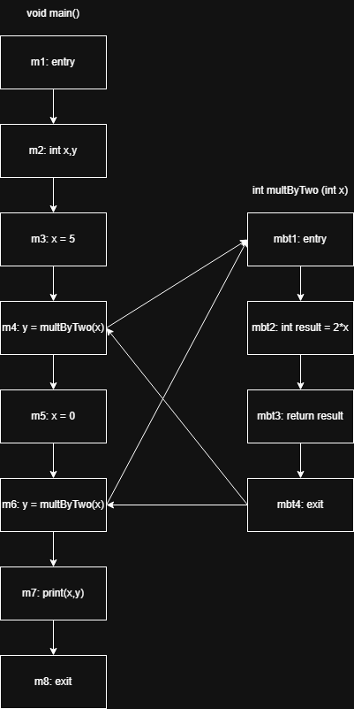
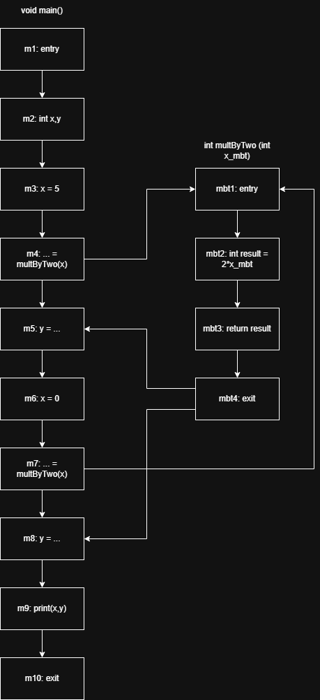
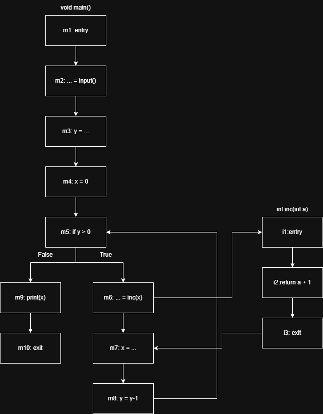
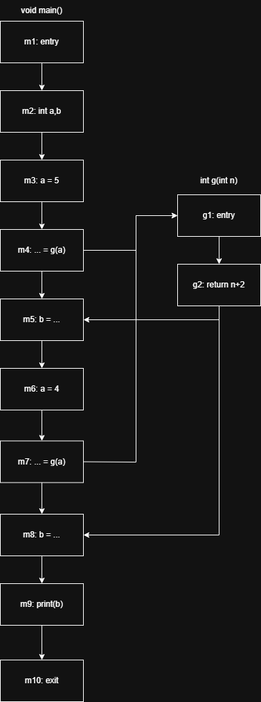
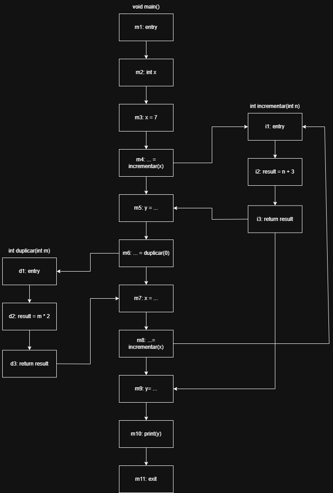

# Ejercicio 1 
Si no consideramos llamados y retornos el cfg seria: 

| Nodo n | IN[n]                        | OUT[n]                       |
|--------|------------------------------|------------------------------|
| m1     | -                            | $\left\lbrace x \to \bot, y \to \bot \right\rbrace$ |
| m2     | $\left\lbrace x \to \bot, y \to \bot \right\rbrace$ | $\left\lbrace x \to \top, y \to \top \right\rbrace$ |
| m3     | $\left\lbrace x \to \top, y \to \top \right\rbrace$ | $\left\lbrace x \to >, y \to \top \right\rbrace$    |
| m4     | $\left\lbrace x \to >, y \to \top \right\rbrace$    | $\left\lbrace x \to >, y \to \top \right\rbrace$    |
| m5     | $\left\lbrace x \to >, y \to \top \right\rbrace$    | $\left\lbrace x \to 0, y \to \top \right\rbrace$    |
| m6     | $\left\lbrace x \to 0, y \to \top \right\rbrace$    | $\left\lbrace x \to 0, y \to \top \right\rbrace$    |
| m7     | $\left\lbrace x \to 0, y \to \top \right\rbrace$    | $\left\lbrace x \to 0, y \to \top \right\rbrace$    |
| m8     | $\left\lbrace x \to 0, y \to \top \right\rbrace$    | -                            |

Asumo que print no modifica los parametros x e y, si lo hiciera habria que cambiar x a $\top$. 

Si ahora si consideramos los llamados y retornos del cfg: 

Ahora considerando llamados y retornos pero sin cloning: 
| Iteracion | Nodo n | IN[n]                                                                                           | OUT[n]                                       |
|-----------|--------|-------------------------------------------------------------------------------------------------|----------------------------------------------|
| 1         | m1     | -                                                                                               | $\left\lbrace x \to \bot, y \to \bot \right\rbrace$                 |
| 1         | m2     | $\left\lbrace x \to \bot, y \to \bot \right\rbrace$                                                                    | $\left\lbrace x \to \top, y \to \top \right\rbrace$                 |
| 1         | m3     | $\left\lbrace x \to \top, y \to \top \right\rbrace$                                                                    | $\left\lbrace x \to +, y \to \top \right\rbrace$                    |
| 1         | m4     | $\left\lbrace x \to +, y \to \top \right\rbrace$                                                                       | $\left\lbrace x \to +, y \to \top \right\rbrace$                    |
| 1         | mbt_11 | $\left\lbrace x_mbt \to +, \text{result} \to \bot \right\rbrace$ $\sqcup$ $\left\lbrace x_mbt \to \bot, \text{result} \to \bot \right\rbrace$ | $\left\lbrace x_mbt \to +, \text{result} \to \bot \right\rbrace$    |
| 1         | mbt_21 | $\left\lbrace x_mbt \to +, \text{result} \to \bot \right\rbrace$                                                       | $\left\lbrace x_mbt \to +, \text{result} \to + \right\rbrace$       |
| 1         | mbt_31 | $\left\lbrace x_mbt \to +, \text{result} \to + \right\rbrace$                                                          | $\left\lbrace x_mbt \to +, \text{result} \to + \right\rbrace$       |
| 1         | mbt_41 | $\left\lbrace x_mbt \to +, \text{result} \to + \right\rbrace$                                                          | $\left\lbrace x_mbt \to +, \text{result} \to + \right\rbrace$       |
| 1         | m5     | $\left\lbrace x \to +, y \to \top \right\rbrace$                                                                       | $\left\lbrace x \to +, y \to + \right\rbrace$                       |
| 1         | m6     | $\left\lbrace x \to +, y \to \top \right\rbrace$                                                                       | $\left\lbrace x \to 0, y \to + \right\rbrace$                       |
| 1         | m7     | $\left\lbrace x \to 0, y \to + \right\rbrace$                                                                          | $\left\lbrace x \to 0, y \to + \right\rbrace$                       |
| 1         | mbt_12 | $\left\lbrace x_mbt \to +, \text{result} \to \bot \right\rbrace$ $\sqcup$ $\left\lbrace x_mbt \to 0, \text{result} \to \bot \right\rbrace$    | $\left\lbrace x_mbt \to \top, \text{result} \to \bot \right\rbrace$ |
| 1         | mbt_22 | $\left\lbrace x_mbt \to \top, \text{result} \to \bot \right\rbrace$                                                    | $\left\lbrace x_mbt \to \top, \text{result} \to \top \right\rbrace$ |
| 1         | mbt_32 | $\left\lbrace x_mbt \to \top, \text{result} \to \bot \right\rbrace$                                                    | $\left\lbrace x_mbt \to \top, \text{result} \to \top \right\rbrace$ |
| 1         | mbt_42 | $\left\lbrace x_mbt \to \top, \text{result} \to \bot \right\rbrace$                                                    | $\left\lbrace x_mbt \to \top, \text{result} \to \top \right\rbrace$ |
| 1         | m8     | $\left\lbrace x \to 0, y \to + \right\rbrace$                                                                          | $\left\lbrace x \to 0, y \to \top \right\rbrace$                    |
| 1         | m9     | $\left\lbrace x \to 0, y \to \top \right\rbrace$                                                                       | $\left\lbrace x \to 0, y \to \top \right\rbrace$                    |
| 1         | m10    | $\left\lbrace x \to 0, y \to \top \right\rbrace$                                                                       | -                                            |
| 2         | m1     | -                                                                                               | $\left\lbrace x \to \bot, y \to \bot \right\rbrace$                 |
| 2         | m2     | $\left\lbrace x \to \bot, y \to \bot \right\rbrace$                                                                    | $\left\lbrace x \to \top, y \to \top \right\rbrace$                 |
| 2         | m3     | $\left\lbrace x \to \top, y \to \top \right\rbrace$                                                                    | $\left\lbrace x \to +, y \to \top \right\rbrace$                    |
| 2         | m4     | $\left\lbrace x \to +, y \to \top \right\rbrace$                                                                       | $\left\lbrace x \to +, y \to \top \right\rbrace$                    |
| 2         | mbt_11 | $\left\lbrace x_mbt \to +, \text{result} \to \bot \right\rbrace$ $\sqcup$ $\left\lbrace x_mbt \to 0, \text{result} \to \bot \right\rbrace$    | $\left\lbrace x_mbt \to \top, \text{result} \to \bot \right\rbrace$ |
| 2         | mbt_21 | $\left\lbrace x_mbt \to \top, \text{result} \to \bot \right\rbrace$                                                    | $\left\lbrace x_mbt \to \top, \text{result} \to \top \right\rbrace$ |
| 2         | mbt_31 | $\left\lbrace x_mbt \to \top, \text{result} \to \top \right\rbrace$                                                    | $\left\lbrace x_mbt \to \top, \text{result} \to \top \right\rbrace$ |
| 2         | mbt_41 | $\left\lbrace x_mbt \to \top, \text{result} \to \top \right\rbrace$                                                    | $\left\lbrace x_mbt \to \top, \text{result} \to \top \right\rbrace$ |
| 2         | m5     | $\left\lbrace x \to +, y \to \top \right\rbrace$                                                                       | $\left\lbrace x \to +, y \to \top \right\rbrace$                    |
| 2         | m6     | $\left\lbrace x \to +, y \to \top \right\rbrace$                                                                       | $\left\lbrace x \to 0, y \to \top \right\rbrace$                    |
| 2         | m7     | $\left\lbrace x \to 0, y \to \top \right\rbrace$                                                                       | $\left\lbrace x \to 0, y \to \top \right\rbrace$                    |
| 2         | mbt_12 | $\left\lbrace x_mbt \to +, \text{result} \to \bot \right\rbrace$ $\sqcup$ $\left\lbrace x_mbt \to 0, \text{result} \to \bot \right\rbrace$    | $\left\lbrace x_mbt \to \top, \text{result} \to \bot \right\rbrace$ |
| 2         | mbt_22 | $\left\lbrace x_mbt \to \top, \text{result} \to \bot \right\rbrace$                                                    | $\left\lbrace x_mbt \to \top, \text{result} \to \top \right\rbrace$ |
| 2         | mbt_32 | $\left\lbrace x_mbt \to \top, \text{result} \to \bot \right\rbrace$                                                    | $\left\lbrace x_mbt \to \top, \text{result} \to \top \right\rbrace$ |
| 2         | mbt_42 | $\left\lbrace x_mbt \to \top, \text{result} \to \bot \right\rbrace$                                                    | $\left\lbrace x_mbt \to \top, \text{result} \to \top \right\rbrace$ |
| 2         | m8     | $\left\lbrace x \to 0, y \to + \right\rbrace$                                                                          | $\left\lbrace x \to 0, y \to \top \right\rbrace$                    |
| 2         | m9     | $\left\lbrace x \to 0, y \to \top \right\rbrace$                                                                       | $\left\lbrace x \to 0, y \to \top \right\rbrace$                    |
| 2         | m10    | $\left\lbrace x \to 0, y \to \top \right\rbrace$                                                                       | -                                            |

Entonces la tabla final queda: 

| Nodo n | IN[n]                                                                                        | OUT[n]                                       |
|--------|----------------------------------------------------------------------------------------------|----------------------------------------------|
| m1     | -                                                                                            | $\left\lbrace x \to \bot, y \to \bot \right\rbrace$                 |
| m2     | $\left\lbrace x \to \bot, y \to \bot \right\rbrace$                                                                 | $\left\lbrace x \to \top, y \to \top \right\rbrace$                 |
| m3     | $\left\lbrace x \to \top, y \to \top \right\rbrace$                                                                 | $\left\lbrace x \to +, y \to \top \right\rbrace$                    |
| m4     | $\left\lbrace x \to +, y \to \top \right\rbrace$                                                                    | $\left\lbrace x \to +, y \to \top \right\rbrace$                    |
| mbt_11 | $\left\lbrace x_mbt \to +, \text{result} \to \bot \right\rbrace$ $\sqcup$ $\left\lbrace x_mbt \to 0, \text{result} \to \bot \right\rbrace$ | $\left\lbrace x_mbt \to \top, \text{result} \to \bot \right\rbrace$ |
| mbt_21 | $\left\lbrace x_mbt \to \top, \text{result} \to \bot \right\rbrace$                                                 | $\left\lbrace x_mbt \to \top, \text{result} \to \top \right\rbrace$ |
| mbt_31 | $\left\lbrace x_mbt \to \top, \text{result} \to \top \right\rbrace$                                                 | $\left\lbrace x_mbt \to \top, \text{result} \to \top \right\rbrace$ |
| mbt_41 | $\left\lbrace x_mbt \to \top, \text{result} \to \top \right\rbrace$                                                 | $\left\lbrace x_mbt \to \top, \text{result} \to \top \right\rbrace$ |
| m5     | $\left\lbrace x \to +, y \to \top \right\rbrace$                                                                    | $\left\lbrace x \to +, y \to \top \right\rbrace$                    |
| m6     | $\left\lbrace x \to +, y \to \top \right\rbrace$                                                                    | $\left\lbrace x \to 0, y \to \top \right\rbrace$                    |
| m7     | $\left\lbrace x \to 0, y \to \top \right\rbrace$                                                                    | $\left\lbrace x \to 0, y \to \top \right\rbrace$                    |
| mbt_12 | $\left\lbrace x_mbt \to +, \text{result} \to \bot \right\rbrace$ $\sqcup$ $\left\lbrace x_mbt \to 0, \text{result} \to \bot \right\rbrace$ | $\left\lbrace x_mbt \to \top, \text{result} \to \bot \right\rbrace$ |
| mbt_22 | $\left\lbrace x_mbt \to \top, \text{result} \to \bot \right\rbrace$                                                 | $\left\lbrace x_mbt \to \top, \text{result} \to \top \right\rbrace$ |
| mbt_32 | $\left\lbrace x_mbt \to \top, \text{result} \to \bot \right\rbrace$                                                 | $\left\lbrace x_mbt \to \top, \text{result} \to \top \right\rbrace$ |
| mbt_42 | $\left\lbrace x_mbt \to \top, \text{result} \to \bot \right\rbrace$                                                 | $\left\lbrace x_mbt \to \top, \text{result} \to \top \right\rbrace$ |
| m8     | $\left\lbrace x \to 0, y \to + \right\rbrace$                                                                       | $\left\lbrace x \to 0, y \to \top \right\rbrace$                    |
| m9     | $\left\lbrace x \to 0, y \to \top \right\rbrace$                                                                    | $\left\lbrace x \to 0, y \to \top \right\rbrace$                    |
| m10    | $\left\lbrace x \to 0, y \to \top \right\rbrace$                                                                    | -                                            |

La entrada para `print(x,y)` es $x \to 0, y \to \top$.

Con cloning:

| Nodo n | IN[n]                                     | OUT[n]                                    |
|--------|-------------------------------------------|-------------------------------------------|
| m1     | -                                         | $\left\lbrace x \to \bot, y \to \bot \right\rbrace$              |
| m2     | $\left\lbrace x \to \bot, y \to \bot \right\rbrace$              | $\left\lbrace x \to \top, y \to \top \right\rbrace$              |
| m3     | $\left\lbrace x \to \top, y \to \top \right\rbrace$              | $\left\lbrace x \to >, y \to \top \right\rbrace$                 |
| m4     | $\left\lbrace x \to >, y \to \top \right\rbrace$                 | $\left\lbrace x \to >, y \to \top \right\rbrace$                 |
| mbt_11 | $\left\lbrace x_{m1} \to >, \text{res}_1 \to \bot \right\rbrace$ | $\left\lbrace x_{m1} \to >, \text{res}_1 \to \bot \right\rbrace$ |
| mbt_12 | $\left\lbrace x_{m1} \to >, \text{res}_1 \to \bot \right\rbrace$ | $\left\lbrace x_{m1} \to >, \text{res}_1 \to > \right\rbrace$    |
| mbt_13 | $\left\lbrace x_{m1} \to >, \text{res}_1 \to > \right\rbrace$    | $\left\lbrace x_{m1} \to >, \text{res}_1 \to > \right\rbrace$    |
| mbt_14 | $\left\lbrace x_{m1} \to >, \text{res}_1 \to > \right\rbrace$    | $\left\lbrace x_{m1} \to >, \text{res}_1 \to > \right\rbrace$    |
| m5     | $\left\lbrace x \to >, y \to \top \right\rbrace$                 | $\left\lbrace x \to >, y \to > \right\rbrace$                    |
| m6     | $\left\lbrace x \to >, y \to > \right\rbrace$                    | $\left\lbrace x \to 0, y \to > \right\rbrace$                    |
| m7     | $\left\lbrace x \to 0, y \to > \right\rbrace$                    | $\left\lbrace x \to 0, y \to > \right\rbrace$                    |
| mbt_21 | $\left\lbrace x_{m2} \to 0, \text{res}_2 \to \bot \right\rbrace$ | $\left\lbrace x_{m1} \to 0, \text{res}_2 \to \bot \right\rbrace$ |
| mbt_22 | $\left\lbrace x_{m2} \to 0, \text{res}_2 \to \bot \right\rbrace$ | $\left\lbrace x_{m1} \to 0, \text{res}_2 \to 0 \right\rbrace$    |
| mbt_23 | $\left\lbrace x_{m2} \to 0, \text{res}_2 \to \bot \right\rbrace$ | $\left\lbrace x_{m1} \to 0, \text{res}_2 \to 0 \right\rbrace$    |
| mbt_24 | $\left\lbrace x_{m2} \to 0, \text{res}_2 \to \bot \right\rbrace$ | $\left\lbrace x_{m1} \to 0, \text{res}_2 \to 0 \right\rbrace$    |
| m8     | $\left\lbrace x \to 0, y \to > \right\rbrace$                    | $\left\lbrace x \to 0, y \to 0 \right\rbrace$                    |
| m9     | $\left\lbrace x \to 0, y \to 0 \right\rbrace$                    | $\left\lbrace x \to 0, y \to 0 \right\rbrace$                    |
| m10    | $\left\lbrace x \to 0, y \to 0 \right\rbrace$                    | -                                         |

Con  cadenas de llamadas con k=1
| Iteracion | Nodo n | IN[n]                                                                                                                   | OUT[n]                                                                                                                  |
|-----------|--------|-------------------------------------------------------------------------------------------------------------------------|-------------------------------------------------------------------------------------------------------------------------|
| 1         | m1     | -                                                                                                                       | $\epsilon \to \left\lbrace x \to \bot, y \to \bot \right\rbrace, c_1 \to \text{unreach}, c_2 \to \text{unreach}$                               |
| 1         | m2     | $\epsilon \to \left\lbrace x \to \bot, y \to \bot \right\rbrace, c_1 \to \text{unreach}, c_2 \to \text{unreach}$                               | $\epsilon \to \left\lbrace x \to \top, y \to \top \right\rbrace, c_1 \to \text{unreach}, c_2 \to \text{unreach}$                               |
| 1         | m3     | $\epsilon \to \left\lbrace x \to \top, y \to \top \right\rbrace, c_1 \to \text{unreach}, c_2 \to \text{unreach}$                               | $\epsilon \to \left\lbrace x \to +, y \to \top \right\rbrace, c_1 \to \text{unreach}, c_2 \to \text{unreach}$                                  |
| 1         | m4     | $\epsilon \to \left\lbrace x \to +, y \to \top \right\rbrace, c_1 \to \text{unreach}, c_2 \to \text{unreach}$                                  | $\epsilon \to \left\lbrace x \to +, y \to \top \right\rbrace, c_1 \to \text{unreach}, c_2 \to \text{unreach}$                                  |
| 1         | mbt_1  | $\epsilon \to \text{unreach}, c_1 \to \left\lbrace x \to +, \text{result} \to \bot \right\rbrace, c_2 \to \text{unreach}$                      | $\epsilon \to \text{unreach}, c_1 \to \left\lbrace x \to +, \text{result} \to \bot \right\rbrace, c_2 \to \text{unreach}$                      |
| 1         | mbt_2  | $\epsilon \to \text{unreach}, c_1 \to \left\lbrace x \to +, \text{result} \to \bot \right\rbrace, c_2 \to \text{unreach}$                      | $\epsilon \to \text{unreach}, c_1 \to \left\lbrace x \to +, \text{result} \to + \right\rbrace, c_2 \to \text{unreach}$                         |
| 1         | mbt_3  | $\epsilon \to \text{unreach}, c_1 \to \left\lbrace x \to +, \text{result} \to + \right\rbrace, c_2 \to \text{unreach}$                         | $\epsilon \to \text{unreach}, c_1 \to \left\lbrace x \to +, \text{result} \to + \right\rbrace, c_2 \to \text{unreach}$                         |
| 1         | mbt_4  | $\epsilon \to \text{unreach}, c_1 \to \left\lbrace x \to +, \text{result} \to + \right\rbrace, c_2 \to \text{unreach}$                         | $\epsilon \to \text{unreach}, c_1 \to \left\lbrace x \to +, \text{result} \to + \right\rbrace, c_2 \to \text{unreach}$                         |
| 1         | m5     | $\epsilon \to \left\lbrace x \to +, y \to \top \right\rbrace, c_1 \to \text{unreach}, c_2 \to \text{unreach}$                                  | $\epsilon \to \left\lbrace x \to +, y \to + \right\rbrace, c_1 \to \text{unreach}, c_2 \to \text{unreach}$                                     |
| 1         | m6     | $\epsilon \to \left\lbrace x \to +, y \to + \right\rbrace, c_1 \to \text{unreach}, c_2 \to \text{unreach}$                                     | $\epsilon \to \left\lbrace x \to Z, y \to + \right\rbrace, c_1 \to \text{unreach}, c_2 \to \text{unreach}$                                     |
| 1         | m7     | $\epsilon \to \left\lbrace x \to Z, y \to + \right\rbrace, c_1 \to \text{unreach}, c_2 \to \text{unreach}$                                     | $\epsilon \to \left\lbrace x \to Z, y \to + \right\rbrace, c_1 \to \text{unreach}, c_2 \to \text{unreach}$                                     |
| 1         | m8     | $\epsilon \to \left\lbrace x \to Z, y \to + \right\rbrace, c_1 \to \text{unreach}, c_2 \to \text{unreach}$                                     | $\epsilon \to \text{unreach}, c_1 \to \text{unreach}, c_2 \to \text{unreach}$                                           |
| 1         | m9     | $\epsilon \to \text{unreach}, c_1 \to \text{unreach}, c_2 \to \text{unreach}$                                           | $\epsilon \to \text{unreach}, c_1 \to \text{unreach}, c_2 \to \text{unreach}$                                           |
| 1         | m10    | $\epsilon \to \text{unreach}, c_1 \to \text{unreach}, c_2 \to \text{unreach}$                                           | -                                                                                                                       |
| 2         | m1     | -                                                                                                                       | $\epsilon \to \left\lbrace x \to \bot, y \to \bot \right\rbrace, c_1 \to \text{unreach}, c_2 \to \text{unreach}$                               |
| 2         | m2     | $\epsilon \to \left\lbrace x \to \bot, y \to \bot \right\rbrace, c_1 \to \text{unreach}, c_2 \to \text{unreach}$                               | $\epsilon \to \left\lbrace x \to \top, y \to \top \right\rbrace, c_1 \to \text{unreach}, c_2 \to \text{unreach}$                               |
| 2         | m3     | $\epsilon \to \left\lbrace x \to \top, y \to \top \right\rbrace, c_1 \to \text{unreach}, c_2 \to \text{unreach}$                               | $\epsilon \to \left\lbrace x \to +, y \to \top \right\rbrace, c_1 \to \text{unreach}, c_2 \to \text{unreach}$                                  |
| 2         | m4     | $\epsilon \to \left\lbrace x \to +, y \to \top \right\rbrace, c_1 \to \text{unreach}, c_2 \to \text{unreach}$                                  | $\epsilon \to \left\lbrace x \to +, y \to \top \right\rbrace, c_1 \to \text{unreach}, c_2 \to \text{unreach}$                                  |
| 2         | mbt_1  | $\epsilon \to \text{unreach}, c_1 \to \left\lbrace x \to +, \text{result} \to \bot \right\rbrace, c_2 \to \left\lbrace x \to Z, \text{result} \to \bot \right\rbrace$ | $\epsilon \to \text{unreach}, c_1 \to \left\lbrace x \to +, \text{result} \to \bot \right\rbrace, c_2 \to \left\lbrace x \to Z, \text{result} \to \bot \right\rbrace$ |
| 2         | mbt_2  | $\epsilon \to \text{unreach}, c_1 \to \left\lbrace x \to +, \text{result} \to \bot \right\rbrace, c_2 \to \left\lbrace x \to Z, \text{result} \to \bot \right\rbrace$ | $\epsilon \to \text{unreach}, c_1 \to \left\lbrace x \to +, \text{result} \to + \right\rbrace, c_2 \to \left\lbrace x \to Z, \text{result} \to Z \right\rbrace$       |
| 2         | mbt_3  | $\epsilon \to \text{unreach}, c_1 \to \left\lbrace x \to +, \text{result} \to \bot \right\rbrace, c_2 \to \left\lbrace x \to Z, \text{result} \to Z \right\rbrace$    | $\epsilon \to \text{unreach}, c_1 \to \left\lbrace x \to +, \text{result} \to \bot \right\rbrace, c_2 \to \left\lbrace x \to Z, \text{result} \to Z \right\rbrace$    |
| 2         | mbt_4  | $\epsilon \to \text{unreach}, c_1 \to \left\lbrace x \to +, \text{result} \to \bot \right\rbrace, c_2 \to \left\lbrace x \to Z, \text{result} \to Z \right\rbrace$    | $\epsilon \to \text{unreach}, c_1 \to \left\lbrace x \to +, \text{result} \to \bot \right\rbrace, c_2 \to \left\lbrace x \to Z, \text{result} \to Z \right\rbrace$    |
| 2         | m5     | $\epsilon \to \left\lbrace x \to +, y \to \top \right\rbrace, c_1 \to \text{unreach}, c_2 \to \text{unreach}$                                  | $\epsilon \to \left\lbrace x \to +, y \to + \right\rbrace, c_1 \to \text{unreach}, c_2 \to \text{unreach}$                                     |
| 2         | m6     | $\epsilon \to \left\lbrace x \to +, y \to + \right\rbrace, c_1 \to \text{unreach}, c_2 \to \text{unreach}$                                     | $\epsilon \to \left\lbrace x \to Z, y \to + \right\rbrace, c_1 \to \text{unreach}, c_2 \to \text{unreach}$                                     |
| 2         | m7     | $\epsilon \to \left\lbrace x \to Z, y \to + \right\rbrace, c_1 \to \text{unreach}, c_2 \to \text{unreach}$                                     | $\epsilon \to \left\lbrace x \to Z, y \to + \right\rbrace, c_1 \to \text{unreach}, c_2 \to \text{unreach}$                                     |
| 2         | m8     | $\epsilon \to \left\lbrace x \to Z, y \to + \right\rbrace, c_1 \to \text{unreach}, c_2 \to \text{unreach}$                                     | $\epsilon \to \left\lbrace x \to Z, y \to Z \right\rbrace, c_1 \to \text{unreach}, c_2 \to \text{unreach}$                                     |
| 2         | m9     | $\epsilon \to \left\lbrace x \to Z, y \to Z \right\rbrace, c_1 \to \text{unreach}, c_2 \to \text{unreach}$                                     | $\epsilon \to \left\lbrace x \to Z, y \to Z \right\rbrace, c_1 \to \text{unreach}, c_2 \to \text{unreach}$                                     |
| 2         | m10    | $\epsilon \to \left\lbrace x \to Z, y \to Z \right\rbrace, c_1 \to \text{unreach}, c_2 \to \text{unreach}$                                     | -                                                                                                                       |

Con contextos funcionales: 

| Nodo n | IN[n]                                                                                                                                                                                                                                                                     | OUT[n]                                                                                                                                                                                                                                                                    |
|--------|---------------------------------------------------------------------------------------------------------------------------------------------------------------------------------------------------------------------------------------------------------------------------|---------------------------------------------------------------------------------------------------------------------------------------------------------------------------------------------------------------------------------------------------------------------------|
| m1     | -                                                                                                                                                                                                                                                                         | $\left\lbrace x \to \bot, y \to \bot \right\rbrace \to \left\lbrace x \to \bot, y \to \bot \right\rbrace, \ldots \to \text{unreach}$                                                                                                                                    |
| m2     | $\left\lbrace x \to \bot, y \to \bot \right\rbrace \to \left\lbrace x \to \bot, y \to \bot \right\rbrace, \ldots \to \text{unreach}$                                                                                                                                    | $\left\lbrace x \to \bot, y \to \bot \right\rbrace \to \left\lbrace x \to \bot, y \to \bot \right\rbrace, \ldots \to \text{unreach}$                                                                                                                                    |
| m3     | $\left\lbrace x \to \bot, y \to \bot \right\rbrace \to \left\lbrace x \to \bot, y \to \bot \right\rbrace, \ldots \to \text{unreach}$                                                                                                                                    | $\left\lbrace x \to \bot, y \to \bot \right\rbrace \to \left\lbrace x \to +, y \to \bot \right\rbrace, \ldots \to \text{unreach}$                                                                                                                                       |
| m4     | $\left\lbrace x \to \bot, y \to \bot \right\rbrace \to \left\lbrace x \to +, y \to \bot \right\rbrace, \ldots \to \text{unreach}$                                                                                                                                       | $\left\lbrace x \to \bot, y \to \bot \right\rbrace \to \left\lbrace x \to +, y \to \bot \right\rbrace, \ldots \to \text{unreach}$                                                                                                                                       |
| mbt_11 | $\left\lbrace x \to +, \text{res} \to \bot \right\rbrace \to \left\lbrace x \to +, \text{res} \to \bot \right\rbrace, \ldots \to \text{unreach}$                                                                                                                        | $\left\lbrace x \to +, \text{res} \to \bot \right\rbrace \to \left\lbrace x \to +, \text{res} \to \bot \right\rbrace, \ldots \to \text{unreach}$                                                                                                                        |
| mbt_12 | $\left\lbrace x \to +, \text{res} \to \bot \right\rbrace \to \left\lbrace x \to +, \text{res} \to \bot \right\rbrace, \ldots \to \text{unreach}$                                                                                                                        | $\left\lbrace x \to +, \text{res} \to \bot \right\rbrace \to \left\lbrace x \to +, \text{res} \to + \right\rbrace, \ldots \to \text{unreach}$                                                                                                                           |
| mbt_13 | $\left\lbrace x \to +, \text{res} \to \bot \right\rbrace \to \left\lbrace x \to +, \text{res} \to + \right\rbrace, \ldots \to \text{unreach}$                                                                                                                           | $\left\lbrace x \to +, \text{res} \to \bot \right\rbrace \to \left\lbrace x \to +, \text{res} \to + \right\rbrace, \ldots \to \text{unreach}$                                                                                                                           |
| mbt_14 | $\left\lbrace x \to +, \text{res} \to \bot \right\rbrace \to \left\lbrace x \to +, \text{res} \to + \right\rbrace, \ldots \to \text{unreach}$                                                                                                                           | $\left\lbrace x \to +, \text{res} \to \bot \right\rbrace \to \left\lbrace x \to +, \text{res} \to + \right\rbrace, \ldots \to \text{unreach}$                                                                                                                           |
| m5     | $\left\lbrace x \to \bot, y \to \bot \right\rbrace \to \left\lbrace x \to +, y \to \bot \right\rbrace, \ldots \to \text{unreach}$                                                                                                                                       | $\left\lbrace x \to \bot, y \to \bot \right\rbrace \to \left\lbrace x \to +, y \to + \right\rbrace, \ldots \to \text{unreach}$                                                                                                                                          |
| m6     | $\left\lbrace x \to \bot, y \to \bot \right\rbrace \to \left\lbrace x \to +, y \to + \right\rbrace, \ldots \to \text{unreach}$                                                                                                                                          | $\left\lbrace x \to \bot, y \to \bot \right\rbrace \to \left\lbrace x \to Z, y \to + \right\rbrace, \ldots \to \text{unreach}$                                                                                                                                          |
| m7     | $\left\lbrace x \to \bot, y \to \bot \right\rbrace \to \left\lbrace x \to Z, y \to + \right\rbrace, \ldots \to \text{unreach}$                                                                                                                                          | $\left\lbrace x \to \bot, y \to \bot \right\rbrace \to \left\lbrace x \to Z, y \to + \right\rbrace, \ldots \to \text{unreach}$                                                                                                                                          |
| mbt_21 | $\left\lbrace x \to +, \text{res} \to \bot \right\rbrace \to \left\lbrace x \to +, \text{res} \to \bot \right\rbrace, \left\lbrace x \to Z, \text{res} \to \bot \right\rbrace \to \left\lbrace x \to Z, \text{res} \to \bot \right\rbrace, \ldots \to \text{unreach}$ | $\left\lbrace x \to +, \text{res} \to \bot \right\rbrace \to \left\lbrace x \to +, \text{res} \to \bot \right\rbrace, \left\lbrace x \to Z, \text{res} \to \bot \right\rbrace \to \left\lbrace x \to Z, \text{res} \to \bot \right\rbrace, \ldots \to \text{unreach}$ |
| mbt_22 | $\left\lbrace x \to +, \text{res} \to \bot \right\rbrace \to \left\lbrace x \to +, \text{res} \to \bot \right\rbrace, \left\lbrace x \to Z, \text{res} \to \bot \right\rbrace \to \left\lbrace x \to Z, \text{res} \to \bot \right\rbrace, \ldots \to \text{unreach}$ | $\left\lbrace x \to +, \text{res} \to \bot \right\rbrace \to \left\lbrace x \to +, \text{res} \to + \right\rbrace, \left\lbrace x \to Z, \text{res} \to \bot \right\rbrace \to \left\lbrace x \to Z, \text{res} \to Z \right\rbrace, \ldots \to \text{unreach}$       |
| mbt_23 | $\left\lbrace x \to +, \text{res} \to \bot \right\rbrace \to \left\lbrace x \to +, \text{res} \to + \right\rbrace, \left\lbrace x \to Z, \text{res} \to \bot \right\rbrace \to \left\lbrace x \to Z, \text{res} \to Z \right\rbrace, \ldots \to \text{unreach}$       | $\left\lbrace x \to +, \text{res} \to \bot \right\rbrace \to \left\lbrace x \to +, \text{res} \to + \right\rbrace, \left\lbrace x \to Z, \text{res} \to \bot \right\rbrace \to \left\lbrace x \to Z, \text{res} \to Z \right\rbrace, \ldots \to \text{unreach}$       |
| mbt_24 | $\left\lbrace x \to +, \text{res} \to \bot \right\rbrace \to \left\lbrace x \to +, \text{res} \to + \right\rbrace, \left\lbrace x \to Z, \text{res} \to \bot \right\rbrace \to \left\lbrace x \to Z, \text{res} \to Z \right\rbrace, \ldots \to \text{unreach}$       | $\left\lbrace x \to +, \text{res} \to \bot \right\rbrace \to \left\lbrace x \to +, \text{res} \to + \right\rbrace, \left\lbrace x \to Z, \text{res} \to \bot \right\rbrace \to \left\lbrace x \to Z, \text{res} \to Z \right\rbrace, \ldots \to \text{unreach}$       |
| m8     | $\left\lbrace x \to \bot, y \to \bot \right\rbrace \to \left\lbrace x \to Z, y \to + \right\rbrace, \ldots \to \text{unreach}$                                                                                                                                          | $\left\lbrace x \to \bot, y \to \bot \right\rbrace \to \left\lbrace x \to Z, y \to Z \right\rbrace, \ldots \to \text{unreach}$                                                                                                                                          |
| m9     | $\left\lbrace x \to \bot, y \to \bot \right\rbrace \to \left\lbrace x \to Z, y \to Z \right\rbrace, \ldots \to \text{unreach}$                                                                                                                                          | $\left\lbrace x \to \bot, y \to \bot \right\rbrace \to \left\lbrace x \to Z, y \to Z \right\rbrace, \ldots \to \text{unreach}$                                                                                                                                          |
| m10    | $\left\lbrace x \to \bot, y \to \bot \right\rbrace \to \left\lbrace x \to Z, y \to Z \right\rbrace, \ldots \to \text{unreach}$                                                                                                                                          | -                                                                                                                                                                                                                                                                         |

    
# Ejercicio 2 
Modificar el codigo haria en el punto D que si solo clonamos la funcion `multByTwo`, al llegar a `multByTwo_2` la primera vez pasando por `multByTwo` llamado por el nodo `m4` se haria un supremo entre $+$ y $\bot$ que da $+$ asi que no hay problema, pero en el segundo llamado desde el nodo `m7` se haria un supremo entre $Z$ y $+$ que da $\top$, por lo que como resultado final $y \to top$. Seria el mismo caso que sin hacer cloning. 

Modificarlo en el punto E haria que como la cadena de llamadas es de tamaño 1, al llegar al entry de `multByTwo_2` haya que tambien tomar supremo entre el out de los nodos llamadores, cuando pasamos en la iteracion 1 habria que tomar el supremo entre $+$ y $\text{unreach}$ que es $+$, pero en el segundo llamado habria que tomar el supremo de $+$ y $Z$, que es $\top$. 

Con contextos funcionales como tenemos "infinitos contextos", en ningun momento hay que tomar supremo y perder presicion. 

# Ejercicio 3 

Asumiendo que `print` no modifica los valores de los parametros y que `input` devuelve $\top$, el zero análisis interprocedural usando el dominio del signo sin contextos va a ser: 

| Iteracion | Nodo n | IN[n]                        | OUT[n]                       |
|-----------|--------|------------------------------|------------------------------|
| 1         | m1     | -                            | $\left\lbrace x \to \bot, y \to \bot \right\rbrace$ |
| 1         | m2     | $\left\lbrace x \to \bot, y \to \bot \right\rbrace$ | $\left\lbrace x \to \bot, y \to \bot \right\rbrace$ |
| 1         | m3     | $\left\lbrace x \to \bot, y \to \bot \right\rbrace$ | $\left\lbrace x \to \bot, y \to \top \right\rbrace$ |
| 1         | m4     | $\left\lbrace x \to \bot, y \to \top \right\rbrace$ | $\left\lbrace x \to Z, y \to \top \right\rbrace$    |
| 1         | m5     | $\left\lbrace x \to Z, y \to \top \right\rbrace$    | $\left\lbrace x \to Z, y \to \top \right\rbrace$    |
| 1         | m6     | $\left\lbrace x \to Z, y \to \top \right\rbrace$    | $\left\lbrace x \to Z, y \to \top \right\rbrace$    |
| 1         | i1     | $\left\lbrace a \to Z \right\rbrace$                | $\left\lbrace a \to Z \right\rbrace$                |
| 1         | i2     | $\left\lbrace a \to Z \right\rbrace$                | $\left\lbrace a \to Z \right\rbrace$                |
| 1         | i3     | $\left\lbrace a \to Z \right\rbrace$                | $\left\lbrace a \to Z \right\rbrace$                |
| 1         | m7     | $\left\lbrace x \to Z, y \to \top \right\rbrace$    | $\left\lbrace x \to +, y \to \top \right\rbrace$    |
| 1         | m8     | $\left\lbrace x \to +, y \to \top \right\rbrace$    | $\left\lbrace x \to +, y \to \top \right\rbrace$    |
| 1         | m9     | $\left\lbrace x \to Z, y \to \top \right\rbrace$    | $\left\lbrace x \to Z, y \to \top \right\rbrace$    |
| 1         | m10    | $\left\lbrace x \to Z, y \to \top \right\rbrace$    | -                            |
| 2         | m1     | -                            | $\left\lbrace x \to \bot, y \to \bot \right\rbrace$ |
| 2         | m2     | $\left\lbrace x \to \bot, y \to \bot \right\rbrace$ | $\left\lbrace x \to \bot, y \to \bot \right\rbrace$ |
| 2         | m3     | $\left\lbrace x \to \bot, y \to \bot \right\rbrace$ | $\left\lbrace x \to \bot, y \to \top \right\rbrace$ |
| 2         | m4     | $\left\lbrace x \to \bot, y \to \top \right\rbrace$ | $\left\lbrace x \to Z, y \to \top \right\rbrace$    |
| 2         | m5     | $\left\lbrace x \to \top, y \to \top \right\rbrace$ | $\left\lbrace x \to \top, y \to \top \right\rbrace$ |
| 2         | m6     | $\left\lbrace x \to \top, y \to \top \right\rbrace$ | $\left\lbrace x \to \top, y \to \top \right\rbrace$ |
| 2         | i1     | $\left\lbrace a \to \top \right\rbrace$             | $\left\lbrace a \to \top \right\rbrace$             |
| 2         | i2     | $\left\lbrace a \to \top \right\rbrace$             | $\left\lbrace a \to \top \right\rbrace$             |
| 2         | i3     | $\left\lbrace a \to \top \right\rbrace$             | $\left\lbrace a \to \top \right\rbrace$             |
| 2         | m7     | $\left\lbrace x \to \top, y \to \top \right\rbrace$ | $\left\lbrace x \to \top, y \to \top \right\rbrace$ |
| 2         | m8     | $\left\lbrace x \to \top, y \to \top \right\rbrace$ | $\left\lbrace x \to \top, y \to \top \right\rbrace$ |
| 2         | m9     | $\left\lbrace x \to \top, y \to \top \right\rbrace$ | $\left\lbrace x \to \top, y \to \top \right\rbrace$ |
| 2         | m10    | $\left\lbrace x \to \top, y \to \top \right\rbrace$ | -                            |

Entonces la tabla final va a ser:

| Nodo n | IN[n]                        | OUT[n]                       |
|--------|------------------------------|------------------------------|
| m1     | -                            | $\left\lbrace x \to \bot, y \to \bot \right\rbrace$ |
| m2     | $\left\lbrace x \to \bot, y \to \bot \right\rbrace$ | $\left\lbrace x \to \bot, y \to \bot \right\rbrace$ |
| m3     | $\left\lbrace x \to \bot, y \to \bot \right\rbrace$ | $\left\lbrace x \to \bot, y \to \top \right\rbrace$ |
| m4     | $\left\lbrace x \to \bot, y \to \top \right\rbrace$ | $\left\lbrace x \to Z, y \to \top \right\rbrace$    |
| m5     | $\left\lbrace x \to \top, y \to \top \right\rbrace$ | $\left\lbrace x \to \top, y \to \top \right\rbrace$ |
| m6     | $\left\lbrace x \to \top, y \to \top \right\rbrace$ | $\left\lbrace x \to \top, y \to \top \right\rbrace$ |
| i1     | $\left\lbrace a \to \top \right\rbrace$             | $\left\lbrace a \to \top \right\rbrace$             |
| i2     | $\left\lbrace a \to \top \right\rbrace$             | $\left\lbrace a \to \top \right\rbrace$             |
| i3     | $\left\lbrace a \to \top \right\rbrace$             | $\left\lbrace a \to \top \right\rbrace$             |
| m7     | $\left\lbrace x \to \top, y \to \top \right\rbrace$ | $\left\lbrace x \to \top, y \to \top \right\rbrace$ |
| m8     | $\left\lbrace x \to \top, y \to \top \right\rbrace$ | $\left\lbrace x \to \top, y \to \top \right\rbrace$ |
| m9     | $\left\lbrace x \to \top, y \to \top \right\rbrace$ | $\left\lbrace x \to \top, y \to \top \right\rbrace$ |
| m10    | $\left\lbrace x \to \top, y \to \top \right\rbrace$ | -                            |

Con cloning, nodos llamadores y contextos funcionales la tabla se veria igual paso a paso, la diferencia si es con contextos es que tendriamos antes apuntando los contextos a los mappings de variables a estados abstractos. 

# Ejercicio 4 

| Iteracion | Nodo n | IN[n]                      | OUT[n]                     |
|-----------|--------|----------------------------|----------------------------|
| 1         | m1     | -                          | $\left\lbrace a \to \bot, b \to \bot \right\rbrace$ |
| 1         | m2     | $\left\lbrace a \to \bot, b \to \bot \right\rbrace$ | $\left\lbrace a \to \top, b \to \top \right\rbrace$ |
| 1         | m3     | $\left\lbrace a \to \top, b \to \top \right\rbrace$ | $\left\lbrace a \to I, b \to \top \right\rbrace$    |
| 1         | m4     | $\left\lbrace a \to I, b \to \top \right\rbrace$    | $\left\lbrace a \to I, b \to \top \right\rbrace$    |
| 1         | g1     | $\left\lbrace n \to I \right\rbrace$                | $\left\lbrace n \to I \right\rbrace$                |
| 1         | g2     | $\left\lbrace n \to I \right\rbrace$                | $\left\lbrace n \to I \right\rbrace$                |
| 1         | m5     | $\left\lbrace a \to I, b \to \top \right\rbrace$    | $\left\lbrace a \to I, b \to I \right\rbrace$       |
| 1         | m6     | $\left\lbrace a \to I, b \to I \right\rbrace$       | $\left\lbrace a \to P, b \to I \right\rbrace$       |
| 1         | m7     | $\left\lbrace a \to P, b \to I \right\rbrace$       | $\left\lbrace a \to P, b \to I \right\rbrace$       |
| 1         | g1     | $\left\lbrace n \to \top \right\rbrace$             | $\left\lbrace n \to \top \right\rbrace$             |
| 1         | g2     | $\left\lbrace n \to \top \right\rbrace$             | $\left\lbrace n \to \top \right\rbrace$             |
| 1         | m8     | $\left\lbrace a \to P, b \to I \right\rbrace$       | $\left\lbrace a \to P, b \to \top \right\rbrace$    |
| 1         | m9     | $\left\lbrace a \to P, b \to \top \right\rbrace$    | $\left\lbrace a \to P, b \to \top \right\rbrace$    |
| 1         | m10    | $\left\lbrace a \to P, b \to \top \right\rbrace$    | -                          |
| 2         | m1     | -                          | $\left\lbrace a \to \bot, b \to \bot \right\rbrace$ |
| 2         | m2     | $\left\lbrace a \to \bot, b \to \bot \right\rbrace$ | $\left\lbrace a \to \top, b \to \top \right\rbrace$ |
| 2         | m3     | $\left\lbrace a \to \top, b \to \top \right\rbrace$ | $\left\lbrace a \to I, b \to \top \right\rbrace$    |
| 2         | m4     | $\left\lbrace a \to I, b \to \top \right\rbrace$    | $\left\lbrace a \to I, b \to \top \right\rbrace$    |
| 2         | g1     | $\left\lbrace n \to \top \right\rbrace$             | $\left\lbrace n \to \top \right\rbrace$             |
| 2         | g2     | $\left\lbrace n \to \top \right\rbrace$             | $\left\lbrace n \to \top \right\rbrace$             |
| 2         | m5     | $\left\lbrace a \to I, b \to \top \right\rbrace$    | $\left\lbrace a \to I, b \to \top \right\rbrace$    |
| 2         | m6     | $\left\lbrace a \to I, b \to \top \right\rbrace$    | $\left\lbrace a \to P, b \to \top \right\rbrace$    |
| 2         | m7     | $\left\lbrace a \to P, b \to \top \right\rbrace$    | $\left\lbrace a \to P, b \to \top \right\rbrace$    |
| 2         | g1     | $\left\lbrace n \to \top \right\rbrace$             | $\left\lbrace n \to \top \right\rbrace$             |
| 2         | g2     | $\left\lbrace n \to \top \right\rbrace$             | $\left\lbrace n \to \top \right\rbrace$             |
| 2         | m8     | $\left\lbrace a \to P, b \to I \right\rbrace$       | $\left\lbrace a \to P, b \to \top \right\rbrace$    |
| 2         | m9     | $\left\lbrace a \to P, b \to \top \right\rbrace$    | $\left\lbrace a \to P, b \to \top \right\rbrace$    |
| 2         | m10    | $\left\lbrace a \to P, b \to \top \right\rbrace$    | -                          |

Entonces la tabla final queda: 

| Nodo n | IN[n]                      | OUT[n]                     |
|--------|----------------------------|----------------------------|
| m1     | -                          | $\left\lbrace a \to \bot, b \to \bot \right\rbrace$ |
| m2     | $\left\lbrace a \to \bot, b \to \bot \right\rbrace$ | $\left\lbrace a \to \top, b \to \top \right\rbrace$ |
| m3     | $\left\lbrace a \to \top, b \to \top \right\rbrace$ | $\left\lbrace a \to I, b \to \top \right\rbrace$    |
| m4     | $\left\lbrace a \to I, b \to \top \right\rbrace$    | $\left\lbrace a \to I, b \to \top \right\rbrace$    |
| g1     | $\left\lbrace n \to \top \right\rbrace$             | $\left\lbrace n \to \top \right\rbrace$             |
| g2     | $\left\lbrace n \to \top \right\rbrace$             | $\left\lbrace n \to \top \right\rbrace$             |
| m5     | $\left\lbrace a \to I, b \to \top \right\rbrace$    | $\left\lbrace a \to I, b \to \top \right\rbrace$    |
| m6     | $\left\lbrace a \to I, b \to \top \right\rbrace$    | $\left\lbrace a \to P, b \to \top \right\rbrace$    |
| m7     | $\left\lbrace a \to P, b \to \top \right\rbrace$    | $\left\lbrace a \to P, b \to \top \right\rbrace$    |
| g1     | $\left\lbrace n \to \top \right\rbrace$             | $\left\lbrace n \to \top \right\rbrace$             |
| g2     | $\left\lbrace n \to \top \right\rbrace$             | $\left\lbrace n \to \top \right\rbrace$             |
| m8     | $\left\lbrace a \to P, b \to I \right\rbrace$       | $\left\lbrace a \to P, b \to \top \right\rbrace$    |
| m9     | $\left\lbrace a \to P, b \to \top \right\rbrace$    | $\left\lbrace a \to P, b \to \top \right\rbrace$    |
| m10    | $\left\lbrace a \to P, b \to \top \right\rbrace$    | -                          |

Usando cadenas de llamadas con $k = 1$: 

| Iteracion | Nodo n | IN[n]                                                                                     | OUT[n]                                                                                    |
|-----------|--------|-------------------------------------------------------------------------------------------|-------------------------------------------------------------------------------------------|
| 1         | m1     | -                                                                                         | $\epsilon \to \left\lbrace a \to \bot, b \to \bot \right\rbrace, c_1 \to \text{unreach}, c_2 \to \text{unreach}$ |
| 1         | m2     | $\epsilon \to \left\lbrace a \to \bot, b \to \bot \right\rbrace, c_1 \to \text{unreach}, c_2 \to \text{unreach}$ | $\epsilon \to \left\lbrace a \to \top, b \to \top \right\rbrace, c_1 \to \text{unreach}, c_2 \to \text{unreach}$ |
| 1         | m3     | $\epsilon \to \left\lbrace a \to \top, b \to \top \right\rbrace, c_1 \to \text{unreach}, c_2 \to \text{unreach}$ | $\epsilon \to \left\lbrace a \to I, b \to \top \right\rbrace, c_1 \to \text{unreach}, c_2 \to \text{unreach}$    |
| 1         | m4     | $\epsilon \to \left\lbrace a \to I, b \to \top \right\rbrace, c_1 \to \text{unreach}, c_2 \to \text{unreach}$    | $\epsilon \to \left\lbrace a \to I, b \to \top \right\rbrace, c_1 \to \text{unreach}, c_2 \to \text{unreach}$    |
| 1         | g1     | $\epsilon \to \text{unreach}, c_1 \to \left\lbrace n \to I \right\rbrace, c_2 \to \text{unreach}$                | $\epsilon \to \text{unreach}, c_1 \to \left\lbrace n \to I \right\rbrace, c_2 \to \text{unreach}$                |
| 1         | g2     | $\epsilon \to \text{unreach}, c_1 \to \left\lbrace n \to I \right\rbrace, c_2 \to \text{unreach}$                | $\epsilon \to \text{unreach}, c_1 \to \left\lbrace n \to I \right\rbrace, c_2 \to \text{unreach}$                |
| 1         | m5     | $\epsilon \to \left\lbrace a \to I, b \to \top \right\rbrace, c_1 \to \text{unreach}, c_2 \to \text{unreach}$    | $\epsilon \to \left\lbrace a \to I, b \to I \right\rbrace, c_1 \to \text{unreach}, c_2 \to \text{unreach}$       |
| 1         | m6     | $\epsilon \to \left\lbrace a \to I, b \to I \right\rbrace, c_1 \to \text{unreach}, c_2 \to \text{unreach}$       | $\epsilon \to \left\lbrace a \to P, b \to I \right\rbrace, c_1 \to \text{unreach}, c_2 \to \text{unreach}$       |
| 1         | m7     | $\epsilon \to \left\lbrace a \to P, b \to I \right\rbrace, c_1 \to \text{unreach}, c_2 \to \text{unreach}$       | $\epsilon \to \left\lbrace a \to P, b \to I \right\rbrace, c_1 \to \text{unreach}, c_2 \to \text{unreach}$       |
| 1         | m8     | $\epsilon \to \left\lbrace a \to P, b \to I \right\rbrace, c_1 \to \text{unreach}, c_2 \to \text{unreach}$       | $\epsilon \to \text{unreach}, c_1 \to \text{unreach}, c_2 \to \text{unreach}$             |
| 1         | m9     | $\epsilon \to \text{unreach}, c_1 \to \text{unreach}, c_2 \to \text{unreach}$             | $\epsilon \to \text{unreach}, c_1 \to \text{unreach}, c_2 \to \text{unreach}$             |
| 1         | m10    | $\epsilon \to \text{unreach}, c_1 \to \text{unreach}, c_2 \to \text{unreach}$             | -                                                                                         |
| 2         | m1     | -                                                                                         | $\epsilon \to \left\lbrace a \to \bot, b \to \bot \right\rbrace, c_1 \to \text{unreach}, c_2 \to \text{unreach}$ |
| 2         | m2     | $\epsilon \to \left\lbrace a \to \bot, b \to \bot \right\rbrace, c_1 \to \text{unreach}, c_2 \to \text{unreach}$ | $\epsilon \to \left\lbrace a \to \top, b \to \top \right\rbrace, c_1 \to \text{unreach}, c_2 \to \text{unreach}$ |
| 2         | m3     | $\epsilon \to \left\lbrace a \to \top, b \to \top \right\rbrace, c_1 \to \text{unreach}, c_2 \to \text{unreach}$ | $\epsilon \to \left\lbrace a \to I, b \to \top \right\rbrace, c_1 \to \text{unreach}, c_2 \to \text{unreach}$    |
| 2         | m4     | $\epsilon \to \left\lbrace a \to I, b \to \top \right\rbrace, c_1 \to \text{unreach}, c_2 \to \text{unreach}$    | $\epsilon \to \left\lbrace a \to I, b \to \top \right\rbrace, c_1 \to \text{unreach}, c_2 \to \text{unreach}$    |
| 2         | g1     | $\epsilon \to \text{unreach}, c_1 \to \left\lbrace n \to I \right\rbrace, c_2 \to \left\lbrace n \to P \right\rbrace$                   | $\epsilon \to \text{unreach}, c_1 \to \left\lbrace n \to I \right\rbrace, c_2 \to \left\lbrace n \to P \right\rbrace$                   |
| 2         | g2     | $\epsilon \to \text{unreach}, c_1 \to \left\lbrace n \to I \right\rbrace, c_2 \to \left\lbrace n \to P \right\rbrace$                   | $\epsilon \to \text{unreach}, c_1 \to \left\lbrace n \to I \right\rbrace, c_2 \to \left\lbrace n \to P \right\rbrace$                   |
| 2         | m5     | $\epsilon \to \left\lbrace a \to I, b \to \top \right\rbrace, c_1 \to \text{unreach}, c_2 \to \text{unreach}$    | $\epsilon \to \left\lbrace a \to I, b \to I \right\rbrace, c_1 \to \text{unreach}, c_2 \to \text{unreach}$       |
| 2         | m6     | $\epsilon \to \left\lbrace a \to I, b \to I \right\rbrace, c_1 \to \text{unreach}, c_2 \to \text{unreach}$       | $\epsilon \to \left\lbrace a \to P, b \to I \right\rbrace, c_1 \to \text{unreach}, c_2 \to \text{unreach}$       |
| 2         | m7     | $\epsilon \to \left\lbrace a \to P, b \to I \right\rbrace, c_1 \to \text{unreach}, c_2 \to \text{unreach}$       | $\epsilon \to \left\lbrace a \to P, b \to I \right\rbrace, c_1 \to \text{unreach}, c_2 \to \text{unreach}$       |
| 2         | m8     | $\epsilon \to \left\lbrace a \to P, b \to I \right\rbrace, c_1 \to \text{unreach}, c_2 \to \text{unreach}$       | $\epsilon \to \left\lbrace a \to P, b \to P \right\rbrace, c_1 \to \text{unreach}, c_2 \to \text{unreach}$       |
| 2         | m9     | $\epsilon \to \left\lbrace a \to P, b \to P \right\rbrace, c_1 \to \text{unreach}, c_2 \to \text{unreach}$       | $\epsilon \to \left\lbrace a \to P, b \to P \right\rbrace, c_1 \to \text{unreach}, c_2 \to \text{unreach}$       |
| 2         | m10    | $\epsilon \to \left\lbrace a \to P, b \to P \right\rbrace, c_1 \to \text{unreach}, c_2 \to \text{unreach}$       | -                                                                                         |

Entonces la tabla final va a ser: 

| Nodo n | IN[n]                                                                                     | OUT[n]                                                                                    |
|--------|-------------------------------------------------------------------------------------------|-------------------------------------------------------------------------------------------|
| m1     | -                                                                                         | $\epsilon \to \left\lbrace a \to \bot, b \to \bot \right\rbrace, c_1 \to \text{unreach}, c_2 \to \text{unreach}$ |
| m2     | $\epsilon \to \left\lbrace a \to \bot, b \to \bot \right\rbrace, c_1 \to \text{unreach}, c_2 \to \text{unreach}$ | $\epsilon \to \left\lbrace a \to \top, b \to \top \right\rbrace, c_1 \to \text{unreach}, c_2 \to \text{unreach}$ |
| m3     | $\epsilon \to \left\lbrace a \to \top, b \to \top \right\rbrace, c_1 \to \text{unreach}, c_2 \to \text{unreach}$ | $\epsilon \to \left\lbrace a \to I, b \to \top \right\rbrace, c_1 \to \text{unreach}, c_2 \to \text{unreach}$    |
| m4     | $\epsilon \to \left\lbrace a \to I, b \to \top \right\rbrace, c_1 \to \text{unreach}, c_2 \to \text{unreach}$    | $\epsilon \to \left\lbrace a \to I, b \to \top \right\rbrace, c_1 \to \text{unreach}, c_2 \to \text{unreach}$    |
| g1     | $\epsilon \to \text{unreach}, c_1 \to \left\lbrace n \to I \right\rbrace, c_2 \to \left\lbrace n \to P \right\rbrace$                   | $\epsilon \to \text{unreach}, c_1 \to \left\lbrace n \to I \right\rbrace, c_2 \to \left\lbrace n \to P \right\rbrace$                   |
| g2     | $\epsilon \to \text{unreach}, c_1 \to \left\lbrace n \to I \right\rbrace, c_2 \to \left\lbrace n \to P \right\rbrace$                   | $\epsilon \to \text{unreach}, c_1 \to \left\lbrace n \to I \right\rbrace, c_2 \to \left\lbrace n \to P \right\rbrace$                   |
| m5     | $\epsilon \to \left\lbrace a \to I, b \to \top \right\rbrace, c_1 \to \text{unreach}, c_2 \to \text{unreach}$    | $\epsilon \to \left\lbrace a \to I, b \to I \right\rbrace, c_1 \to \text{unreach}, c_2 \to \text{unreach}$       |
| m6     | $\epsilon \to \left\lbrace a \to I, b \to I \right\rbrace, c_1 \to \text{unreach}, c_2 \to \text{unreach}$       | $\epsilon \to \left\lbrace a \to P, b \to I \right\rbrace, c_1 \to \text{unreach}, c_2 \to \text{unreach}$       |
| m7     | $\epsilon \to \left\lbrace a \to P, b \to I \right\rbrace, c_1 \to \text{unreach}, c_2 \to \text{unreach}$       | $\epsilon \to \left\lbrace a \to P, b \to I \right\rbrace, c_1 \to \text{unreach}, c_2 \to \text{unreach}$       |
| m8     | $\epsilon \to \left\lbrace a \to P, b \to I \right\rbrace, c_1 \to \text{unreach}, c_2 \to \text{unreach}$       | $\epsilon \to \left\lbrace a \to P, b \to P \right\rbrace, c_1 \to \text{unreach}, c_2 \to \text{unreach}$       |
| m9     | $\epsilon \to \left\lbrace a \to P, b \to P \right\rbrace, c_1 \to \text{unreach}, c_2 \to \text{unreach}$       | $\epsilon \to \left\lbrace a \to P, b \to P \right\rbrace, c_1 \to \text{unreach}, c_2 \to \text{unreach}$       |
| m10    | $\epsilon \to \left\lbrace a \to P, b \to P \right\rbrace, c_1 \to \text{unreach}, c_2 \to \text{unreach}$       | -                                                                                         |

Usando contextos funcionales: 

| Nodo n | IN[n]                                                                                 | OUT[n]                                                                                |
|--------|---------------------------------------------------------------------------------------|---------------------------------------------------------------------------------------|
| m1     | -                                                                                     | $\left\lbrace a \to \bot, b \to \bot \right\rbrace \to \left\lbrace a \to \bot, b \to \bot \right\rbrace \ldots \to \text{unreach}$ |
| m2     | $\left\lbrace a \to \bot, b \to \bot \right\rbrace \to \left\lbrace a \to \bot, b \to \bot \right\rbrace \ldots \to \text{unreach}$ | $\left\lbrace a \to \bot, b \to \bot \right\rbrace \to \left\lbrace a \to \top, b \to \top \right\rbrace \ldots \to \text{unreach}$ |
| m3     | $\left\lbrace a \to \bot, b \to \bot \right\rbrace \to \left\lbrace a \to \top, b \to \top \right\rbrace \ldots \to \text{unreach}$ | $\left\lbrace a \to \bot, b \to \bot \right\rbrace \to \left\lbrace a \to I, b \to \top \right\rbrace \ldots \to \text{unreach}$    |
| m4     | $\left\lbrace a \to \bot, b \to \bot \right\rbrace \to \left\lbrace a \to I, b \to \top \right\rbrace \ldots \to \text{unreach}$    | $\left\lbrace a \to \bot, b \to \bot \right\rbrace \to \left\lbrace a \to I, b \to \top \right\rbrace \ldots \to \text{unreach}$    |
| g1     | $\left\lbrace n \to I \right\rbrace \to \left\lbrace n \to I \right\rbrace \ldots \to \text{unreach}$                               | $\left\lbrace n \to I \right\rbrace \to \left\lbrace n \to I \right\rbrace \ldots \to \text{unreach}$                               |
| g2     | $\left\lbrace n \to I \right\rbrace \to \left\lbrace n \to I \right\rbrace \ldots \to \text{unreach}$                               | $\left\lbrace n \to I \right\rbrace \to \left\lbrace n \to I \right\rbrace \ldots \to \text{unreach}$                               |
| m5     | $\left\lbrace a \to \bot, b \to \bot \right\rbrace \to \left\lbrace a \to I, b \to \top \right\rbrace \ldots \to \text{unreach}$    | $\left\lbrace a \to \bot, b \to \bot \right\rbrace \to \left\lbrace a \to I, b \to I \right\rbrace \ldots \to \text{unreach}$       |
| m6     | $\left\lbrace a \to \bot, b \to \bot \right\rbrace \to \left\lbrace a \to I, b \to I \right\rbrace \ldots \to \text{unreach}$       | $\left\lbrace a \to \bot, b \to \bot \right\rbrace \to \left\lbrace a \to P, b \to I \right\rbrace \ldots \to \text{unreach}$       |
| m7     | $\left\lbrace a \to \bot, b \to \bot \right\rbrace \to \left\lbrace a \to P, b \to I \right\rbrace \ldots \to \text{unreach}$       | $\left\lbrace a \to \bot, b \to \bot \right\rbrace \to \left\lbrace a \to P, b \to I \right\rbrace \ldots \to \text{unreach}$       |
| g1     | $\left\lbrace n \to I \right\rbrace \to \left\lbrace n \to I \right\rbrace \left\lbrace n \to P \right\rbrace \to \left\lbrace n \to P \right\rbrace \ldots \to \text{unreach}$   | $\left\lbrace n \to I \right\rbrace \to \left\lbrace n \to I \right\rbrace \left\lbrace n \to P \right\rbrace \to \left\lbrace n \to P \right\rbrace \ldots \to \text{unreach}$   |
| g2     | $\left\lbrace n \to I \right\rbrace \to \left\lbrace n \to I \right\rbrace \left\lbrace n \to P \right\rbrace \to \left\lbrace n \to P \right\rbrace \ldots \to \text{unreach}$   | $\left\lbrace n \to I \right\rbrace \to \left\lbrace n \to I \right\rbrace \left\lbrace n \to P \right\rbrace \to \left\lbrace n \to P \right\rbrace \ldots \to \text{unreach}$   |
| m8     | $\left\lbrace a \to \bot, b \to \bot \right\rbrace \to \left\lbrace a \to P, b \to I \right\rbrace \ldots \to \text{unreach}$       | $\left\lbrace a \to \bot, b \to \bot \right\rbrace \to \left\lbrace a \to P, b \to P \right\rbrace \ldots \to \text{unreach}$       |
| m9     | $\left\lbrace a \to \bot, b \to \bot \right\rbrace \to \left\lbrace a \to P, b \to P \right\rbrace \ldots \to \text{unreach}$       | $\left\lbrace a \to \bot, b \to \bot \right\rbrace \to \left\lbrace a \to P, b \to P \right\rbrace \ldots \to \text{unreach}$       |
| m10    | $\left\lbrace a \to \bot, b \to \bot \right\rbrace \to \left\lbrace a \to P, b \to P \right\rbrace \ldots \to \text{unreach}$       | -                                                                                     |

# Ejercicio 5

Analisis sin contextos: 

| Iteracion | Nodo n | IN[n]                          | OUT[n]                         |
|-----------|--------|--------------------------------|--------------------------------|
| 1         | m1     | -                              | $\left\lbrace x \to \bot, y \to \bot \right\rbrace$   |
| 1         | m2     | $\left\lbrace x \to \bot, y \to \bot \right\rbrace$   | $\left\lbrace x \to \top, y \to \top \right\rbrace$   |
| 1         | m3     | $\left\lbrace x \to \top, y \to \top \right\rbrace$   | $\left\lbrace x \to +, y \to \top \right\rbrace$      |
| 1         | m4     | $\left\lbrace x \to +, y \to \top \right\rbrace$      | $\left\lbrace x \to +, y \to \top \right\rbrace$      |
| 1         | i1     | $\left\lbrace n \to +, res \to \bot \right\rbrace$    | $\left\lbrace n \to +, res \to \bot \right\rbrace$    |
| 1         | i2     | $\left\lbrace n \to +, res \to \bot \right\rbrace$    | $\left\lbrace n \to +, res \to + \right\rbrace$       |
| 1         | i3     | $\left\lbrace n \to +, res \to + \right\rbrace$       | $\left\lbrace n \to +, res \to + \right\rbrace$       |
| 1         | m5     | $\left\lbrace x \to +, y \to \top \right\rbrace$      | $\left\lbrace x \to +, y \to + \right\rbrace$         |
| 1         | m6     | $\left\lbrace x \to +, y \to + \right\rbrace$         | $\left\lbrace x \to +, y \to + \right\rbrace$         |
| 1         | d1     | $\left\lbrace m \to Z, res \to \bot \right\rbrace$    | $\left\lbrace m \to Z, res \to \bot \right\rbrace$    |
| 1         | d2     | $\left\lbrace m \to Z, res \to \bot \right\rbrace$    | $\left\lbrace m \to Z, res \to Z \right\rbrace$       |
| 1         | d3     | $\left\lbrace m \to Z, res \to Z \right\rbrace$       | $\left\lbrace m \to Z, res \to Z \right\rbrace$       |
| 1         | m7     | $\left\lbrace x \to +, y \to + \right\rbrace$         | $\left\lbrace x \to Z, y \to + \right\rbrace$         |
| 1         | m8     | $\left\lbrace x \to Z, y \to + \right\rbrace$         | $\left\lbrace x \to Z, y \to + \right\rbrace$         |
| 1         | i1     | $\left\lbrace n \to \top, res \to \bot \right\rbrace$ | $\left\lbrace n \to \top, res \to \bot \right\rbrace$ |
| 1         | i2     | $\left\lbrace n \to \top, res \to \bot \right\rbrace$ | $\left\lbrace n \to \top, res \to \top \right\rbrace$ |
| 1         | i3     | $\left\lbrace n \to \top, res \to \top \right\rbrace$ | $\left\lbrace n \to \top, res \to \top \right\rbrace$ |
| 1         | m9     | $\left\lbrace x \to Z, y \to + \right\rbrace$         | $\left\lbrace x \to Z, y \to \top \right\rbrace$      |
| 1         | m10    | $\left\lbrace x \to Z, y \to \top \right\rbrace$      | $\left\lbrace x \to Z, y \to \top \right\rbrace$      |
| 1         | m11    | $\left\lbrace x \to Z, y \to \top \right\rbrace$      | -                              |
| 2         | m1     | -                              | $\left\lbrace x \to \bot, y \to \bot \right\rbrace$   |
| 2         | m2     | $\left\lbrace x \to \bot, y \to \bot \right\rbrace$   | $\left\lbrace x \to \top, y \to \top \right\rbrace$   |
| 2         | m3     | $\left\lbrace x \to \top, y \to \top \right\rbrace$   | $\left\lbrace x \to +, y \to \top \right\rbrace$      |
| 2         | m4     | $\left\lbrace x \to +, y \to \top \right\rbrace$      | $\left\lbrace x \to +, y \to \top \right\rbrace$      |
| 2         | i1     | $\left\lbrace n \to \top, res \to \bot \right\rbrace$ | $\left\lbrace n \to \top, res \to \bot \right\rbrace$ |
| 2         | i2     | $\left\lbrace n \to \top, res \to \bot \right\rbrace$ | $\left\lbrace n \to \top, res \to \top \right\rbrace$ |
| 2         | i3     | $\left\lbrace n \to \top, res \to \top \right\rbrace$ | $\left\lbrace n \to \top, res \to \top \right\rbrace$ |
| 2         | m5     | $\left\lbrace x \to +, y \to \top \right\rbrace$      | $\left\lbrace x \to +, y \to \top \right\rbrace$      |
| 2         | m6     | $\left\lbrace x \to +, y \to \top \right\rbrace$      | $\left\lbrace x \to +, y \to \top \right\rbrace$      |
| 2         | d1     | $\left\lbrace m \to Z, res \to \bot \right\rbrace$    | $\left\lbrace m \to Z, res \to \bot \right\rbrace$    |
| 2         | d2     | $\left\lbrace m \to Z, res \to \bot \right\rbrace$    | $\left\lbrace m \to Z, res \to Z \right\rbrace$       |
| 2         | d3     | $\left\lbrace m \to Z, res \to Z \right\rbrace$       | $\left\lbrace m \to Z, res \to Z \right\rbrace$       |
| 2         | m7     | $\left\lbrace x \to +, y \to \top \right\rbrace$      | $\left\lbrace x \to Z, y \to \top \right\rbrace$      |
| 2         | m8     | $\left\lbrace x \to Z, y \to \top \right\rbrace$      | $\left\lbrace x \to Z, y \to \top \right\rbrace$      |
| 2         | i1     | $\left\lbrace n \to \top, res \to \bot \right\rbrace$ | $\left\lbrace n \to \top, res \to \bot \right\rbrace$ |
| 2         | i2     | $\left\lbrace n \to \top, res \to \bot \right\rbrace$ | $\left\lbrace n \to \top, res \to \top \right\rbrace$ |
| 2         | i3     | $\left\lbrace n \to \top, res \to \top \right\rbrace$ | $\left\lbrace n \to \top, res \to \top \right\rbrace$ |
| 2         | m9     | $\left\lbrace x \to Z, y \to + \right\rbrace$         | $\left\lbrace x \to Z, y \to \top \right\rbrace$      |
| 2         | m10    | $\left\lbrace x \to Z, y \to \top \right\rbrace$      | $\left\lbrace x \to Z, y \to \top \right\rbrace$      |
| 2         | m11    | $\left\lbrace x \to Z, y \to \top \right\rbrace$      | -                              |

Entonces la tabla final va a ser: 

| Nodo n | IN[n]                          | OUT[n]                         |
|--------|--------------------------------|--------------------------------|
| m1     | -                              | $\left\lbrace x \to \bot, y \to \bot \right\rbrace$   |
| m2     | $\left\lbrace x \to \bot, y \to \bot \right\rbrace$   | $\left\lbrace x \to \top, y \to \top \right\rbrace$   |
| m3     | $\left\lbrace x \to \top, y \to \top \right\rbrace$   | $\left\lbrace x \to +, y \to \top \right\rbrace$      |
| m4     | $\left\lbrace x \to +, y \to \top \right\rbrace$      | $\left\lbrace x \to +, y \to \top \right\rbrace$      |
| i1     | $\left\lbrace n \to \top, res \to \bot \right\rbrace$ | $\left\lbrace n \to \top, res \to \bot \right\rbrace$ |
| i2     | $\left\lbrace n \to \top, res \to \bot \right\rbrace$ | $\left\lbrace n \to \top, res \to \top \right\rbrace$ |
| i3     | $\left\lbrace n \to \top, res \to \top \right\rbrace$ | $\left\lbrace n \to \top, res \to \top \right\rbrace$ |
| m5     | $\left\lbrace x \to +, y \to \top \right\rbrace$      | $\left\lbrace x \to +, y \to \top \right\rbrace$      |
| m6     | $\left\lbrace x \to +, y \to \top \right\rbrace$      | $\left\lbrace x \to +, y \to \top \right\rbrace$      |
| d1     | $\left\lbrace m \to Z, res \to \bot \right\rbrace$    | $\left\lbrace m \to Z, res \to \bot \right\rbrace$    |
| d2     | $\left\lbrace m \to Z, res \to \bot \right\rbrace$    | $\left\lbrace m \to Z, res \to Z \right\rbrace$       |
| d3     | $\left\lbrace m \to Z, res \to Z \right\rbrace$       | $\left\lbrace m \to Z, res \to Z \right\rbrace$       |
| m7     | $\left\lbrace x \to +, y \to \top \right\rbrace$      | $\left\lbrace x \to Z, y \to \top \right\rbrace$      |
| m8     | $\left\lbrace x \to Z, y \to \top \right\rbrace$      | $\left\lbrace x \to Z, y \to \top \right\rbrace$      |
| i1     | $\left\lbrace n \to \top, res \to \bot \right\rbrace$ | $\left\lbrace n \to \top, res \to \bot \right\rbrace$ |
| i2     | $\left\lbrace n \to \top, res \to \bot \right\rbrace$ | $\left\lbrace n \to \top, res \to \top \right\rbrace$ |
| i3     | $\left\lbrace n \to \top, res \to \top \right\rbrace$ | $\left\lbrace n \to \top, res \to \top \right\rbrace$ |
| m9     | $\left\lbrace x \to Z, y \to + \right\rbrace$         | $\left\lbrace x \to Z, y \to \top \right\rbrace$      |
| m10    | $\left\lbrace x \to Z, y \to \top \right\rbrace$      | $\left\lbrace x \to Z, y \to \top \right\rbrace$      |
| m11    | $\left\lbrace x \to Z, y \to \top \right\rbrace$      | -                              |

Usando cadenas de llamadas con $k=1$: 

| Iteracion | Nodo n | IN[n]                                                                                                                          | OUT[n]                                                                                                                         |
|-----------|--------|--------------------------------------------------------------------------------------------------------------------------------|--------------------------------------------------------------------------------------------------------------------------------|
| 1         | m1     | -                                                                                                                              | $\epsilon \to \left\lbrace x \to \bot, y \to \bot \right\rbrace,\ c_1 \to \text{unreach},\ c_2 \to \text{unreach},\ c_3 \to \text{unreach}$           |
| 1         | m2     | $\epsilon \to \left\lbrace x \to \bot, y \to \bot \right\rbrace,\ c_1 \to \text{unreach},\ c_2 \to \text{unreach},\ c_3 \to \text{unreach}$           | $\epsilon \to \left\lbrace x \to \top, y \to \top \right\rbrace,\ c_1 \to \text{unreach},\ c_2 \to \text{unreach},\ c_3 \to \text{unreach}$           |
| 1         | m3     | $\epsilon \to \left\lbrace x \to \top, y \to \top \right\rbrace,\ c_1 \to \text{unreach},\ c_2 \to \text{unreach},\ c_3 \to \text{unreach}$           | $\epsilon \to \left\lbrace x \to +, y \to \top \right\rbrace,\ c_1 \to \text{unreach},\ c_2 \to \text{unreach},\ c_3 \to \text{unreach}$              |
| 1         | m4     | $\epsilon \to \left\lbrace x \to +, y \to \top \right\rbrace,\ c_1 \to \text{unreach},\ c_2 \to \text{unreach},\ c_3 \to \text{unreach}$              | $\epsilon \to \left\lbrace x \to +, y \to \top \right\rbrace,\ c_1 \to \text{unreach},\ c_2 \to \text{unreach},\ c_3 \to \text{unreach}$              |
| 1         | i1     | $\epsilon \to \text{unreach},\ c_1 \to \left\lbrace n \to +, res \to \bot \right\rbrace,\ c_2 \to \text{unreach},\ c_3 \to \text{unreach}$            | $\epsilon \to \text{unreach},\ c_1 \to \left\lbrace n \to +, res \to \bot \right\rbrace,\ c_2 \to \text{unreach},\ c_3 \to \text{unreach}$            |
| 1         | i2     | $\epsilon \to \text{unreach},\ c_1 \to \left\lbrace n \to +, res \to \bot \right\rbrace,\ c_2 \to \text{unreach},\ c_3 \to \text{unreach}$            | $\epsilon \to \text{unreach},\ c_1 \to \left\lbrace n \to +, res \to + \right\rbrace,\ c_2 \to \text{unreach},\ c_3 \to \text{unreach}$               |
| 1         | i3     | $\epsilon \to \text{unreach},\ c_1 \to \left\lbrace n \to +, res \to + \right\rbrace,\ c_2 \to \text{unreach},\ c_3 \to \text{unreach}$               | $\epsilon \to \text{unreach},\ c_1 \to \left\lbrace n \to +, res \to + \right\rbrace,\ c_2 \to \text{unreach},\ c_3 \to \text{unreach}$               |
| 1         | m5     | $\epsilon \to \left\lbrace x \to +, y \to \top \right\rbrace,\ c_1 \to \text{unreach},\ c_2 \to \text{unreach},\ c_3 \to \text{unreach}$              | $\epsilon \to \left\lbrace x \to +, y \to + \right\rbrace,\ c_1 \to \text{unreach},\ c_2 \to \text{unreach},\ c_3 \to \text{unreach}$                 |
| 1         | m6     | $\epsilon \to \left\lbrace x \to +, y \to + \right\rbrace,\ c_1 \to \text{unreach},\ c_2 \to \text{unreach},\ c_3 \to \text{unreach}$                 | $\epsilon \to \left\lbrace x \to +, y \to + \right\rbrace,\ c_1 \to \text{unreach},\ c_2 \to \text{unreach},\ c_3 \to \text{unreach}$                 |
| 1         | d1     | $\epsilon \to \text{unreach},\ c_1 \to \text{unreach},\ c_2 \to \left\lbrace m \to Z, res \to \bot \right\rbrace,\ c_3 \to \text{unreach}$            | $\epsilon \to \text{unreach},\ c_1 \to \text{unreach},\ c_2 \to \left\lbrace m \to Z, res \to \bot \right\rbrace,\ c_3 \to \text{unreach}$            |
| 1         | d2     | $\epsilon \to \text{unreach},\ c_1 \to \text{unreach},\ c_2 \to \left\lbrace m \to Z, res \to \bot \right\rbrace,\ c_3 \to \text{unreach}$            | $\epsilon \to \text{unreach},\ c_1 \to \text{unreach},\ c_2 \to \left\lbrace m \to Z, res \to Z \right\rbrace,\ c_3 \to \text{unreach}$               |
| 1         | d3     | $\epsilon \to \text{unreach},\ c_1 \to \text{unreach},\ c_2 \to \left\lbrace m \to Z, res \to Z \right\rbrace,\ c_3 \to \text{unreach}$               | $\epsilon \to \text{unreach},\ c_1 \to \text{unreach},\ c_2 \to \left\lbrace m \to Z, res \to Z \right\rbrace,\ c_3 \to \text{unreach}$               |
| 1         | m7     | $\epsilon \to \left\lbrace x \to +, y \to + \right\rbrace,\ c_1 \to \text{unreach},\ c_2 \to \text{unreach},\ c_3 \to \text{unreach}$                 | $\epsilon \to \left\lbrace x \to Z, y \to + \right\rbrace,\ c_1 \to \text{unreach},\ c_2 \to \text{unreach},\ c_3 \to \text{unreach}$                 |
| 1         | m8     | $\epsilon \to \left\lbrace x \to Z, y \to + \right\rbrace,\ c_1 \to \text{unreach},\ c_2 \to \text{unreach},\ c_3 \to \text{unreach}$                 | $\epsilon \to \left\lbrace x \to Z, y \to + \right\rbrace,\ c_1 \to \text{unreach},\ c_2 \to \text{unreach},\ c_3 \to \text{unreach}$                 |
| 1         | m9     | $\epsilon \to \left\lbrace x \to Z, y \to + \right\rbrace,\ c_1 \to \text{unreach},\ c_2 \to \text{unreach},\ c_3 \to \text{unreach}$                 | $\epsilon \to \text{unreach},\ c_1 \to \text{unreach},\ c_2 \to \text{unreach},\ c_3 \to \text{unreach}$                       |
| 1         | m10    | $\epsilon \to \text{unreach},\ c_1 \to \text{unreach},\ c_2 \to \text{unreach},\ c_3 \to \text{unreach}$                       | $\epsilon \to \text{unreach},\ c_1 \to \text{unreach},\ c_2 \to \text{unreach},\ c_3 \to \text{unreach}$                       |
| 1         | m11    | $\epsilon \to \text{unreach},\ c_1 \to \text{unreach},\ c_2 \to \text{unreach},\ c_3 \to \text{unreach}$                       | -                                                                                                                              |
| 2         | m1     | -                                                                                                                              | $\epsilon \to \left\lbrace x \to \bot, y \to \bot \right\rbrace,\ c_1 \to \text{unreach},\ c_2 \to \text{unreach},\ c_3 \to \text{unreach}$           |
| 2         | m2     | $\epsilon \to \left\lbrace x \to \bot, y \to \bot \right\rbrace,\ c_1 \to \text{unreach},\ c_2 \to \text{unreach},\ c_3 \to \text{unreach}$           | $\epsilon \to \left\lbrace x \to \top, y \to \top \right\rbrace,\ c_1 \to \text{unreach},\ c_2 \to \text{unreach},\ c_3 \to \text{unreach}$           |
| 2         | m3     | $\epsilon \to \left\lbrace x \to \top, y \to \top \right\rbrace,\ c_1 \to \text{unreach},\ c_2 \to \text{unreach},\ c_3 \to \text{unreach}$           | $\epsilon \to \left\lbrace x \to +, y \to \top \right\rbrace,\ c_1 \to \text{unreach},\ c_2 \to \text{unreach},\ c_3 \to \text{unreach}$              |
| 2         | m4     | $\epsilon \to \left\lbrace x \to +, y \to \top \right\rbrace,\ c_1 \to \text{unreach},\ c_2 \to \text{unreach},\ c_3 \to \text{unreach}$              | $\epsilon \to \left\lbrace x \to +, y \to \top \right\rbrace,\ c_1 \to \text{unreach},\ c_2 \to \text{unreach},\ c_3 \to \text{unreach}$              |
| 2         | i1     | $\epsilon \to \text{unreach},\ c_1 \to \left\lbrace n \to +, res \to \bot \right\rbrace,\ c_2 \to \left\lbrace n \to Z, res \to \bot \right\rbrace,\ c_3 \to \text{unreach}$ | $\epsilon \to \text{unreach},\ c_1 \to \left\lbrace n \to +, res \to \bot \right\rbrace,\ c_2 \to \left\lbrace n \to Z, res \to \bot \right\rbrace,\ c_3 \to \text{unreach}$ |
| 2         | i2     | $\epsilon \to \text{unreach},\ c_1 \to \left\lbrace n \to +, res \to \bot \right\rbrace,\ c_2 \to \left\lbrace n \to Z, res \to \bot \right\rbrace,\ c_3 \to \text{unreach}$ | $\epsilon \to \text{unreach},\ c_1 \to \left\lbrace n \to +, res \to + \right\rbrace,\ c_2 \to \left\lbrace n \to Z, res \to + \right\rbrace,\ c_3 \to \text{unreach}$       |
| 2         | i3     | $\epsilon \to \text{unreach},\ c_1 \to \left\lbrace n \to +, res \to + \right\rbrace,\ c_2 \to \left\lbrace n \to Z, res \to + \right\rbrace,\ c_3 \to \text{unreach}$       | $\epsilon \to \text{unreach},\ c_1 \to \left\lbrace n \to +, res \to + \right\rbrace,\ c_2 \to \left\lbrace n \to Z, res \to + \right\rbrace,\ c_3 \to \text{unreach}$       |
| 2         | m5     | $\epsilon \to \left\lbrace x \to +, y \to \top \right\rbrace,\ c_1 \to \text{unreach},\ c_2 \to \text{unreach},\ c_3 \to \text{unreach}$              | $\epsilon \to \left\lbrace x \to +, y \to + \right\rbrace,\ c_1 \to \text{unreach},\ c_2 \to \text{unreach},\ c_3 \to \text{unreach}$                 |
| 2         | m6     | $\epsilon \to \left\lbrace x \to +, y \to + \right\rbrace,\ c_1 \to \text{unreach},\ c_2 \to \text{unreach},\ c_3 \to \text{unreach}$                 | $\epsilon \to \left\lbrace x \to +, y \to + \right\rbrace,\ c_1 \to \text{unreach},\ c_2 \to \text{unreach},\ c_3 \to \text{unreach}$                 |
| 2         | d1     | $\epsilon \to \text{unreach},\ c_1 \to \text{unreach},\ c_2 \to \left\lbrace m \to Z, res \to \bot \right\rbrace,\ c_3 \to \text{unreach}$            | $\epsilon \to \text{unreach},\ c_1 \to \text{unreach},\ c_2 \to \left\lbrace m \to Z, res \to \bot \right\rbrace,\ c_3 \to \text{unreach}$            |
| 2         | d2     | $\epsilon \to \text{unreach},\ c_1 \to \text{unreach},\ c_2 \to \left\lbrace m \to Z, res \to \bot \right\rbrace,\ c_3 \to \text{unreach}$            | $\epsilon \to \text{unreach},\ c_1 \to \text{unreach},\ c_2 \to \left\lbrace m \to Z, res \to Z \right\rbrace,\ c_3 \to \text{unreach}$               |
| 2         | d3     | $\epsilon \to \text{unreach},\ c_1 \to \text{unreach},\ c_2 \to \left\lbrace m \to Z, res \to Z \right\rbrace,\ c_3 \to \text{unreach}$               | $\epsilon \to \text{unreach},\ c_1 \to \text{unreach},\ c_2 \to \left\lbrace m \to Z, res \to Z \right\rbrace,\ c_3 \to \text{unreach}$               |
| 2         | m7     | $\epsilon \to \left\lbrace x \to +, y \to + \right\rbrace,\ c_1 \to \text{unreach},\ c_2 \to \text{unreach},\ c_3 \to \text{unreach}$                 | $\epsilon \to \left\lbrace x \to Z, y \to + \right\rbrace,\ c_1 \to \text{unreach},\ c_2 \to \text{unreach},\ c_3 \to \text{unreach}$                 |
| 2         | m8     | $\epsilon \to \left\lbrace x \to Z, y \to + \right\rbrace,\ c_1 \to \text{unreach},\ c_2 \to \text{unreach},\ c_3 \to \text{unreach}$                 | $\epsilon \to \left\lbrace x \to Z, y \to + \right\rbrace,\ c_1 \to \text{unreach},\ c_2 \to \text{unreach},\ c_3 \to \text{unreach}$                 |
| 2         | m9     | $\epsilon \to \left\lbrace x \to Z, y \to + \right\rbrace,\ c_1 \to \text{unreach},\ c_2 \to \text{unreach},\ c_3 \to \text{unreach}$                 | $\epsilon \to \left\lbrace x \to Z, y \to + \right\rbrace,\ c_1 \to \text{unreach},\ c_2 \to \text{unreach},\ c_3 \to \text{unreach}$                 |
| 2         | m10    | $\epsilon \to \left\lbrace x \to Z, y \to + \right\rbrace,\ c_1 \to \text{unreach},\ c_2 \to \text{unreach},\ c_3 \to \text{unreach}$                 | $\epsilon \to \left\lbrace x \to Z, y \to + \right\rbrace,\ c_1 \to \text{unreach},\ c_2 \to \text{unreach},\ c_3 \to \text{unreach}$                 |
| 2         | m11    | $\epsilon \to \left\lbrace x \to Z, y \to + \right\rbrace,\ c_1 \to \text{unreach},\ c_2 \to \text{unreach},\ c_3 \to \text{unreach}$                 | -                                                                                                                              |

