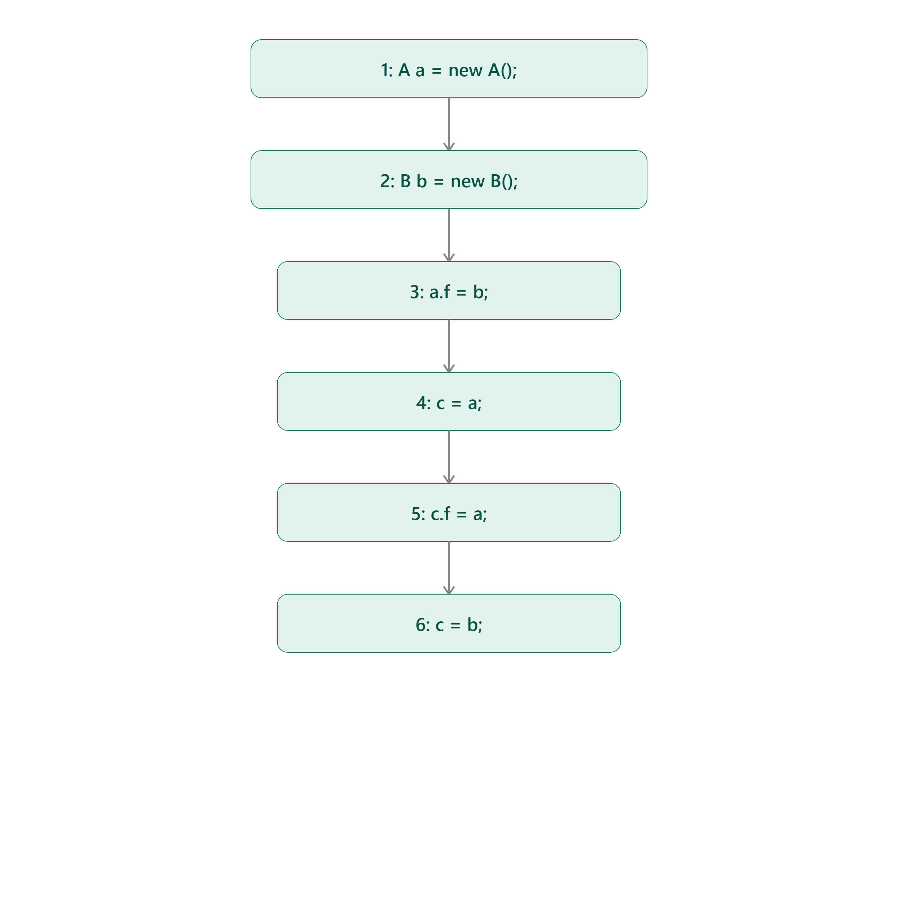
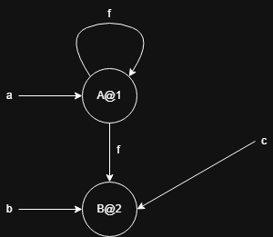
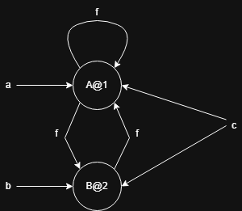
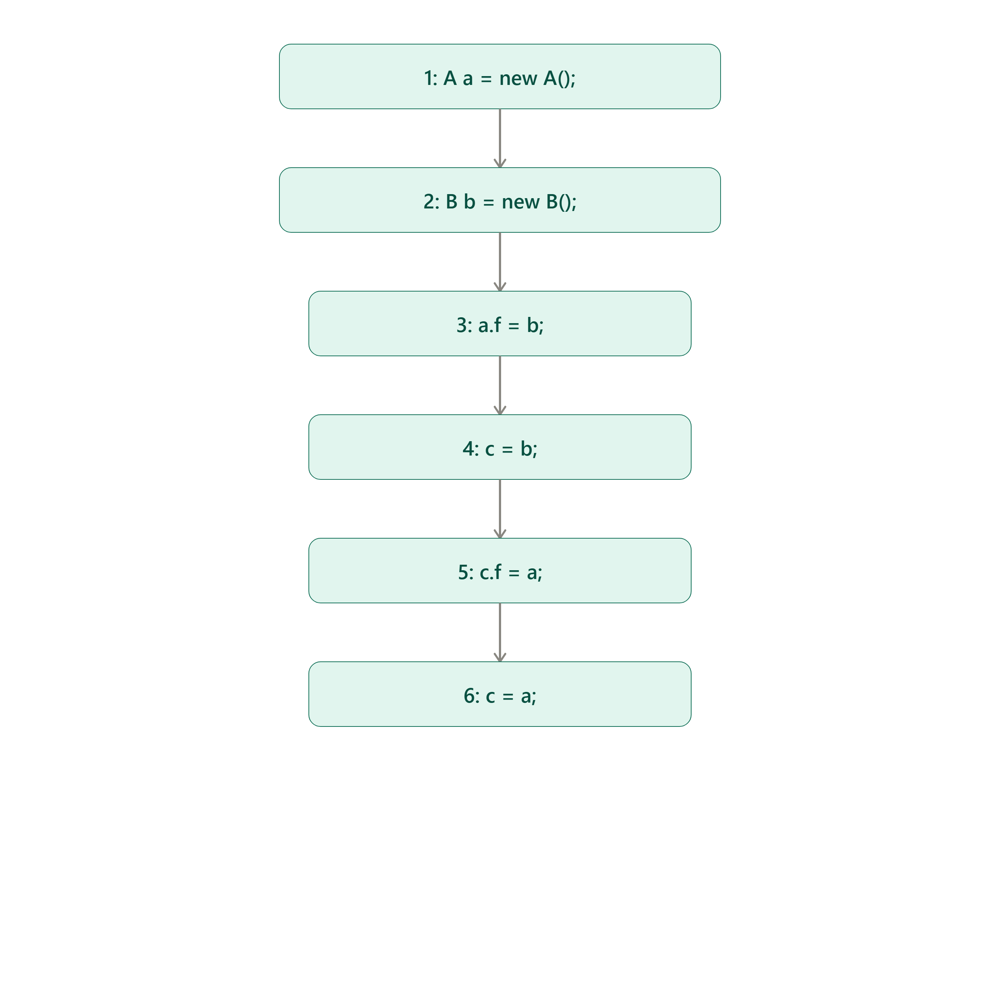
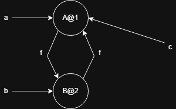
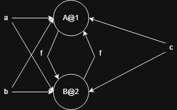

# Ejercicio 1 

El PTG al final del programa utilizando un análisis points-to flow-sensitive es: 

Usando el algoritmo de Andersen: 

Las restricciones van a ser: 

1. $\{A@1\} \subseteq L(a)$
2. $\{B@2\} \subseteq L(b)$
3. $L(b) \subseteq \cap \{E(k,f) | k \in L(a)\}$
4. $L(a) \subseteq L(c)$
5. $L(a) \subseteq \cap \{E(k,f) | k \in L(c)\}$
6. $L(b) \subseteq L(c)$

Y el analisis: 

- $L(a) = \{A@1\}$
- $L(b) = \{B@2\}$
- $L(c) = \{A@1, B@2\}$
- $E(A@1, f) = \{B@2, A@1\}$
- $E(B@2, f) = \{A@1\}$

El PTG final va a quedar: 

Si alternamos las lineas 4 y 6 el cfg va a ser: 

EL PTG al final del programa utilizando un  análisis points-to flow-sensitive va a ser: 

Usando el algoritmo de Andersen: 
Las restricciones van a ser: 
1. $\{A@1\} \subseteq L(a)$
2. $\{B@2\} \subseteq L(b)$
3. $L(b) \subseteq \cap \{E(k,f) | k \in L(a)\}$
4. $L(b) \subseteq L(c)$
5. $L(a) \subseteq \cap \{E(k,f) | k \in L(c)\}$
6. $L(a) \subseteq L(c)$

Y el analisis va a ser: 

- $L(a) = \{A@1\}$
- $L(b) = \{B@2\}$
- $L(c) = \{B@2, A@1\}$
- $E(A@1, f) = \{B@2, A@1\}$
- $E(B@2, f) = \{A@1\}$.

Que queda igual que en la version original del programa.  

Este experimento puede afirmar que el analisis de Andersen sobreaproxima versus el analis point-to flow-sensitive, porque en el algoritmo de Andersen estamos sobreaproximando $L(c)$. 

Usando el algoritmo de Steensgard en el programa original las restricciones van a ser: 

1. $\{A@1\} = L(a)$
2. $\{B@2\} = L(b)$
3. $L(b) = \cap \{E(k,f) | k \in L(a)\}$
4. $L(a) = L(c)$
5. $L(a) = \cap \{E(k,f) | k \in L(c)\}$
6. $L(b) = L(c)$

Las restricciones actualizadas: 
1. $\{A@1B@2\} = L(a)$
2. $\{A@1B@2\} = L(b)$
3. $L(b) = \cap \{E(k,f) | k \in L(a)\}$
4. $L(a) = L(c)$
5. $L(a) = \cap \{E(k,f) | k \in L(c)\}$
6. $L(b) = L(c)$

El analisis va a ser: 

- $L(a) = \{A@1B@2\}$
- $L(b) = \{A@1B@2\}$
- $L(c) = \{A@1B@2\}$
- $E(A@1B@2, f) = \{A@1B@2\}$

Y el PTG final va a ser: 

