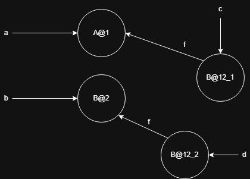

# Ejercicio 1 

El PTG al final del programa utilizando un análisis points-to flow-sensitive es: 

Usando el algoritmo de Andersen: 

Las restricciones van a ser: 

1. $\{A@1\} \subseteq L(a)$
2. $\{B@2\} \subseteq L(b)$
3. $L(b) \subseteq \cap \{E(k,f) | k \in L(a)\}$
4. $L(a) \subseteq L(c)$
5. $L(a) \subseteq \cap \{E(k,f) | k \in L(c)\}$
6. $L(b) \subseteq L(c)$

Y el analisis: 

- $L(a) = \{A@1\}$
- $L(b) = \{B@2\}$
- $L(c) = \{A@1, B@2\}$
- $E(A@1, f) = \{B@2, A@1\}$
- $E(B@2, f) = \{A@1\}$

El PTG final va a quedar: 

Si alternamos las lineas 4 y 6 el cfg va a ser: 

EL PTG al final del programa utilizando un  análisis points-to flow-sensitive va a ser: 

Usando el algoritmo de Andersen: 
Las restricciones van a ser: 
1. $\{A@1\} \subseteq L(a)$
2. $\{B@2\} \subseteq L(b)$
3. $L(b) \subseteq \cap \{E(k,f) | k \in L(a)\}$
4. $L(b) \subseteq L(c)$
5. $L(a) \subseteq \cap \{E(k,f) | k \in L(c)\}$
6. $L(a) \subseteq L(c)$

Y el analisis va a ser: 

- $L(a) = \{A@1\}$
- $L(b) = \{B@2\}$
- $L(c) = \{B@2, A@1\}$
- $E(A@1, f) = \{B@2, A@1\}$
- $E(B@2, f) = \{A@1\}$.

Que queda igual que en la version original del programa.  

Este experimento puede afirmar que el analisis de Andersen sobreaproxima versus el analis point-to flow-sensitive, porque en el algoritmo de Andersen estamos sobreaproximando $L(c)$. 

Usando el algoritmo de Steensgard en el programa original las restricciones van a ser: 

1. $\{A@1\} = L(a)$
2. $\{B@2\} = L(b)$
3. $L(b) = \cap \{E(k,f) | k \in L(a)\}$
4. $L(a) = L(c)$
5. $L(a) = \cap \{E(k,f) | k \in L(c)\}$
6. $L(b) = L(c)$

Las restricciones actualizadas: 
1. $\{A@1B@2\} = L(a)$
2. $\{A@1B@2\} = L(b)$
3. $L(b) = \cap \{E(k,f) | k \in L(a)\}$
4. $L(a) = L(c)$
5. $L(a) = \cap \{E(k,f) | k \in L(c)\}$
6. $L(b) = L(c)$

El analisis va a ser: 

- $L(a) = \{A@1B@2\}$
- $L(b) = \{A@1B@2\}$
- $L(c) = \{A@1B@2\}$
- $E(A@1B@2, f) = \{A@1B@2\}$

Y el PTG final va a ser: 

# Ejercicio 2 
El PTG al final del programa utilizando un análisis points-to flow-sensitive sin contexto es:  

Preguntar si el que es $K=1$ no es igual al anterior. 

Usando cadenas de contexto con $K = 2$: 

# Ejercicio 3: 

Usando el algoritmo de Andersen sin contextos: 
Las restricciones van a ser: 
1. $\{H1@2\} \subseteq L(x)$
2. $\{H2@3\} \subseteq L(z)$
3. $L(x) \subseteq L(y)$
4. $L(x) \subseteq L(w)$
5. $L(z) \subseteq L(w)$

Por lo tanto va a quedar: 
- $L(x) = \{H1@2\}$
- $L(z) = \{H2@3\}$
- $L(y) = \{H1@2\}$
- $L(w) = \{H1@2, H2@3\}$

Por lo que el PTG final va a ser: 

Si hacemos cloning, las restricciones van a ser: 
1. $\{H1@2\} \subseteq L(x)$
2. $\{H2@3\} \subseteq L(z)$
4. $L(x) \subseteq L(y)$
5. $L(z) \subseteq L(w)$

Por lo tanto va a quedar: 
- $L(x) = \{H1@2\}$
- $L(z) = \{H2@3\}$
- $L(y) = \{H1@2\}$
- $L(w) = \{H2@3\}$

Por lo tanto el PTG va a tener la forma: 

Lo mismo pasa usando contextos. 

# Ejercicio 4 
Usando el algoritmo de Andersen sin contexto las restricciones van a ser: 

1. $\{H1@2\} \subseteq L(x)$
2. $\{H2@3\} \subseteq L(z)$

TODO

# Ejercicio 5
Las restricciones van a ser: 
1. $\{E1\} \subseteq L(e1)$
2. $\{E2\} \subseteq L(e2)$
3. $\{E3\} \subseteq L(e3)$
4. $L(e2) \subseteq \cap \{E(k, \text{siguiente}) | k \in L(e1)\}$
5. $L(e3) \subseteq \cap \{E(k, \text{siguiente}) | k \in L(e2)\}$
6. $L(e1) \subseteq \cap \{E(k, \text{siguiente}) | k \in L(e3)\}$
7. $\cup \{E(k, \text{siguiente}) | k \in L(e3)\} \subseteq L(e3)$

- $L(e1) = \{E1\}$
- $L(e2) = \{E2\}$
- $L(e3) = \{E3, E1, E2\}$
- $E(E1, \text{siguiente}) = \{E2, E1\}$
- $E(E2, \text{siguiente}) = \{E3, E1, E2\}$
- $E(E3, \text{siguiente}) = \{E1\}$

