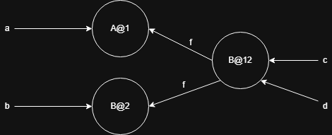
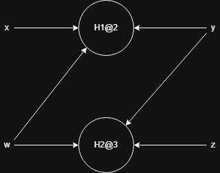
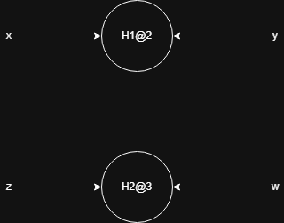
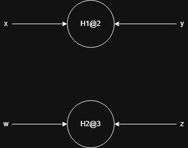
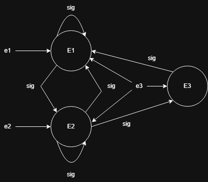
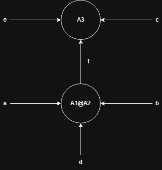
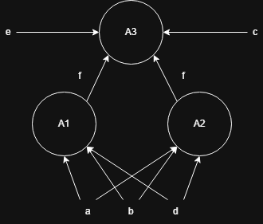

# Ejercicio 1 

El PTG al final del programa utilizando un análisis points-to flow-sensitive es: 

Usando el algoritmo de Andersen: 

Las restricciones van a ser: 

1. $\left\lbrace A@1\right\rbrace \subseteq L(a)$
2. $\left\lbrace B@2\right\rbrace \subseteq L(b)$
3. $L(b) \subseteq \cap \left\lbrace E(k,f) | k \in L(a)\right\rbrace$
4. $L(a) \subseteq L(c)$
5. $L(a) \subseteq \cap \left\lbrace E(k,f) | k \in L(c)\right\rbrace$
6. $L(b) \subseteq L(c)$

Y el analisis: 

- $L(a) = \left\lbrace A@1\right\rbrace$
- $L(b) = \left\lbrace B@2\right\rbrace$
- $L(c) = \left\lbrace A@1, B@2\right\rbrace$
- $E(A@1, f) = \left\lbrace B@2, A@1\right\rbrace$
- $E(B@2, f) = \left\lbrace A@1\right\rbrace$

El PTG final va a quedar: 

Si alternamos las lineas 4 y 6 el cfg va a ser: 

EL PTG al final del programa utilizando un  análisis points-to flow-sensitive va a ser: 

Usando el algoritmo de Andersen: 
Las restricciones van a ser: 
1. $\left\lbrace A@1\right\rbrace \subseteq L(a)$
2. $\left\lbrace B@2\right\rbrace \subseteq L(b)$
3. $L(b) \subseteq \cap \left\lbrace E(k,f) | k \in L(a)\right\rbrace$
4. $L(b) \subseteq L(c)$
5. $L(a) \subseteq \cap \left\lbrace E(k,f) | k \in L(c)\right\rbrace$
6. $L(a) \subseteq L(c)$

Y el analisis va a ser: 

- $L(a) = \left\lbrace A@1\right\rbrace$
- $L(b) = \left\lbrace B@2\right\rbrace$
- $L(c) = \left\lbrace B@2, A@1\right\rbrace$
- $E(A@1, f) = \left\lbrace B@2, A@1\right\rbrace$
- $E(B@2, f) = \left\lbrace A@1\right\rbrace$.

Que queda igual que en la version original del programa.  

Este experimento puede afirmar que el analisis de Andersen sobreaproxima versus el analis point-to flow-sensitive, porque el algoritmo de Andersen es flow-insensitive. 

Usando el algoritmo de Steensgard en el programa original las restricciones van a ser: 

1. $\left\lbrace A@1\right\rbrace = L(a)$
2. $\left\lbrace B@2\right\rbrace = L(b)$
3. $L(b) = \cap \left\lbrace E(k,f) | k \in L(a)\right\rbrace$
4. $L(a) = L(c)$
5. $L(a) = \cap \left\lbrace E(k,f) | k \in L(c)\right\rbrace$
6. $L(b) = L(c)$

Las restricciones actualizadas: 
1. $\left\lbrace A@1B@2\right\rbrace = L(a)$
2. $\left\lbrace A@1B@2\right\rbrace = L(b)$
3. $L(b) = \cap \left\lbrace E(k,f) | k \in L(a)\right\rbrace$
4. $L(a) = L(c)$
5. $L(a) = \cap \left\lbrace E(k,f) | k \in L(c)\right\rbrace$
6. $L(b) = L(c)$

El analisis va a ser: 

- $L(a) = \left\lbrace A@1B@2\right\rbrace$
- $L(b) = \left\lbrace A@1B@2\right\rbrace$
- $L(c) = \left\lbrace A@1B@2\right\rbrace$
- $E(A@1B@2, f) = \left\lbrace A@1B@2\right\rbrace$

Y el PTG final va a ser: 

# Ejercicio 2 
El PTG al final del programa utilizando un análisis points-to flow-sensitive sin contexto es:  

Va a ser igual tanto para $K = 1$ como para $K = 2$. 

# Ejercicio 3: 

Usando el algoritmo de Andersen sin contextos: 
Las restricciones van a ser: 
1. $\left\lbrace H1@2\right\rbrace \subseteq L(x)$
2. $\left\lbrace H2@3\right\rbrace \subseteq L(z)$
3. $L(x) \subseteq L(y)$
4. $L(z) \subseteq L(y)$
5. $L(x) \subseteq L(w)$
6. $L(z) \subseteq L(w)$

Por lo tanto va a quedar: 
- $L(x) = \left\lbrace H1@2\right\rbrace$
- $L(z) = \left\lbrace H2@3\right\rbrace$
- $L(y) = \left\lbrace H1@2, H2@3\right\rbrace$
- $L(w) = \left\lbrace H1@2, H2@3\right\rbrace$

Por lo que el PTG final va a ser: 

Si hacemos cloning, las restricciones van a ser: 
1. $\left\lbrace H1@2\right\rbrace \subseteq L(x)$
2. $\left\lbrace H2@3\right\rbrace \subseteq L(z)$
4. $L(x) \subseteq L(y)$
5. $L(z) \subseteq L(w)$

Por lo tanto va a quedar: 
- $L(x) = \left\lbrace H1@2\right\rbrace$
- $L(z) = \left\lbrace H2@3\right\rbrace$
- $L(y) = \left\lbrace H1@2\right\rbrace$
- $L(w) = \left\lbrace H2@3\right\rbrace$

Por lo tanto el PTG va a tener la forma: 

Lo mismo pasa usando contextos. 

# Ejercicio 4 
Usando el algoritmo de Andersen sin contexto las restricciones van a ser: 

1. $\left\lbrace H1@2\right\rbrace \subseteq L(x)$
2. $\left\lbrace H2@3\right\rbrace \subseteq L(z)$
3. $L(x) \subseteq L(y)$
4. $L(z) \subseteq L(y)$
5. $L(z) \subseteq L(w)$
6. $L(x) \subseteq L(w)$

Por lo tanto va a quedar: 
- $L(x) = \left\lbrace H1@2\right\rbrace$
- $L(z) = \left\lbrace H2@3\right\rbrace$
- $L(y) = \left\lbrace H1@2, H2@3\right\rbrace$
- $L(w) = \left\lbrace H1@2, H2@3\right\rbrace$

Por lo tanto el PTG va a quedar: 

No se puede hacer cloning porque la funcion es recursiva, a lo sumo si se diera un parametro de cuantas veces clonarlo en ese caso se podria clonar esas $k$ veces. 

Usando cadenas de longitud 2 va a ser el mismo PTG que antes. 

Si usamos contextos funcionales: 
1. $\left\lbrace H1@2\right\rbrace \subseteq L(x)$
2. $\left\lbrace H2@3\right\rbrace \subseteq L(z)$
3. $L(x) \subseteq L(y)$
4. $L(z) \subseteq L(w)$

Por lo tanto va a quedar: 
- $L(x) = \left\lbrace H1@2\right\rbrace$
- $L(z) = \left\lbrace H2@3\right\rbrace$
- $L(y) = \left\lbrace H1@2\right\rbrace$
- $L(w) = \left\lbrace H2@3\right\rbrace$

# Ejercicio 5
Las restricciones van a ser: 
1. $\left\lbrace E1\right\rbrace \subseteq L(e1)$
2. $\left\lbrace E2\right\rbrace \subseteq L(e2)$
3. $\left\lbrace E3\right\rbrace \subseteq L(e3)$
4. $L(e2) \subseteq \cap \left\lbrace E(k, \text{siguiente}) | k \in L(e1)\right\rbrace$
5. $L(e3) \subseteq \cap \left\lbrace E(k, \text{siguiente}) | k \in L(e2)\right\rbrace$
6. $L(e1) \subseteq \cap \left\lbrace E(k, \text{siguiente}) | k \in L(e3)\right\rbrace$
7. $\cup \left\lbrace E(k, \text{siguiente}) | k \in L(e3)\right\rbrace \subseteq L(e3)$

- $L(e1) = \left\lbrace E1\right\rbrace$
- $L(e2) = \left\lbrace E2\right\rbrace$
- $L(e3) = \left\lbrace E3, E1, E2\right\rbrace$
- $E(E1, \text{siguiente}) = \left\lbrace E2, E1\right\rbrace$
- $E(E2, \text{siguiente}) = \left\lbrace E3, E1, E2\right\rbrace$
- $E(E3, \text{siguiente}) = \left\lbrace E1\right\rbrace$

# Ejercicio 6
Las restricciones van a ser:

1. $\left\lbrace A1 \right\rbrace = L(a)$
2. $\left\lbrace A2 \right\rbrace = L(b)$
3. $\left\lbrace A3 \right\rbrace = L(c)$
4. $L(a) = L(d)$
5. $L(b) = L(d)$
6. $L(c) = \cap \left\lbrace E(k,f) | k \in L(d) \right\rbrace$
7. $\cup \left\lbrace E(k,f) | k \in L(a) \right\rbrace = L(e)$

Analizandolo: 

- $L(a) = \left\lbrace A1\text{@}A2 \right\rbrace$
- $L(b) = \left\lbrace A1\text{@}A2 \right\rbrace$
- $L(c) = \left\lbrace A3 \right\rbrace$
- $L(d) = \left\lbrace A1\text{@}A2 \right\rbrace$
- $E(A1\text{@}A2, f) = \left\lbrace A3 \right\rbrace$
- $L(e) = \left\lbrace A3 \right\rbrace$

Con todo unificado el PTG es: 

Sin unificacion el PTG resultante es: 
