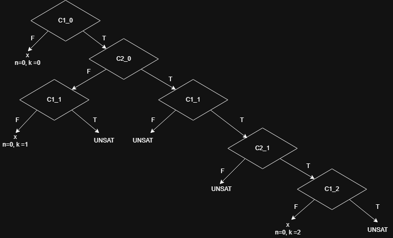
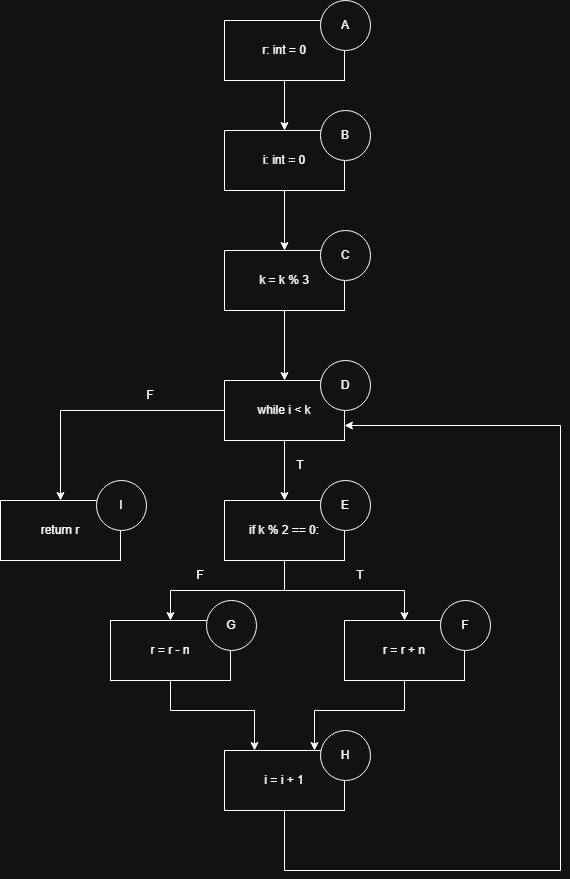
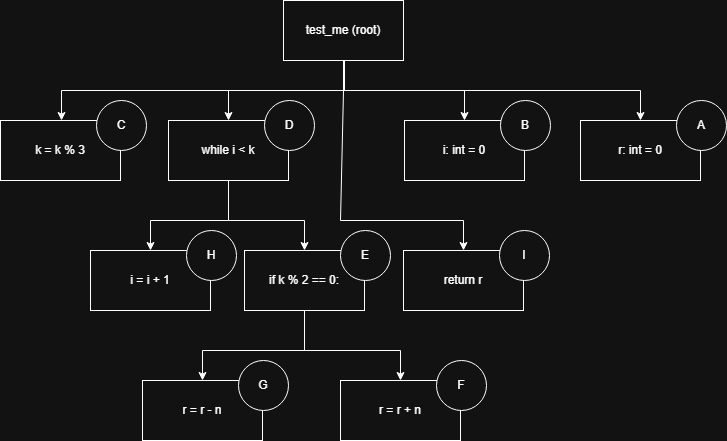

# Ejercicio 1 
Un mutante utilizando el operador de mutacion relational operator replacement puede ser: 

```py 
def test_me(n: int, k: int) -> int: 
    r: int = 0
    i: int = 0
    k = k % 3 
    while i < k: 
        if k % 2 != 0: # Modifico == por != 
            r = r + n 
        else: 
            r = r - n 
        i = i + 1 
    return r
```

Un test que lo detecta puede ser: 
```py
class TestTestMe(unittest.TestCase):
    def test1(self):
        res = testme(3, 2)
        self.assertEqual(res, 6) # Con el mutante res va a ser igual a -6
```

Un mutante equivalente puede ser: 
```py 
def test_me(n: int, k: int) -> int: 
    r: int = 0
    i: int = 0
    k = k % 3 
    while i < k: 
        if k % 2 <= 0: # Modifico == por <= 
            r = r + n 
        else: 
            r = r - n 
        i = i + 1 
    return r
```

Porque como todos los valores posibles que puede tomar `k % 2` son 0 o 1, no puede haber ningun caso que de menor a 0 y sumemos de mas. 

# Ejercicio 2 
| Iteración | Input Concreto | Condición de Ruta                                       | Fórmula enviada al demostrador                     | Resultado posible |
|-----------|----------------|---------------------------------------------------------|----------------------------------------------------|-------------------|
| 1         | n=0, k=0       | $\neg C1_0$                                             | $C1_0$                                             | n=0, k=1          |
| 2         | n=0, k=1       | $C1_0 \land \neg C2_0 \land \neg C1_1$                  | $C1_0 \land \neg C2_0 \land C1_1$                  | UNSAT             |
|           |                |                                                         | $C1_0 \land C2_0$                                  | n=0, k=2          |
| 3         | n=0, k=2       | $C1_0 \land C2_0 \land C1_1 \land C2_1 \land \neg C1_2$ | $C1_0 \land C2_0 \land C1_1 \land C2_1 \land C1_2$ | UNSAT             |
|           |                |                                                         | $C1_0 \land C2_0 \land C1_1 \land \neg C2_1$       | UNSAT             |
|           |                |                                                         | $C1_0 \land C2_0 \land \neg C1_1$                  | UNSAT             |

<p align="center">
  
</p>

# Ejercicio 3 

CFG: 
<p align="center">
  
</p>

Tabla de dominadores: 
| Nodo | Dominadores      |
|------|------------------|
| A    | A                |
| B    | A, B             |
| C    | A, B, C          |
| D    | A, B, C, D       |
| E    | A, B, C, D, E    |
| F    | A, B, C, D, E, F |
| G    | A, B, C, D, E, G |
| H    | A, B, C, D, E, H |
| I    | A, B, C, D, I    |

Tabla de post dominadores: 

| Nodo | Post-Dominadores |
|------|------------------|
| A    | A, B, C, D, I    |
| B    | B, C, D, I       |
| C    | C, D, I          |
| D    | D, I             |
| E    | E, H, D, I       |
| F    | F, H, D, I       |
| G    | G, H, D, I       |
| H    | H, D, I          |
| I    | I                |

El CDG va a ser: 
<p align="center">
  
</p>

Con la test suite: 

```py 
def test_0(self): 
    self.assertEqual(0, test_me(0,7))

def test_1(self):
    self.assertEqual(0, test_me(0,13))
```

El valor del approach level para cada uno de los nodos va a ser igual a cero, excepto para el nodo F que va a tener approach level igual a uno. 

El valor de la distancia de branch no normalizada para cada desicion va a ser: 
| Nodo | Distancia de Branch no normalizada |
|------|------------------------------------|
| D    | 0                                  |
| E    | 1 + 1 = 2                          |

El cubrimiento de branches del test suite es del 75$. 

# Ejercicio 4 
| input | lineas cubiertas                                                                                                                                  | frecuencia | energia                                            |
|-------|---------------------------------------------------------------------------------------------------------------------------------------------------|------------|----------------------------------------------------|
| #1    | [2, 3, 4, 5, 6, 7, 10, 11, 12, 13, 14, 15, 5, 6, 7, 10, 11, 12, 13, 14, 15,5, 16]                                                                 | 4          | $\frac{1}{4^5} = \frac{1}{1024} \approx 0{,}00098$ |
| #2    | [2, 3, 4, 5, 6, 7, 10, 11, 12, 13, 14, 15, 5, 6, 7, 10, 11, 12, 13, 14, 15,5, 16]                                                                 | 4          | $\frac{1}{4^5} = \frac{1}{1024} \approx 0{,}00098$ |
| #3    | [2, 3, 4, 5, 16]                                                                                                                                  | 1          | $\frac{1}{1^5} = 1$                                |
| #4    | [2, 3, 4, 5, 6, 7, 8, 9, 5, 6, 7, 10, 11, 12, 13, 14, 15, 5, 6, 7, 8, 9, 5, 6, 7, 10, 11, 12, 13, 14, 15, 5, 6, 7, 10, 11, 12, 13, 14, 15, 5, 16] | 1          | $\frac{1}{1^5} = 1$                                |
| #5    | [2, 3, 4, 5, 6, 7, 8, 9, 5, 6, 7, 10, 11, 12, 13, 14, 15, 5, 6, 7, 10, 11, 12, 13, 14, 15, 5, 16]                                                 | 1          | $\frac{1}{1^5} = 1$                                |
| #6    | [2, 3, 4, 5, 6, 7, 10, 11, 12, 13, 14, 15, 5, 16]                                                                                                 | 2          | $\frac{1}{2^5} = \frac{1}{32} = 0{,}03125$         |
| #7    | [2, 3, 4, 5, 6, 7, 10, 11, 12, 13, 14, 15, 5, 16]                                                                                                 | 2          | $\frac{1}{2^5} = \frac{1}{32} = 0{,}03125$         |
| #8    | [2, 3, 4, 5, 6, 7, 10, 11, 12, 13, 14, 15, 5, 6, 7, 10, 11, 12, 13, 14, 15, 5, 16]                                                                | 4          | $\frac{1}{4^5} = \frac{1}{1024} \approx 0{,}00098$ |
| #9    | [2, 3, 4, 5, 6, 7, 10, 11, 12, 13, 14, 15, 5, 6, 7, 10, 11, 12, 13, 14, 15, 5, 5, 6, 7, 10, 11, 12, 13, 14, 15, 5, 16]                            | 1          | $\frac{1}{1^5} = 1$                                |
| #10   | [2, 3, 4, 5, 6, 7, 10, 11, 12, 13, 14, 15, 5, 6, 7, 10, 11, 12, 13, 14, 15, 5, 16]                                                                | 4          | $\frac{1}{4^5} = \frac{1}{1024} \approx 0{,}00098$ |

La probabilidad de que el fuzzer eliga el input numero 10 para mutarlo es $\frac{1}{1024}$ / sumatoria de energias que es igual a $\frac{1}{4164}$.
