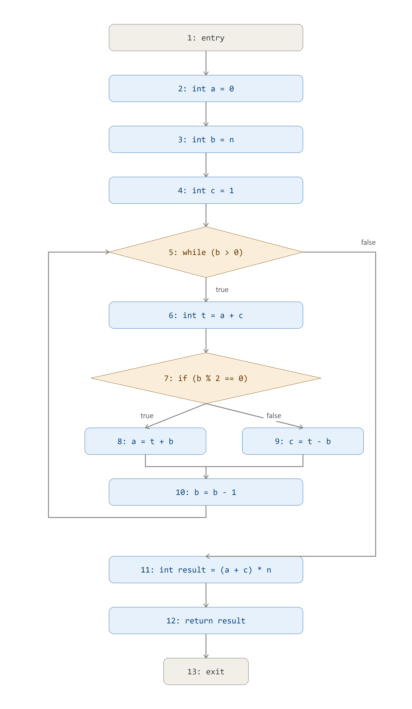
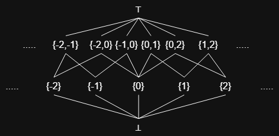
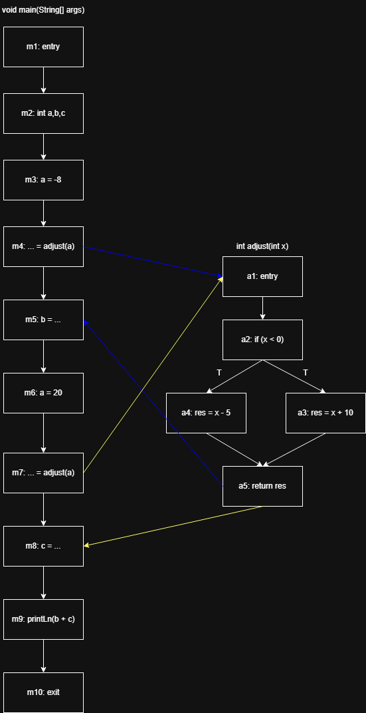
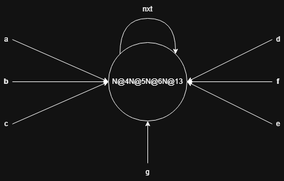

# Ejercicio 1


Las expresiones aritmeticas en el codigo son:
- `a + c`
- `b % 2 == 0`
- `t + b`
- `t - b`
- `b - 1`
- `(a + c) * n`

El estado inicial seria:

| Nodo n | IN[n]                                                 | OUT[n]                                                |
|--------|-------------------------------------------------------|-------------------------------------------------------|
| 1      | $\left\lbrace a + c, t + b, t - b, b - 1, (a + c) * n, b \% 2 == 0 \right\rbrace$ | $\left\lbrace a + c, t + b, t - b, b - 1, (a + c) * n, b \% 2 == 0 \right\rbrace$ |
| 2      | $\left\lbrace a + c, t + b, t - b, b - 1, (a + c) * n, b \% 2 == 0 \right\rbrace$ | $\left\lbrace a + c, t + b, t - b, b - 1, (a + c) * n, b \% 2 == 0 \right\rbrace$ |
| 3      | $\left\lbrace a + c, t + b, t - b, b - 1, (a + c) * n, b \% 2 == 0 \right\rbrace$ | $\left\lbrace a + c, t + b, t - b, b - 1, (a + c) * n, b \% 2 == 0 \right\rbrace$ |
| 4      | $\left\lbrace a + c, t + b, t - b, b - 1, (a + c) * n, b \% 2 == 0 \right\rbrace$ | $\left\lbrace a + c, t + b, t - b, b - 1, (a + c) * n, b \% 2 == 0 \right\rbrace$ |
| 5      | $\left\lbrace a + c, t + b, t - b, b - 1, (a + c) * n, b \% 2 == 0 \right\rbrace$ | $\left\lbrace a + c, t + b, t - b, b - 1, (a + c) * n, b \% 2 == 0 \right\rbrace$ |
| 6      | $\left\lbrace a + c, t + b, t - b, b - 1, (a + c) * n, b \% 2 == 0 \right\rbrace$ | $\left\lbrace a + c, t + b, t - b, b - 1, (a + c) * n, b \% 2 == 0 \right\rbrace$ |
| 7      | $\left\lbrace a + c, t + b, t - b, b - 1, (a + c) * n, b \% 2 == 0 \right\rbrace$ | $\left\lbrace a + c, t + b, t - b, b - 1, (a + c) * n, b \% 2 == 0 \right\rbrace$ |
| 8      | $\left\lbrace a + c, t + b, t - b, b - 1, (a + c) * n, b \% 2 == 0 \right\rbrace$ | $\left\lbrace a + c, t + b, t - b, b - 1, (a + c) * n, b \% 2 == 0 \right\rbrace$ |
| 9      | $\left\lbrace a + c, t + b, t - b, b - 1, (a + c) * n, b \% 2 == 0 \right\rbrace$ | $\left\lbrace a + c, t + b, t - b, b - 1, (a + c) * n, b \% 2 == 0 \right\rbrace$ |
| 10     | $\left\lbrace a + c, t + b, t - b, b - 1, (a + c) * n, b \% 2 == 0 \right\rbrace$ | $\left\lbrace a + c, t + b, t - b, b - 1, (a + c) * n, b \% 2 == 0 \right\rbrace$ |
| 11     | $\left\lbrace a + c, t + b, t - b, b - 1, (a + c) * n, b \% 2 == 0 \right\rbrace$ | $\left\lbrace a + c, t + b, t - b, b - 1, (a + c) * n, b \% 2 == 0 \right\rbrace$ |
| 12     | $\left\lbrace a + c, t + b, t - b, b - 1, (a + c) * n, b \% 2 == 0 \right\rbrace$ | $\left\lbrace a + c, t + b, t - b, b - 1, (a + c) * n, b \% 2 == 0 \right\rbrace$ |
| 13     | $\left\lbrace b \% 2 == 0 \right\rbrace$                                          | $\left\lbrace a + c, b \% 2 == 0, t + b, t - b, b - 1, (a + c) * n \right\rbrace$ |

| Iteración | Nodo n | IN[n]                      | OUT[n]              |
|-----------|--------|----------------------------|---------------------|
| 1         | 1      | -                          | $\left\lbrace\right\rbrace$                  |
| 1         | 2      | $\left\lbrace\right\rbrace$                         | $\left\lbrace\right\rbrace$                  |
| 1         | 3      | $\left\lbrace\right\rbrace$                         | $\left\lbrace\right\rbrace$                  |
| 1         | 4      | $\left\lbrace\right\rbrace$                         | $\left\lbrace\right\rbrace$                  |
| 1         | 5      | $\left\lbrace\right\rbrace$                         | $\left\lbrace\right\rbrace$                  |
| 1         | 6      | $\left\lbrace b - 1, b \% 2 == 0, a + c \right\rbrace$ | $\left\lbrace b - 1, b \% 2 == 0 \right\rbrace$ |
| 1         | 7      | $\left\lbrace b - 1, b \% 2 == 0 \right\rbrace$        | $\left\lbrace b - 1 \right\rbrace$             |
| 1         | 8      | $\left\lbrace b - 1, t + b \right\rbrace$             | $\left\lbrace b - 1 \right\rbrace$             |
| 1         | 9      | $\left\lbrace b - 1, t - b \right\rbrace$             | $\left\lbrace b - 1 \right\rbrace$             |
| 1         | 10     | $\left\lbrace b - 1 \right\rbrace$                    | $\left\lbrace\right\rbrace$                  |
| 1         | 11     | $\left\lbrace (a + c) * n \right\rbrace$              | $\left\lbrace\right\rbrace$                  |
| 1         | 12     | $\left\lbrace\right\rbrace$                         | $\left\lbrace\right\rbrace$                  |
| 1         | 13     | $\left\lbrace\right\rbrace$                         | -                   |
| 2         | 1      | -                          | $\left\lbrace\right\rbrace$                  |
| 2         | 2      | $\left\lbrace\right\rbrace$                         | $\left\lbrace\right\rbrace$                  |
| 2         | 3      | $\left\lbrace\right\rbrace$                         | $\left\lbrace\right\rbrace$                  |
| 2         | 4      | $\left\lbrace\right\rbrace$                         | $\left\lbrace\right\rbrace$                  |
| 2         | 5      | $\left\lbrace\right\rbrace$                         | $\left\lbrace\right\rbrace$                  |
| 2         | 6      | $\left\lbrace b - 1, b \% 2 == 0, a + c \right\rbrace$ | $\left\lbrace b - 1, b \% 2 == 0 \right\rbrace$ |
| 2         | 7      | $\left\lbrace b - 1, b \% 2 == 0 \right\rbrace$        | $\left\lbrace b - 1 \right\rbrace$             |
| 2         | 8      | $\left\lbrace b - 1, t + b \right\rbrace$             | $\left\lbrace b - 1 \right\rbrace$             |
| 2         | 9      | $\left\lbrace b - 1, t - b \right\rbrace$             | $\left\lbrace b - 1 \right\rbrace$             |
| 2         | 10     | $\left\lbrace b - 1 \right\rbrace$                    | $\left\lbrace\right\rbrace$                  |
| 2         | 11     | $\left\lbrace (a + c) * n \right\rbrace$              | $\left\lbrace\right\rbrace$                  |
| 2         | 12     | $\left\lbrace\right\rbrace$                         | $\left\lbrace\right\rbrace$                  |
| 2         | 13     | $\left\lbrace\right\rbrace$                         | -                   |

# Ejercicio 2
El reticulado va a ser:



La idea es que:
- Si una variable no esta inicializada su valor abstracto va a ser $\bot$.
- Si una variable puede tomar un unico valor su valor abstracto va a ser $\{k\}, \text{ con } k \in \mathbb{Z}$.
- Si una variable puede tomar o un valor o otro, su valor abstracto va a ser $\{k, m\}, \text{ con } k, m \in \mathbb{Z}$.
- Si una variable tiene mas de dos opciones de valores, o no sabemos su valor, su valor abstracto va a ser $\top$.

Si tuvieramos que construir un analisis de dataflow, este seria de tipo forward may, donde la informacion se combinaria tomando el supremo entre los valores abstractos de las variables: $\text{IN}[n] = \bigsqcup_{n' \in \text{pred}(n)} \text{OUT}[n']$.

$$
\text{Transfer}(n, S) =
\begin{cases}
S[\text{var} \mapsto K] & \text{si } n = \text{var = K} (\text{con } K \in \mathbb{Z}) \\
S[\text{var} \mapsto v] & \text{si } n = \text{var = var'} \land [\text{var'} \mapsto v] \in S \\
S[\text{var} \mapsto \text{Eval}(E,S)] & \text{si } n = \text{var = E} \\
S & \text{sino}
\end{cases}
$$

La semantica de la suma y resta en Eval va a ser:

| $E1 + E2$   | $\bot$ | $\left\lbrace k \right\rbrace$             | $\left\lbrace k,m \right\rbrace$           | $\top$ |
|-------------|--------|---------------------|---------------------|--------|
| $\bot$      | $\bot$ | $\bot$              | $\bot$              | $\bot$ |
| $\left\lbrace k' \right\rbrace$    | $\bot$ | $\left\lbrace k + k' \right\rbrace$        | $\left\lbrace k + k',m + k' \right\rbrace$ | $\top$ |
| $\left\lbrace k',m' \right\rbrace$ | $\bot$ | $\left\lbrace k' + k,m' + k \right\rbrace$ | $\top$              | $\top$ |
| $\top$      | $\bot$ | $\top$              | $\top$              | $\top$ |

| $E1 - E2$   | $\bot$ | $\left\lbrace k \right\rbrace$             | $\left\lbrace k,m \right\rbrace$           | $\top$ |
|-------------|--------|---------------------|---------------------|--------|
| $\bot$      | $\bot$ | $\bot$              | $\bot$              | $\bot$ |
| $\left\lbrace k' \right\rbrace$    | $\bot$ | $\left\lbrace k - k' \right\rbrace$        | $\left\lbrace k - k',m - k' \right\rbrace$ | $\top$ |
| $\left\lbrace k',m' \right\rbrace$ | $\bot$ | $\left\lbrace k - k',k - m' \right\rbrace$ | $\top$              | $\top$ |
| $\top$      | $\bot$ | $\top$              | $\top$              | $\top$ |


# Ejercicio 3
Entiendo que el codigo dice esto:
```java
static int adjust(int x) {
    if (x < 0)
        return x + 10;
    else
        return x - 5;
}

static void main(String[] args) {
    int a, b, c;
    a = -8;
    b = adjust(a); // llamada 1
    a = 20;
    c = adjust(a); // llamada 2
    System.out.println(b + c);
}
```
El CFG va a ser:



Si no usamos contexto de llamadas el analisis va a ser:

| Iteración | Nodo n | IN[n]                                              | OUT[n]                                             |
|-----------|--------|----------------------------------------------------|----------------------------------------------------|
| 1         | m1     | -                                                  | $\left\lbrace a \to \bot, b \to \bot, c \to \bot \right\rbrace$             |
| 1         | m2     | $\left\lbrace a \to \bot, b \to \bot, c \to \bot \right\rbrace$             | $\left\lbrace a \to \bot, b \to \bot, c \to \bot \right\rbrace$             |
| 1         | m3     | $\left\lbrace a \to \bot, b \to \bot, c \to \bot \right\rbrace$             | $\left\lbrace a \to [-8, -8], b \to \bot, c \to \bot \right\rbrace$         |
| 1         | m4     | $\left\lbrace a \to [-8, -8], b \to \bot, c \to \bot \right\rbrace$         | $\left\lbrace a \to [-8, -8], b \to \bot, c \to \bot \right\rbrace$         |
| 1         | a1     | $\left\lbrace x \to [-8, -8], res \to \bot \right\rbrace$                   | $\left\lbrace x \to [-8, -8], res \to \bot \right\rbrace$                   |
| 1         | a2     | $\left\lbrace x \to [-8, -8], res \to \bot \right\rbrace$                   | $\left\lbrace x \to [-8, -8], res \to \bot \right\rbrace$                   |
| 1         | a3     | $\left\lbrace x \to [-8, -8], res \to \bot \right\rbrace$                   | $\left\lbrace x \to [-8, -8], res \to [2,2] \right\rbrace$                  |
| 1         | a4     | $\left\lbrace x \to [-8, -8], res \to \bot \right\rbrace$                   | $\left\lbrace x \to [-8, -8], res \to [-13,-13] \right\rbrace$              |
| 1         | a5     | $\left\lbrace x \to [-8, -8], res \to [-13, 2] \right\rbrace$               | $\left\lbrace x \to [-8, -8], res \to [-13, 2] \right\rbrace$               |
| 1         | m5     | $\left\lbrace a \to [-8, -8], b \to \bot, c \to \bot \right\rbrace$         | $\left\lbrace a \to [-8, -8], b \to [-13, 2], c \to \bot \right\rbrace$     |
| 1         | m6     | $\left\lbrace a \to [-8, -8], b \to [-13, 2], c \to \bot \right\rbrace$     | $\left\lbrace a \to [20, 20], b \to [-13, 2], c \to \bot \right\rbrace$     |
| 1         | m7     | $\left\lbrace a \to [20, 20], b \to [-13, 2], c \to \bot \right\rbrace$     | $\left\lbrace a \to [20, 20], b \to [-13, 2], c \to \bot \right\rbrace$     |
| 1         | a1     | $\left\lbrace x \to [-8, 20], res \to \bot \right\rbrace$                   | $\left\lbrace x \to [-8, 20], res \to \bot \right\rbrace$                   |
| 1         | a2     | $\left\lbrace x \to [-8, 20], res \to \bot \right\rbrace$                   | $\left\lbrace x \to [-8, 20], res \to \bot \right\rbrace$                   |
| 1         | a3     | $\left\lbrace x \to [-8, 20], res \to \bot \right\rbrace$                   | $\left\lbrace x \to [-8, 20], res \to [2, 30] \right\rbrace$                |
| 1         | a4     | $\left\lbrace x \to [-8, 20], res \to \bot \right\rbrace$                   | $\left\lbrace x \to [-8, 20], res \to [-3, 25] \right\rbrace$               |
| 1         | a5     | $\left\lbrace x \to [-8, 20], res \to [-3, 30] \right\rbrace$               | $\left\lbrace x \to [-8, 20], res \to [-3, 30] \right\rbrace$               |
| 1         | m8     | $\left\lbrace a \to [20, 20], b \to [-13, 2], c \to \bot \right\rbrace$     | $\left\lbrace a \to [20, 20], b \to [-13, 2], c \to [-3, 30] \right\rbrace$  |
| 1         | m9     | $\left\lbrace a \to [20, 20], b \to [-13, 2], c \to [-3, 30] \right\rbrace$  | $\left\lbrace a \to [20, 20], b \to [-13, 2], c \to [-3, 30] \right\rbrace$  |
| 1         | m10    | $\left\lbrace a \to [20, 20], b \to [-13, 2], c \to [-3, 30] \right\rbrace$  | -                                                  |
| 2         | m1     | -                                                  | $\left\lbrace a \to \bot, b \to \bot, c \to \bot \right\rbrace$             |
| 2         | m2     | $\left\lbrace a \to \bot, b \to \bot, c \to \bot \right\rbrace$             | $\left\lbrace a \to \bot, b \to \bot, c \to \bot \right\rbrace$             |
| 2         | m3     | $\left\lbrace a \to \bot, b \to \bot, c \to \bot \right\rbrace$             | $\left\lbrace a \to [-8, -8], b \to \bot, c \to \bot \right\rbrace$         |
| 2         | m4     | $\left\lbrace a \to [-8, -8], b \to \bot, c \to \bot \right\rbrace$         | $\left\lbrace a \to [-8, -8], b \to \bot, c \to \bot \right\rbrace$         |
| 2         | a1     | $\left\lbrace x \to [-8, 20], res \to \bot \right\rbrace$                   | $\left\lbrace x \to [-8, 20], res \to \bot \right\rbrace$                   |
| 2         | a2     | $\left\lbrace x \to [-8, 20], res \to \bot \right\rbrace$                   | $\left\lbrace x \to [-8, 20], res \to \bot \right\rbrace$                   |
| 2         | a3     | $\left\lbrace x \to [-8, 20], res \to \bot \right\rbrace$                   | $\left\lbrace x \to [-8, 20], res \to [2,30] \right\rbrace$                 |
| 2         | a4     | $\left\lbrace x \to [-8, 20], res \to \bot \right\rbrace$                   | $\left\lbrace x \to [-8, 20], res \to [-13,15] \right\rbrace$               |
| 2         | a5     | $\left\lbrace x \to [-8, 20], res \to [-13, 30] \right\rbrace$              | $\left\lbrace x \to [-8, -8], res \to [-13, 30] \right\rbrace$              |
| 2         | m5     | $\left\lbrace a \to [-8, -8], b \to \bot, c \to \bot \right\rbrace$         | $\left\lbrace a \to [-8, -8], b \to [-13, 30], c \to \bot \right\rbrace$    |
| 2         | m6     | $\left\lbrace a \to [-8, -8], b \to [-13, 30], c \to \bot \right\rbrace$    | $\left\lbrace a \to [20, 20], b \to [-13, 30], c \to \bot \right\rbrace$    |
| 2         | m7     | $\left\lbrace a \to [20, 20], b \to [-13, 30], c \to \bot \right\rbrace$    | $\left\lbrace a \to [20, 20], b \to [-13, 30], c \to \bot \right\rbrace$    |
| 2         | a1     | $\left\lbrace x \to [-8, 20], res \to \bot \right\rbrace$                   | $\left\lbrace x \to [-8, 20], res \to \bot \right\rbrace$                   |
| 2         | a2     | $\left\lbrace x \to [-8, 20], res \to \bot \right\rbrace$                   | $\left\lbrace x \to [-8, 20], res \to \bot \right\rbrace$                   |
| 2         | a3     | $\left\lbrace x \to [-8, 20], res \to \bot \right\rbrace$                   | $\left\lbrace x \to [-8, 20], res \to [2, 30] \right\rbrace$                |
| 2         | a4     | $\left\lbrace x \to [-8, 20], res \to \bot \right\rbrace$                   | $\left\lbrace x \to [-8, 20], res \to [-3, 25] \right\rbrace$               |
| 2         | a5     | $\left\lbrace x \to [-8, 20], res \to [-3, 30] \right\rbrace$               | $\left\lbrace x \to [-8, 20], res \to [-3, 30] \right\rbrace$               |
| 2         | m8     | $\left\lbrace a \to [20, 20], b \to [-13, 30], c \to \bot \right\rbrace$    | $\left\lbrace a \to [20, 20], b \to [-13, 30], c \to [-3, 30] \right\rbrace$ |
| 2         | m9     | $\left\lbrace a \to [20, 20], b \to [-13, 30], c \to [-3, 30] \right\rbrace$ | $\left\lbrace a \to [20, 20], b \to [-13, 30], c \to [-3, 30] \right\rbrace$ |
| 2         | m10    | $\left\lbrace a \to [20, 20], b \to [-13, 30], c \to [-3, 30] \right\rbrace$ | -                                                  |

Por lo tanto si no usamos contextos de llamadas el analisis de dataflow va a quedar como:

| Nodo n | IN[n]                                              | OUT[n]                                             |
|--------|-----------------------------------------------------|-----------------------------------------------------|
| m1     | -                                                  | $\left\lbrace a \to \bot, b \to \bot, c \to \bot \right\rbrace$             |
| m2     | $\left\lbrace a \to \bot, b \to \bot, c \to \bot \right\rbrace$             | $\left\lbrace a \to \bot, b \to \bot, c \to \bot \right\rbrace$             |
| m3     | $\left\lbrace a \to \bot, b \to \bot, c \to \bot \right\rbrace$             | $\left\lbrace a \to [-8, -8], b \to \bot, c \to \bot \right\rbrace$         |
| m4     | $\left\lbrace a \to [-8, -8], b \to \bot, c \to \bot \right\rbrace$         | $\left\lbrace a \to [-8, -8], b \to \bot, c \to \bot \right\rbrace$         |
| a1     | $\left\lbrace x \to [-8, 20], res \to \bot \right\rbrace$                   | $\left\lbrace x \to [-8, 20], res \to \bot \right\rbrace$                   |
| a2     | $\left\lbrace x \to [-8, 20], res \to \bot \right\rbrace$                   | $\left\lbrace x \to [-8, 20], res \to \bot \right\rbrace$                   |
| a3     | $\left\lbrace x \to [-8, 20], res \to \bot \right\rbrace$                   | $\left\lbrace x \to [-8, 20], res \to [2,30] \right\rbrace$                 |
| a4     | $\left\lbrace x \to [-8, 20], res \to \bot \right\rbrace$                   | $\left\lbrace x \to [-8, 20], res \to [-13,15] \right\rbrace$               |
| a5     | $\left\lbrace x \to [-8, 20], res \to [-13, 30] \right\rbrace$              | $\left\lbrace x \to [-8, -8], res \to [-13, 30] \right\rbrace$              |
| m5     | $\left\lbrace a \to [-8, -8], b \to \bot, c \to \bot \right\rbrace$         | $\left\lbrace a \to [-8, -8], b \to [-13, 30], c \to \bot \right\rbrace$    |
| m6     | $\left\lbrace a \to [-8, -8], b \to [-13, 30], c \to \bot \right\rbrace$    | $\left\lbrace a \to [20, 20], b \to [-13, 30], c \to \bot \right\rbrace$    |
| m7     | $\left\lbrace a \to [20, 20], b \to [-13, 30], c \to \bot \right\rbrace$    | $\left\lbrace a \to [20, 20], b \to [-13, 30], c \to \bot \right\rbrace$    |
| a1     | $\left\lbrace x \to [-8, 20], res \to \bot \right\rbrace$                   | $\left\lbrace x \to [-8, 20], res \to \bot \right\rbrace$                   |
| a2     | $\left\lbrace x \to [-8, 20], res \to \bot \right\rbrace$                   | $\left\lbrace x \to [-8, 20], res \to \bot \right\rbrace$                   |
| a3     | $\left\lbrace x \to [-8, 20], res \to \bot \right\rbrace$                   | $\left\lbrace x \to [-8, 20], res \to [2, 30] \right\rbrace$                |
| a4     | $\left\lbrace x \to [-8, 20], res \to \bot \right\rbrace$                   | $\left\lbrace x \to [-8, 20], res \to [-3, 25] \right\rbrace$               |
| a5     | $\left\lbrace x \to [-8, 20], res \to [-3, 30] \right\rbrace$               | $\left\lbrace x \to [-8, 20], res \to [-3, 30] \right\rbrace$               |
| m8     | $\left\lbrace a \to [20, 20], b \to [-13, 30], c \to \bot \right\rbrace$    | $\left\lbrace a \to [20, 20], b \to [-13, 30], c \to [-3, 30] \right\rbrace$ |
| m9     | $\left\lbrace a \to [20, 20], b \to [-13, 30], c \to [-3, 30] \right\rbrace$ | $\left\lbrace a \to [20, 20], b \to [-13, 30], c \to [-3, 30] \right\rbrace$ |
| m10    | $\left\lbrace a \to [20, 20], b \to [-13, 30], c \to [-3, 30] \right\rbrace$ | -                                                  |

Usando nodos llamadores el analisis va a ser:
| Iteración | Nodo n | IN[n]                                                                                                                 | OUT[n]                                                                                                                  |
|-----------|--------|-----------------------------------------------------------------------------------------------------------------------|-------------------------------------------------------------------------------------------------------------------------|
| 1         | m1     | -                                                                                                                     | $\epsilon \to \left\lbrace a \to \bot, b \to \bot, c \to \bot \right\rbrace, c_1 \to \text{unreach}, c_2 \to \text{unreach}$                   |
| 1         | m2     | $\epsilon \to \left\lbrace a \to \bot, b \to \bot, c \to \bot \right\rbrace, c_1 \to \text{unreach}, c_2 \to \text{unreach}$                 | $\epsilon \to \left\lbrace a \to \bot, b \to \bot, c \to \bot \right\rbrace, c_1 \to \text{unreach}, c_2 \to \text{unreach}$                   |
| 1         | m3     | $\epsilon \to \left\lbrace a \to \bot, b \to \bot, c \to \bot \right\rbrace, c_1 \to \text{unreach}, c_2 \to \text{unreach}$                 | $\epsilon \to \left\lbrace a \to [-8,-8], b \to \bot, c \to \bot \right\rbrace, c_1 \to \text{unreach}, c_2 \to \text{unreach}$                |
| 1         | m4     | $\epsilon \to \left\lbrace a \to [-8,-8], b \to \bot, c \to \bot \right\rbrace, c_1 \to \text{unreach}, c_2 \to \text{unreach}$              | $\epsilon \to \left\lbrace a \to [-8,-8], b \to \bot, c \to \bot \right\rbrace, c_1 \to \text{unreach}, c_2 \to \text{unreach}$                |
| 1         | a1     | $\epsilon \to \text{unreach}, c_1 \to \left\lbrace x \to [-8,-8], res \to \bot \right\rbrace, c_2 \to \text{unreach}$                        | $\epsilon \to \text{unreach}, c_1 \to \left\lbrace x \to [-8,-8], res \to \bot \right\rbrace, c_2 \to \text{unreach}$                          |
| 1         | a2     | $\epsilon \to \text{unreach}, c_1 \to \left\lbrace x \to [-8,-8], res \to \bot \right\rbrace, c_2 \to \text{unreach}$                        | $\epsilon \to \text{unreach}, c_1 \to \left\lbrace x \to [-8,-8], res \to \bot \right\rbrace, c_2 \to \text{unreach}$                          |
| 1         | a3     | $\epsilon \to \text{unreach}, c_1 \to \left\lbrace x \to [-8,-8], res \to \bot \right\rbrace, c_2 \to \text{unreach}$                        | $\epsilon \to \text{unreach}, c_1 \to \left\lbrace x \to [-8,-8], res \to [2,2] \right\rbrace, c_2 \to \text{unreach}$                         |
| 1         | a4     | $\epsilon \to \text{unreach}, c_1 \to \left\lbrace x \to [-8,-8], res \to \bot \right\rbrace, c_2 \to \text{unreach}$                        | $\epsilon \to \text{unreach}, c_1 \to \left\lbrace x \to [-8,-8], res \to [-13,-13] \right\rbrace, c_2 \to \text{unreach}$                     |
| 1         | a5     | $\epsilon \to \text{unreach}, c_1 \to \left\lbrace x \to [-8,-8], res \to [-13,2] \right\rbrace, c_2 \to \text{unreach}$                     | $\epsilon \to \text{unreach}, c_1 \to \left\lbrace x \to [-8,-8], res \to [-13,2] \right\rbrace, c_2 \to \text{unreach}$                       |
| 1         | m5     | $\epsilon \to \left\lbrace a \to [-8,-8], b \to \bot, c \to \bot \right\rbrace, c_1 \to \text{unreach}, c_2 \to \text{unreach}$              | $\epsilon \to \left\lbrace a \to [-8,-8], b \to [-13,2], c \to \bot \right\rbrace, c_1 \to \text{unreach}, c_2 \to \text{unreach}$             |
| 1         | m6     | $\epsilon \to \left\lbrace a \to [-8,-8], b \to [-13,2], c \to \bot \right\rbrace, c_1 \to \text{unreach}, c_2 \to \text{unreach}$           | $\epsilon \to \left\lbrace a \to [20,20], b \to [-13,2], c \to \bot \right\rbrace, c_1 \to \text{unreach}, c_2 \to \text{unreach}$             |
| 1         | m7     | $\epsilon \to \left\lbrace a \to [20,20], b \to [-13,2], c \to \bot \right\rbrace, c_1 \to \text{unreach}, c_2 \to \text{unreach}$           | $\epsilon \to \left\lbrace a \to [20,20], b \to [-13,2], c \to \bot \right\rbrace, c_1 \to \text{unreach}, c_2 \to \text{unreach}$             |
| 1         | m8     | $\epsilon \to \left\lbrace a \to [20,20], b \to [-13,2], c \to \bot \right\rbrace, c_1 \to \text{unreach}, c_2 \to \text{unreach}$           | $\epsilon \to \text{unreach}, c_1 \to \text{unreach}, c_2 \to \text{unreach}$                                           |
| 1         | m9     | $\epsilon \to \text{unreach}, c_1 \to \text{unreach}, c_2 \to \text{unreach}$                                         | $\epsilon \to \text{unreach}, c_1 \to \text{unreach}, c_2 \to \text{unreach}$                                           |
| 1         | m10    | $\epsilon \to \text{unreach}, c_1 \to \text{unreach}, c_2 \to \text{unreach}$                                         | -                                                                                                                       |
| 2         | m1     | -                                                                                                                     | $\epsilon \to \left\lbrace a \to \bot, b \to \bot, c \to \bot \right\rbrace, c_1 \to \text{unreach}, c_2 \to \text{unreach}$                   |
| 2         | m2     | $\epsilon \to \left\lbrace a \to \bot, b \to \bot, c \to \bot \right\rbrace, c_1 \to \text{unreach}, c_2 \to \text{unreach}$                 | $\epsilon \to \left\lbrace a \to \bot, b \to \bot, c \to \bot \right\rbrace, c_1 \to \text{unreach}, c_2 \to \text{unreach}$                   |
| 2         | m3     | $\epsilon \to \left\lbrace a \to \bot, b \to \bot, c \to \bot \right\rbrace, c_1 \to \text{unreach}, c_2 \to \text{unreach}$                 | $\epsilon \to \left\lbrace a \to [-8,-8], b \to \bot, c \to \bot \right\rbrace, c_1 \to \text{unreach}, c_2 \to \text{unreach}$                |
| 2         | m4     | $\epsilon \to \left\lbrace a \to [-8,-8], b \to \bot, c \to \bot \right\rbrace, c_1 \to \text{unreach}, c_2 \to \text{unreach}$              | $\epsilon \to \left\lbrace a \to [-8,-8], b \to \bot, c \to \bot \right\rbrace, c_1 \to \text{unreach}, c_2 \to \text{unreach}$                |
| 2         | a1     | $\epsilon \to \text{unreach}, c_1 \to \left\lbrace x \to [-8,-8], res \to \bot \right\rbrace, c_2 \to \left\lbrace x \to [20,20], res \to \bot \right\rbrace$       | $\epsilon \to \text{unreach}, c_1 \to \left\lbrace x \to [-8,-8], res \to \bot \right\rbrace, c_2 \to \left\lbrace x \to [20,20], res \to \bot \right\rbrace$         |
| 2         | a2     | $\epsilon \to \text{unreach}, c_1 \to \left\lbrace x \to [-8,-8], res \to \bot \right\rbrace, c_2 \to \left\lbrace x \to [20,20], res \to \bot \right\rbrace$       | $\epsilon \to \text{unreach}, c_1 \to \left\lbrace x \to [-8,-8], res \to \bot \right\rbrace, c_2 \to \left\lbrace x \to [20,20], res \to \bot \right\rbrace$         |
| 2         | a3     | $\epsilon \to \text{unreach}, c_1 \to \left\lbrace x \to [-8,-8], res \to \bot \right\rbrace, c_2 \to \left\lbrace x \to [20,20], res \to \bot \right\rbrace$       | $\epsilon \to \text{unreach}, c_1 \to \left\lbrace x \to [-8,-8], res \to [2,2] \right\rbrace, c_2 \to \left\lbrace x \to [20,20], res \to [30,30] \right\rbrace$     |
| 2         | a4     | $\epsilon \to \text{unreach}, c_1 \to \left\lbrace x \to [-8,-8], res \to \bot \right\rbrace, c_2 \to \left\lbrace x \to [20,20], res \to \bot \right\rbrace$       | $\epsilon \to \text{unreach}, c_1 \to \left\lbrace x \to [-8,-8], res \to [-13,-13] \right\rbrace, c_2 \to \left\lbrace x \to [20,20], res \to [15,15] \right\rbrace$ |
| 2         | a5     | $\epsilon \to \text{unreach}, c_1 \to \left\lbrace x \to [-8,-8], res \to [-13,2] \right\rbrace, c_2 \to \left\lbrace x \to [20,20], res \to [15,30] \right\rbrace$ | $\epsilon \to \text{unreach}, c_1 \to \left\lbrace x \to [-8,-8], res \to [-13,2] \right\rbrace, c_2 \to \left\lbrace x \to [20,20], res \to [15,30] \right\rbrace$   |
| 2         | m5     | $\epsilon \to \left\lbrace a \to [-8,-8], b \to \bot, c \to \bot \right\rbrace, c_1 \to \text{unreach}, c_2 \to \text{unreach}$              | $\epsilon \to \left\lbrace a \to [-8,-8], b \to [-13,2], c \to \bot \right\rbrace, c_1 \to \text{unreach}, c_2 \to \text{unreach}$             |
| 2         | m6     | $\epsilon \to \left\lbrace a \to [-8,-8], b \to [-13,2], c \to \bot \right\rbrace, c_1 \to \text{unreach}, c_2 \to \text{unreach}$           | $\epsilon \to \left\lbrace a \to [20,20], b \to [-13,2], c \to \bot \right\rbrace, c_1 \to \text{unreach}, c_2 \to \text{unreach}$             |
| 2         | m7     | $\epsilon \to \left\lbrace a \to [20,20], b \to [-13,2], c \to \bot \right\rbrace, c_1 \to \text{unreach}, c_2 \to \text{unreach}$           | $\epsilon \to \left\lbrace a \to [20,20], b \to [-13,2], c \to \bot \right\rbrace, c_1 \to \text{unreach}, c_2 \to \text{unreach}$             |
| 2         | m8     | $\epsilon \to \left\lbrace a \to [20,20], b \to [-13,2], c \to \bot \right\rbrace, c_1 \to \text{unreach}, c_2 \to \text{unreach}$           | $\epsilon \to \left\lbrace a \to [20,20], b \to [-13,2], c \to [15,30] \right\rbrace, c_1 \to \text{unreach}, c_2 \to \text{unreach}$          |
| 2         | m9     | $\epsilon \to \left\lbrace a \to [20,20], b \to [-13,2], c \to [15,30] \right\rbrace, c_1 \to \text{unreach}, c_2 \to \text{unreach}$        | $\epsilon \to \left\lbrace a \to [20,20], b \to [-13,2], c \to [15,30] \right\rbrace, c_1 \to \text{unreach}, c_2 \to \text{unreach}$          |
| 2         | m10    | $\epsilon \to \left\lbrace a \to [20,20], b \to [-13,2], c \to [15,30] \right\rbrace, c_1 \to \text{unreach}, c_2 \to \text{unreach}$        | -                                                                                                                       |


# Ejercicio 4

Las restricciones van a ser:

1. $L(a) = \{N@4\}$
2. $L(b) = \{N@5\}$
3. $L(c) = \{N@6\}$
4. $L(a) = L(d)$
5. $L(c) = L(b)$
6. $L(b) = \cap \{(k, \text{nxt}) | k \in L(d)\}$
7. $L(b) = L(a)$
8. $\cup \{(k, \text{nxt}) | k \in L(d)\} = L(e)$
9. $L(a) = \cap \{(k, \text{nxt}) | k \in L(e)\}$
10. $L(f) = \{N@13\}$
11. $L(f) = L(b)$
12. $\cup \{(k, \text{nxt}) | k \in L(b)\} = L(g)$

Analizandolo:
- $L(a) = \{N@4N@5N@6N@13\}$
- $L(b) = \{N@4N@5N@6N@13\}$
- $L(c) = \{N@4N@5N@6N@13\}$
- $L(d) = \{N@4N@5N@6N@13\}$
- $L(f) = \{N@4N@5N@6N@13\}$
- $L(e) = \{N@4N@5N@6N@13\}$
- $L(g) = \{N@4N@5N@6N@13\}$
- $E(N@4N@5N@6N@13, \text{nxt}) = N@4N@5N@6N@13$

Antes de separar los nodos el PTG se va a ver como:



Al separar los nodos queda que todos los 4 nodos se apuntan entre si y a ellos mismos y todas las variables apuntan a todos los nodos.
